Práctica 11. Aplicaciones relacionadas a la demografía (2 de 4)
================
Ana Escoto
3/12/2020

# Previo

## Paquetería

``` r
if (!require("pacman")) install.packages("pacman") # instala pacman si se requiere
```

    ## Loading required package: pacman

``` r
pacman::p_load(tidyverse, 
               readxl,writexl,googlesheets4, # importar hojas de cálculo
               haven, foreign, # importación de dta y sav
               sjlabelled, # etiquetas
               janitor, skimr, #limpieza y verificación
               imputeTS, # para imputar valores
               srvyr, # Para el diseño muestral
               esquisse, # para usar ggplot de manera más amigable
               #DescTools, # Paquete para estimaciones y pruebas
               #infer, # tidy way 
               #broom,  # Una escobita para limpiar (pero es para arreglar)
               #estimatr, car, stargazer, ggpubr, # Para la regresión práctica 7
               #jtools, lm.beta, robustbase, sandwich, effects,
               #officer,flextable,huxtable, ggstance, kableExtra, # Para la regresión práctica 8
               #ResourceSelection, lmtest, mlogit, nnet # Práctica 9
                apyramid, LexisPlotR, ipumsr) # Práctica 10 y 11
```

# ¡Lexis en R\!

## Sobre el paquete

El paquete fue creado Philipp Ottolinger, este ejercicio es una versión
en español (con algunos comentarios) de su ejemplo
<https://github.com/ottlngr/LexisPlotR>

## Dibujar una cuadrícula

Este paquete nos puede ayudar a hacer nuestras cuadrículas. Ponemos los
años de inicio y de final; así como las edades de inicio y de final.
Recuerda que un diagrama de Lexis debe tener una misma escala en los
ejes.

``` r
# Dibuje una cuadrícula de Lexis desde el año 2010 hasta el año 2015, que representa las edades de 0 a 5 años.
lexis_grid(year_start = 2010, year_end = 2015, age_start = 0, age_end = 5)
```

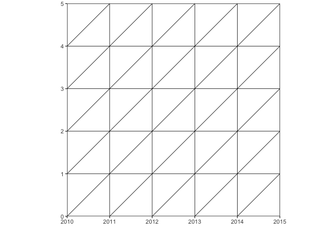<!-- -->

Aunque no necesariamente podemos dibujar sólo cuadrados

``` r
# Dibuje una cuadrícula de Lexis desde el año 2010 hasta el año 2015, que representa las edades de 0 a 7 años.

lexis_grid(year_start = 2010, year_end = 2015, age_start = 0, age_end = 7)
```

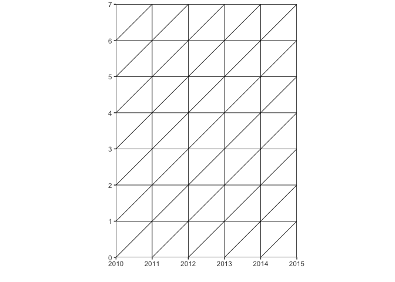<!-- -->

Si no ponemos nada especifico en un argumento “d=”, asume que los deltas
son de un año. Pero lo podemos modificar

``` r
lexis_grid(year_start = 1950, year_end = 2000, age_start = 0, age_end = 50, delta = 5)
```

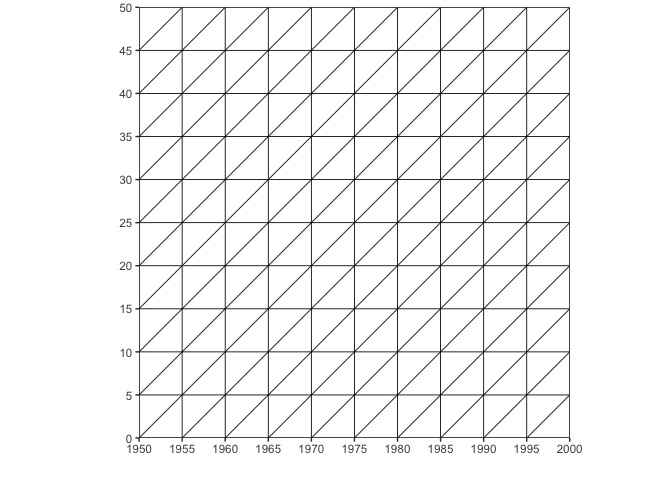<!-- -->

## Sombreados en el diagrama

Previo: objetos. R es un lenguaje de programación por objetos. Un objeto
tiene información de diferentes tipos. Normalmente “declaramos” los
objetos usando una flechita \<-

``` r
mi_diagrama <- lexis_grid(year_start = 1995, year_end = 2000, age_start = 0, age_end = 5)
```

Parece que no se hizo nada, pero si revisas en el ambiente hay un
objeto. Para “imprimir” un objeto, escribimos el nombre del mismo en
nuestro script o en nuestra consola

``` r
mi_diagrama
```

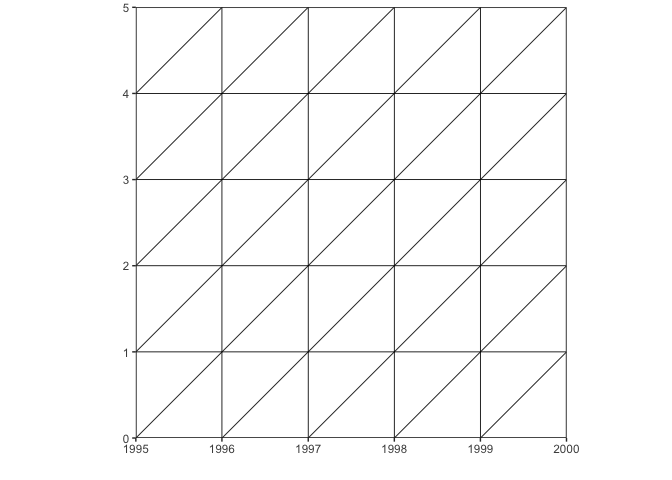<!-- -->

Para poder sombrear áreas con este paquete, debemos tener un diagrama ya
guardado como objeto. Con distintas funciones vamos sombreando áreas.

### Edad

``` r
# Destacar todos los puntos que pertenecen a la edad de 2 años
lexis_age(lg = mi_diagrama, age = 2)
```

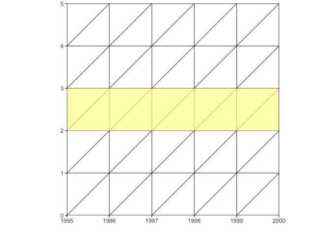<!-- -->

¿Qué tipo de observación o estudio sería este?

Para cambiar el color:

``` r
lexis_age(lg = mi_diagrama, age = 2, fill = "red", alpha = 0.5)
```

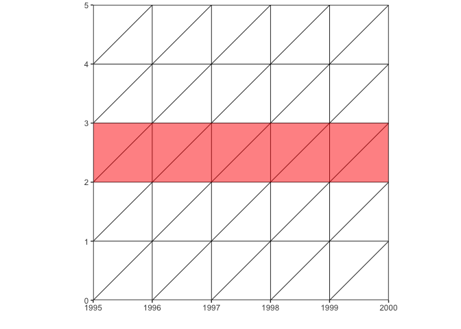<!-- -->

### Periodo

También podemos sombrear períodos

``` r
lexis_year(lg = mi_diagrama, year=1998)
```

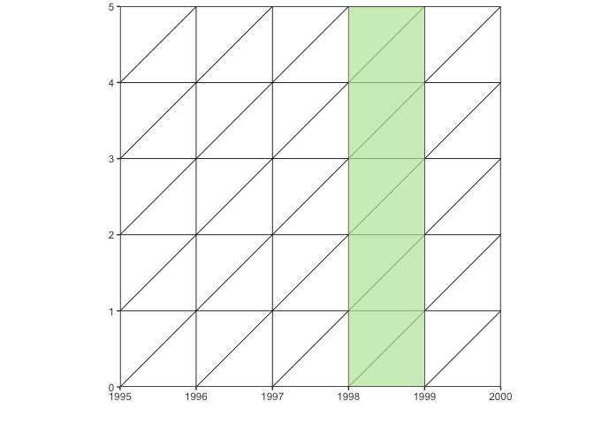<!-- --> ¿Qué tipo de
observación o estudio sería este?

Para cambiar el color: \[Más info del color
<http://sape.inf.usi.ch/quick-reference/ggplot2/colour>\]

``` r
lexis_year(lg = mi_diagrama, year=1998, fill = "grey70", alpha = 0.5)
```

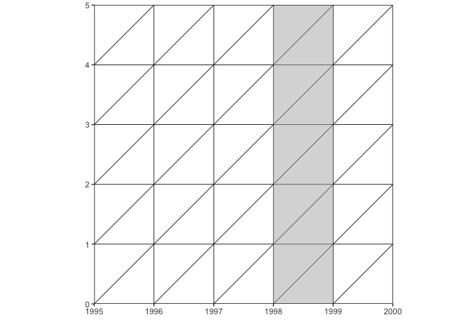<!-- -->

### Cohorte

``` r
lexis_cohort(lg = mi_diagrama, cohort=1994)
```

<!-- --> ¿Qué tipo de
observación o estudio sería este?

También podemos cambiar el color y la transparencia:

``` r
lexis_cohort(lg = mi_diagrama, cohort=1994, fill="plum1", alpha=0.8)
```

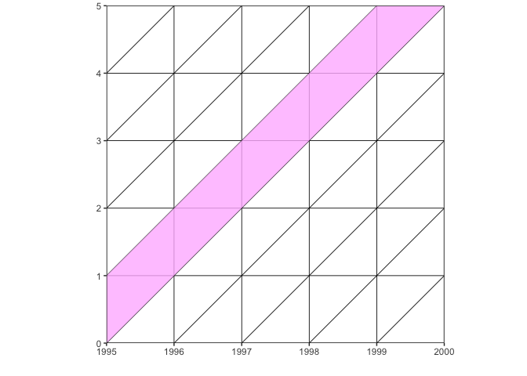<!-- -->

### Líneas de vida

Alguien entra

``` r
lexis_lifeline(lg = mi_diagrama, birth = "1996-09-23")
```

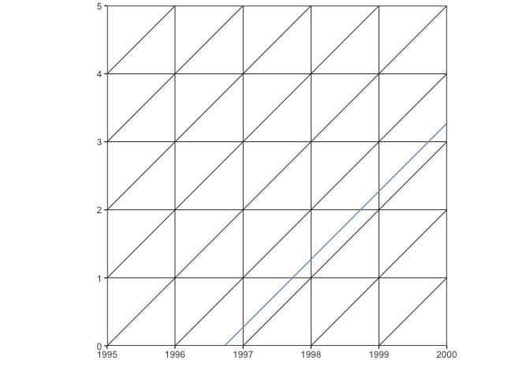<!-- -->

Alguien entra y sale

``` r
lexis_lifeline(lg = mi_diagrama, birth =  "1996-09-23", exit="1999-09-23")
```

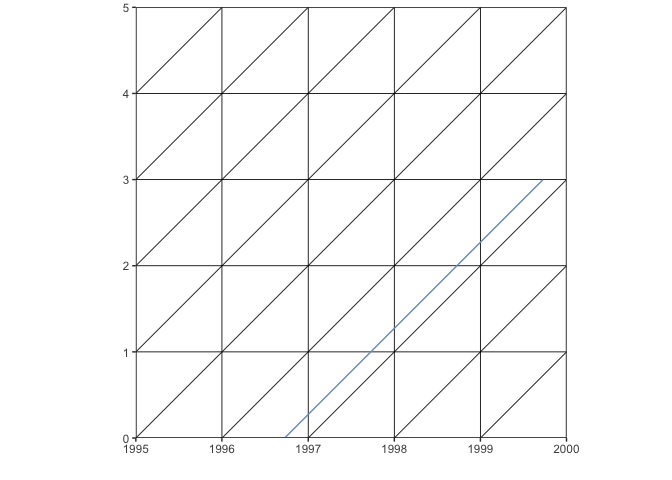<!-- -->

### Polígonos

No es tan sencillo, pero podemos dibujar un espacio “APC”, o varios

``` r
polygons <- data.frame(group = c(1,
                                 1,
                                 1), # es un triángulo
                       x = c("1996-01-01", 
                             "1997-01-01", 
                             "1997-01-01"), # van en fechas
                       y = c(1,
                             1,
                             2)) # van en edades

lexis_polygon(lg = mi_diagrama, x = polygons$x, y = polygons$y, group = polygons$group)
```

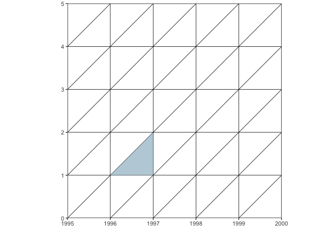<!-- -->

checa que básicamente se trata de colocar los puntos que dibujan el
polígono. Son tres puntos:

1.  Fecha: “1996-01-01”, edad=1

2.  Fecha: “1997-01-01”, edad=1

3.  Fecha: “1997-01-01”, edad=2

Si queremos más triángulos, podemos agregarlos en el mismo objeto:

``` r
polygons <- data.frame(group = c(1,
                                 1,
                                 1, # es un triángulo
                                 2, 
                                 2,
                                 2), # es otro triángulo
                       x = c("1996-01-01", 
                             "1997-01-01", 
                             "1997-01-01", # van en fechas 1
                             "1998-01-01", 
                             "1998-01-01", 
                             "1999-01-01"), # van en fechas 2
                       y = c(1,
                             1,
                             2, # van en edades 1
                             3,
                             4,
                             4))# van en edades 2

lexis_polygon(lg = mi_diagrama, x = polygons$x, y = polygons$y, group = polygons$group)
```

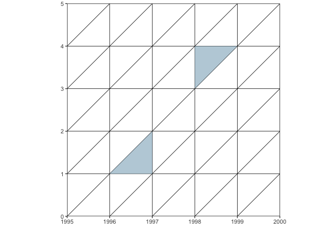<!-- -->

### Todo en uno

Podemos ir reescribiendo nuestro objeto

``` r
mi_diagrama2 <- lexis_grid(year_start = 1995, year_end = 2000, age_start = 0, age_end = 5)
mi_diagrama2<-lexis_age(lg = mi_diagrama2, age = 2, fill = "red", alpha = 0.5)
mi_diagrama2<-lexis_year(lg = mi_diagrama2, year = 1998)
mi_diagrama2<-lexis_cohort(lg = mi_diagrama2, cohort=1994)
mi_diagrama2<-lexis_lifeline(lg = mi_diagrama2, birth = "1996-09-23", exit="1999-09-23")
mi_diagrama2
```

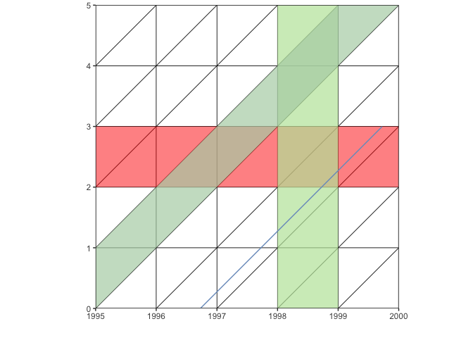<!-- -->

### Anotación manual

Para hacer cuadrados

``` r
mi_diagrama  + 
   annotate("rect", 
            xmin = as.Date("1996-01-01"),
            xmax = as.Date("1997-01-01"), 
            ymin = 0, ymax = 1, alpha = .2)
```

<!-- -->

¿Qué tipo de observación es esta?

``` r
mi_diagrama  + 
   annotate("rect", 
            xmin = as.Date("1996-01-01"),
            xmax = as.Date("1997-01-01"), 
            ymin = 0, ymax = 1, alpha = .2)
```

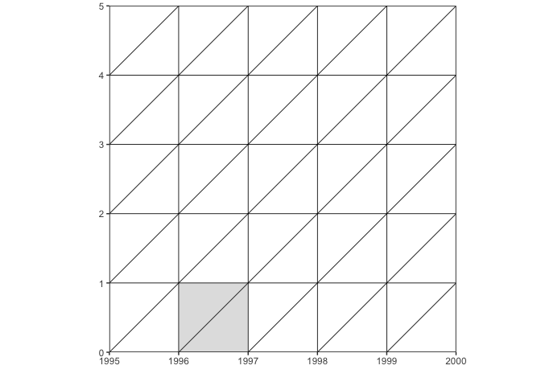<!-- -->

¿Qué tipo de observación es esta?

Si quisiéramos gráficar la fecha de un censo:

``` r
mi_diagrama  + 
   geom_vline(xintercept = as.Date("1995-11-05"), colour = "red")
```

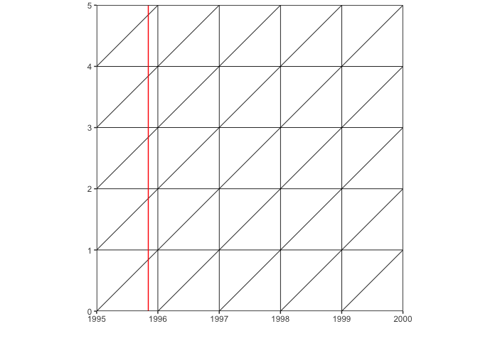<!-- -->

Si queremos poner una edad exacta:

``` r
mi_diagrama  + 
   geom_hline(yintercept = 4, colour = "red")
```

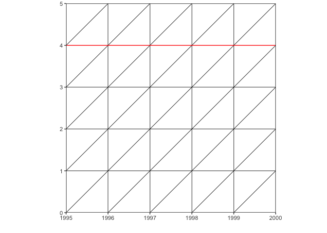<!-- -->

# IPUMSr

<https://international.ipums.org/international/>

Vamos a utilizar los datos de la consulta que ya generé. Pedí datos de
la última ronda de censos de Argentina, Canadá y Costa Rica.


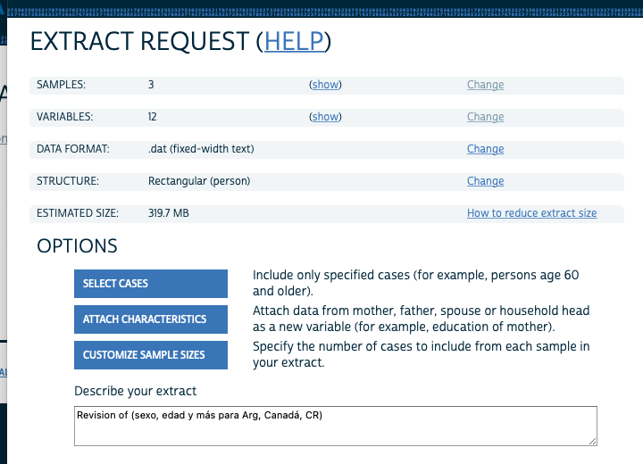

 Cuando ya tenemos el correito que nos dice
incluso hasta cómo citar nuestra fuente, revisamos de nuevo nuestro
“Dashboard”


``` r
#NOTE: To load data, you must download both the extract's data and the DDI
# and also set the working directory to the folder with these files (or change the path below).

if (!require("ipumsr")) stop("Reading IPUMS data into R requires the ipumsr package. It can be installed using the following command: install.packages('ipumsr')")

ddi <- read_ipums_ddi("ipumsi_00006.xml")
data <- read_ipums_micro(ddi)
```

    ## Use of data from IPUMS-International is subject to conditions including that
    ## users should cite the data appropriately. Use command `ipums_conditions()` for
    ## more details.

Revisemos la base

``` r
skimr::skim(data)
```

    ## Warning: Couldn't find skimmers for class: haven_labelled, vctrs_vctr, integer,
    ## numeric; No user-defined `sfl` provided. Falling back to `character`.
    
    ## Warning: Couldn't find skimmers for class: haven_labelled, vctrs_vctr, integer,
    ## numeric; No user-defined `sfl` provided. Falling back to `character`.
    
    ## Warning: Couldn't find skimmers for class: haven_labelled, vctrs_vctr, integer,
    ## numeric; No user-defined `sfl` provided. Falling back to `character`.
    
    ## Warning: Couldn't find skimmers for class: haven_labelled, vctrs_vctr, integer,
    ## numeric; No user-defined `sfl` provided. Falling back to `character`.
    
    ## Warning: Couldn't find skimmers for class: haven_labelled, vctrs_vctr, integer,
    ## numeric; No user-defined `sfl` provided. Falling back to `character`.
    
    ## Warning: Couldn't find skimmers for class: haven_labelled, vctrs_vctr, integer,
    ## numeric; No user-defined `sfl` provided. Falling back to `character`.
    
    ## Warning: Couldn't find skimmers for class: haven_labelled, vctrs_vctr, integer,
    ## numeric; No user-defined `sfl` provided. Falling back to `character`.

|                                                  |         |
| :----------------------------------------------- | :------ |
| Name                                             | data    |
| Number of rows                                   | 5321891 |
| Number of columns                                | 12      |
| \_\_\_\_\_\_\_\_\_\_\_\_\_\_\_\_\_\_\_\_\_\_\_   |         |
| Column type frequency:                           |         |
| character                                        | 7       |
| numeric                                          | 5       |
| \_\_\_\_\_\_\_\_\_\_\_\_\_\_\_\_\_\_\_\_\_\_\_\_ |         |
| Group variables                                  | None    |

Data summary

**Variable type: character**

| skim\_variable | n\_missing | complete\_rate | min | max | empty | n\_unique | whitespace |
| :------------- | ---------: | -------------: | --: | --: | ----: | --------: | ---------: |
| COUNTRY        |          0 |              1 |   2 |   3 |     0 |         3 |          0 |
| SAMPLE         |          0 |              1 |   8 |   9 |     0 |         3 |          0 |
| RELATE         |          0 |              1 |   1 |   1 |     0 |         5 |          0 |
| RELATED        |          0 |              1 |   4 |   4 |     0 |        15 |          0 |
| AGE            |          0 |              1 |   1 |   3 |     0 |       101 |          0 |
| AGE2           |          0 |              1 |   1 |   2 |     0 |        18 |          0 |
| SEX            |          0 |              1 |   1 |   1 |     0 |         2 |          0 |

**Variable type: numeric**

| skim\_variable | n\_missing | complete\_rate |         mean |           sd |   p0 |       p25 |       p50 |       p75 |         p100 | hist  |
| :------------- | ---------: | -------------: | -----------: | -----------: | ---: | --------: | --------: | --------: | -----------: | :---- |
| YEAR           |          0 |              1 |      2010.25 |         0.44 | 2010 |      2010 |      2010 |      2011 | 2.011000e+03 | ▇▁▁▁▃ |
| SERIAL         |          0 |              1 | 507795686.18 | 370123806.07 | 1000 | 173498000 | 429397000 | 833431500 | 1.217166e+09 | ▇▅▃▃▃ |
| HHWT           |          0 |              1 |        14.43 |        11.21 |    0 |        10 |        10 |        10 | 2.937200e+02 | ▇▁▁▁▁ |
| PERNUM         |          0 |              1 |         2.57 |         1.68 |    1 |         1 |         2 |         3 | 4.000000e+01 | ▇▁▁▁▁ |
| PERWT          |          0 |              1 |        14.43 |        11.21 |   10 |        10 |        10 |        10 | 2.937200e+02 | ▇▁▁▁▁ |

``` r
data <- data %>%
  mutate(COUNTRY_factor = as_label(COUNTRY),
         sex0=as_label(SEX),
         eda5=as_label(AGE2))
```

Vamos a hacer una pirámide para comparar estas poblaciones

``` r
data %>% 
  mutate(pop_pi=if_else(SEX==1,
                       -PERWT, 
                       PERWT)) %>% 
  ggplot(aes(eda5, fill=sex0, weights=pop_pi))+
    geom_bar() + coord_flip() +
  labs(y="Poblacion", x="Grupos de edad") +
  scale_fill_brewer(palette = "Set2") + 
  theme_light() + facet_wrap(~COUNTRY_factor, scales="free") 
```

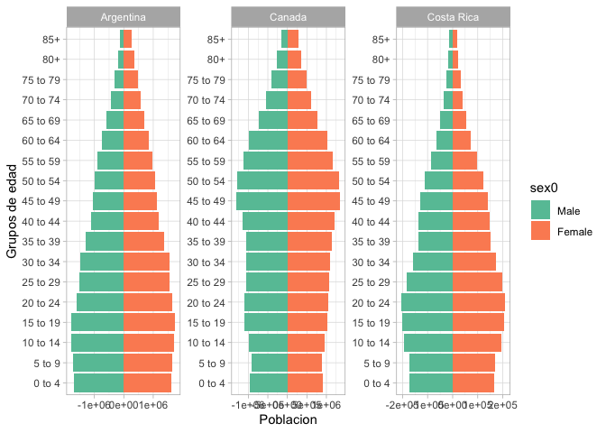<!-- -->

# Ejercicio

*Parte 1*

1.  Dibuje una cuadrícula de Lexis de los nacidos entre 1975 y 1985
    entre 20 y 30 años.
2.  Sombree cómo se vería un estudio etario de los 27 años
3.  Sombree cómo se vería un análisis de esa población en 1996
4.  Sombree cómo se vería el seguimiento de únicamente los nacidos en
    1984

*Parte 2*

Haga una consulta con ipums, impórtela y haga un gráfico de los que ya
hemos revisado a lo largo del semestre. Mejor agarre un país chiquitito.

<https://forms.gle/uHdiyrMAqE5STZyF7>
