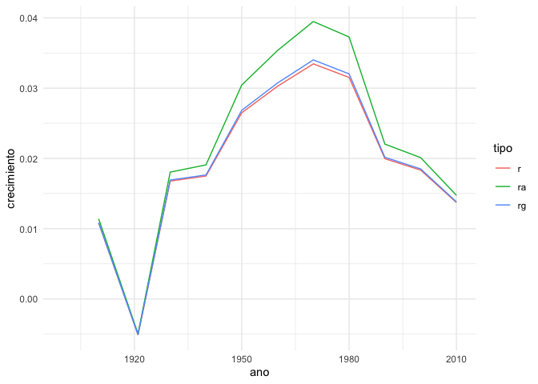
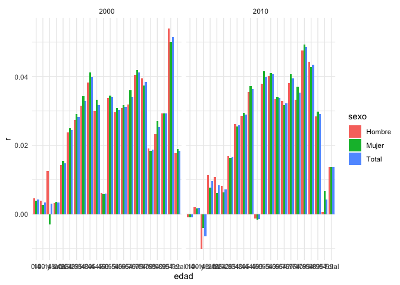
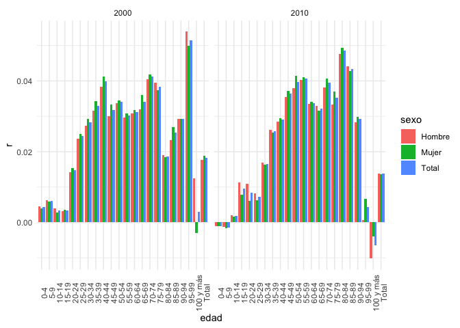
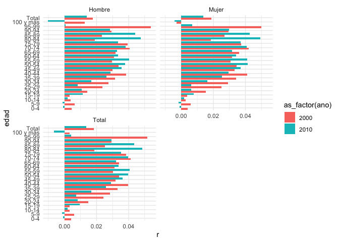
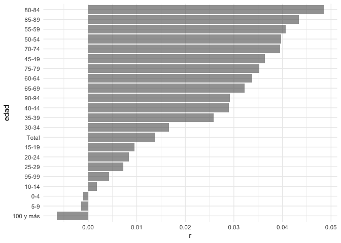
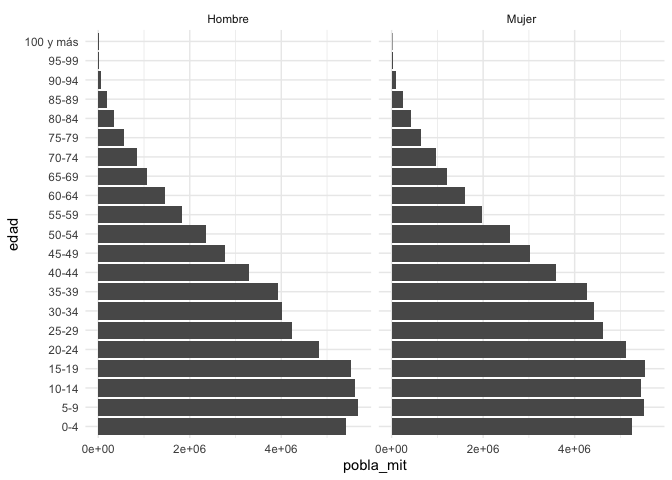

Práctica 12. Aplicaciones relacionadas a la demografía (III)
================
Ana Escoto
06/01/2021

# Previo

## Paquetería

``` r
if (!require("pacman")) install.packages("pacman") # instala pacman si se requiere
```

    ## Loading required package: pacman

``` r
pacman::p_load(tidyverse, 
               readxl,writexl, # importar hojas de cálculo
               haven, foreign, # importación de dta y sav
               janitor, skimr, #limpieza y verificación
               imputeTS, # para imputar valores
               esquisse) # para usar ggplot de manera más amigable
```

## Directorio

En caso que no tengas un proyecto,establecer el directorio puede ayudar

``` r
rm(list=ls()) # mala práctica pero quizás necesaria porque vamos a cambiar de tema
setwd("/Users/anaescoto/Dropbox/2020/2021-1 R para Demográfos/repo/R_Demo")
```

## Fechas censales y tasas de crecimiento

``` r
url <- "https://github.com/aniuxa/R_Demo/raw/master/datos/censos.xlsx"

destfile <- "censos.xlsx"
curl::curl_download(url, destfile)

censos <- read_excel(destfile, 
                     col_types = c("numeric","date", "numeric"))
```

Un elemento fundamental es encontrar los periodos intercensales en años.
Los censos tienen diferentes fechas.

``` r
censos<-censos %>%
    mutate(dias = c(NA, diff(fecha))) %>% 
    mutate(n=dias/365) %>% 
  clean_names

censos  
```

    ## # A tibble: 12 x 5
    ##      ano fecha               poblacion  dias     n
    ##    <dbl> <dttm>                  <dbl> <dbl> <dbl>
    ##  1  1900 1900-10-28 00:00:00  13607272    NA NA   
    ##  2  1910 1910-10-27 00:00:00  15160369  3651 10.0 
    ##  3  1921 1921-10-20 00:00:00  14334780  4011 11.0 
    ##  4  1930 1930-05-15 00:00:00  16552722  3129  8.57
    ##  5  1940 1940-03-06 00:00:00  19653552  3583  9.82
    ##  6  1950 1950-06-06 00:00:00  25791017  3744 10.3 
    ##  7  1960 1960-06-08 00:00:00  34923129  3655 10.0 
    ##  8  1970 1970-01-28 00:00:00  48225238  3521  9.65
    ##  9  1980 1980-06-04 00:00:00  66846833  3780 10.4 
    ## 10  1990 1990-03-12 00:00:00  81249645  3568  9.78
    ## 11  2000 2000-02-14 00:00:00  97483412  3626  9.93
    ## 12  2010 2010-06-12 00:00:00 112336538  3771 10.3

Con esta base ya podemos ir calculando diferentes tipos de crecimiento
básicos.

### Ritmo

\[ ritmo=\frac{P_{t+n}}{P_t} \]

``` r
censos<-censos %>% 
   mutate(ritmo = poblacion/lag(poblacion))
censos
```

    ## # A tibble: 12 x 6
    ##      ano fecha               poblacion  dias     n  ritmo
    ##    <dbl> <dttm>                  <dbl> <dbl> <dbl>  <dbl>
    ##  1  1900 1900-10-28 00:00:00  13607272    NA NA    NA    
    ##  2  1910 1910-10-27 00:00:00  15160369  3651 10.0   1.11 
    ##  3  1921 1921-10-20 00:00:00  14334780  4011 11.0   0.946
    ##  4  1930 1930-05-15 00:00:00  16552722  3129  8.57  1.15 
    ##  5  1940 1940-03-06 00:00:00  19653552  3583  9.82  1.19 
    ##  6  1950 1950-06-06 00:00:00  25791017  3744 10.3   1.31 
    ##  7  1960 1960-06-08 00:00:00  34923129  3655 10.0   1.35 
    ##  8  1970 1970-01-28 00:00:00  48225238  3521  9.65  1.38 
    ##  9  1980 1980-06-04 00:00:00  66846833  3780 10.4   1.39 
    ## 10  1990 1990-03-12 00:00:00  81249645  3568  9.78  1.22 
    ## 11  2000 2000-02-14 00:00:00  97483412  3626  9.93  1.20 
    ## 12  2010 2010-06-12 00:00:00 112336538  3771 10.3   1.15

### Crecimiento

\[ c=\frac{P_{t+n}-{P_t}}{P_t} =\frac{P_{t+n}}{P_t}-1 \]

Básicamente es el ritmo menos 1

``` r
censos<-censos %>% 
   mutate(c = ritmo-1)
censos
```

    ## # A tibble: 12 x 7
    ##      ano fecha               poblacion  dias     n  ritmo       c
    ##    <dbl> <dttm>                  <dbl> <dbl> <dbl>  <dbl>   <dbl>
    ##  1  1900 1900-10-28 00:00:00  13607272    NA NA    NA     NA     
    ##  2  1910 1910-10-27 00:00:00  15160369  3651 10.0   1.11   0.114 
    ##  3  1921 1921-10-20 00:00:00  14334780  4011 11.0   0.946 -0.0545
    ##  4  1930 1930-05-15 00:00:00  16552722  3129  8.57  1.15   0.155 
    ##  5  1940 1940-03-06 00:00:00  19653552  3583  9.82  1.19   0.187 
    ##  6  1950 1950-06-06 00:00:00  25791017  3744 10.3   1.31   0.312 
    ##  7  1960 1960-06-08 00:00:00  34923129  3655 10.0   1.35   0.354 
    ##  8  1970 1970-01-28 00:00:00  48225238  3521  9.65  1.38   0.381 
    ##  9  1980 1980-06-04 00:00:00  66846833  3780 10.4   1.39   0.386 
    ## 10  1990 1990-03-12 00:00:00  81249645  3568  9.78  1.22   0.215 
    ## 11  2000 2000-02-14 00:00:00  97483412  3626  9.93  1.20   0.200 
    ## 12  2010 2010-06-12 00:00:00 112336538  3771 10.3   1.15   0.152

### Crecimiento aritmético

\[ r_a=\frac{P_{t+n}-{P_t}}{n*P_t} =\frac{c}n \] Básicamente es el
crecimiento entre el periodo intercensal.

``` r
censos<-censos %>% 
   mutate(ra = c/n)
censos
```

    ## # A tibble: 12 x 8
    ##      ano fecha               poblacion  dias     n  ritmo       c       ra
    ##    <dbl> <dttm>                  <dbl> <dbl> <dbl>  <dbl>   <dbl>    <dbl>
    ##  1  1900 1900-10-28 00:00:00  13607272    NA NA    NA     NA      NA      
    ##  2  1910 1910-10-27 00:00:00  15160369  3651 10.0   1.11   0.114   0.0114 
    ##  3  1921 1921-10-20 00:00:00  14334780  4011 11.0   0.946 -0.0545 -0.00496
    ##  4  1930 1930-05-15 00:00:00  16552722  3129  8.57  1.15   0.155   0.0180 
    ##  5  1940 1940-03-06 00:00:00  19653552  3583  9.82  1.19   0.187   0.0191 
    ##  6  1950 1950-06-06 00:00:00  25791017  3744 10.3   1.31   0.312   0.0304 
    ##  7  1960 1960-06-08 00:00:00  34923129  3655 10.0   1.35   0.354   0.0354 
    ##  8  1970 1970-01-28 00:00:00  48225238  3521  9.65  1.38   0.381   0.0395 
    ##  9  1980 1980-06-04 00:00:00  66846833  3780 10.4   1.39   0.386   0.0373 
    ## 10  1990 1990-03-12 00:00:00  81249645  3568  9.78  1.22   0.215   0.0220 
    ## 11  2000 2000-02-14 00:00:00  97483412  3626  9.93  1.20   0.200   0.0201 
    ## 12  2010 2010-06-12 00:00:00 112336538  3771 10.3   1.15   0.152   0.0147

### Crecimiento geométrico

\[ r_g=\sqrt[n]\frac{P_{t+n}}{{P_t}}-1 \] Es la raíz n-ésima del ritmo
menos 1

``` r
censos<-censos %>% 
   mutate(rg = ritmo^(1/n)-1)
censos
```

    ## # A tibble: 12 x 9
    ##      ano fecha               poblacion  dias     n  ritmo       c       ra
    ##    <dbl> <dttm>                  <dbl> <dbl> <dbl>  <dbl>   <dbl>    <dbl>
    ##  1  1900 1900-10-28 00:00:00  13607272    NA NA    NA     NA      NA      
    ##  2  1910 1910-10-27 00:00:00  15160369  3651 10.0   1.11   0.114   0.0114 
    ##  3  1921 1921-10-20 00:00:00  14334780  4011 11.0   0.946 -0.0545 -0.00496
    ##  4  1930 1930-05-15 00:00:00  16552722  3129  8.57  1.15   0.155   0.0180 
    ##  5  1940 1940-03-06 00:00:00  19653552  3583  9.82  1.19   0.187   0.0191 
    ##  6  1950 1950-06-06 00:00:00  25791017  3744 10.3   1.31   0.312   0.0304 
    ##  7  1960 1960-06-08 00:00:00  34923129  3655 10.0   1.35   0.354   0.0354 
    ##  8  1970 1970-01-28 00:00:00  48225238  3521  9.65  1.38   0.381   0.0395 
    ##  9  1980 1980-06-04 00:00:00  66846833  3780 10.4   1.39   0.386   0.0373 
    ## 10  1990 1990-03-12 00:00:00  81249645  3568  9.78  1.22   0.215   0.0220 
    ## 11  2000 2000-02-14 00:00:00  97483412  3626  9.93  1.20   0.200   0.0201 
    ## 12  2010 2010-06-12 00:00:00 112336538  3771 10.3   1.15   0.152   0.0147 
    ## # … with 1 more variable: rg <dbl>

### Crecimiento exponencial

\[ r=\frac{ln\frac{P_{t+n}}{{P_t}}}n\]

Básicamente es logaritmo del ritmo entre n

``` r
censos<-censos %>% 
   mutate(r = log(ritmo)/n)
censos
```

    ## # A tibble: 12 x 10
    ##      ano fecha               poblacion  dias     n  ritmo       c       ra
    ##    <dbl> <dttm>                  <dbl> <dbl> <dbl>  <dbl>   <dbl>    <dbl>
    ##  1  1900 1900-10-28 00:00:00  13607272    NA NA    NA     NA      NA      
    ##  2  1910 1910-10-27 00:00:00  15160369  3651 10.0   1.11   0.114   0.0114 
    ##  3  1921 1921-10-20 00:00:00  14334780  4011 11.0   0.946 -0.0545 -0.00496
    ##  4  1930 1930-05-15 00:00:00  16552722  3129  8.57  1.15   0.155   0.0180 
    ##  5  1940 1940-03-06 00:00:00  19653552  3583  9.82  1.19   0.187   0.0191 
    ##  6  1950 1950-06-06 00:00:00  25791017  3744 10.3   1.31   0.312   0.0304 
    ##  7  1960 1960-06-08 00:00:00  34923129  3655 10.0   1.35   0.354   0.0354 
    ##  8  1970 1970-01-28 00:00:00  48225238  3521  9.65  1.38   0.381   0.0395 
    ##  9  1980 1980-06-04 00:00:00  66846833  3780 10.4   1.39   0.386   0.0373 
    ## 10  1990 1990-03-12 00:00:00  81249645  3568  9.78  1.22   0.215   0.0220 
    ## 11  2000 2000-02-14 00:00:00  97483412  3626  9.93  1.20   0.200   0.0201 
    ## 12  2010 2010-06-12 00:00:00 112336538  3771 10.3   1.15   0.152   0.0147 
    ## # … with 2 more variables: rg <dbl>, r <dbl>

Este crecimiento es el más utilizado.

Podemos graficar los diferentes crecimientos, será más fácil si
cambiamos el formato

``` r
censos %>% 
  select(c(ano, ra, rg, r)) %>% 
  pivot_longer(-ano, names_to = "tipo", values_to = "crecimiento") 
```

    ## # A tibble: 36 x 3
    ##      ano tipo  crecimiento
    ##    <dbl> <chr>       <dbl>
    ##  1  1900 ra       NA      
    ##  2  1900 rg       NA      
    ##  3  1900 r        NA      
    ##  4  1910 ra        0.0114 
    ##  5  1910 rg        0.0109 
    ##  6  1910 r         0.0108 
    ##  7  1921 ra       -0.00496
    ##  8  1921 rg       -0.00508
    ##  9  1921 r        -0.00510
    ## 10  1930 ra        0.0180 
    ## # … with 26 more rows

``` r
censos %>% 
  select(c(ano, ra, rg, r)) %>% 
  pivot_longer(-ano, names_to = "tipo", values_to = "crecimiento") %>% 
  ggplot(aes(ano,crecimiento, group=tipo, color=tipo)) + 
  geom_line() + theme_minimal()
```

    ## Warning: Removed 3 row(s) containing missing values (geom_path).

<!-- -->

Con estas tasas de crecimiento también podemos hacer estimaciones de
tiempo y de poblaciones en fechas específicas.

### Proyeccion

\[ P_{t+n}= P_t * e^{nr} \] Vamos a proyectar la población al primero de
julio de 2009

``` r
n<-difftime(as.Date("2009-07-1"),
        as.Date("2000-02-14"))
n
```

    ## Time difference of 3425 days

``` r
n<-as.numeric(n/365)

n
```

    ## [1] 9.383562

``` r
ptn=censos[11,"poblacion"]*exp(n*censos[12,10])
paste(ptn) # para ver los decimales
```

    ## [1] "110884271.797442"

### Tiempo

\[ n=\frac{ln\frac{P_{t+n}}{{P_t}}}r\]

¿Cuánto tiempo tardaría en duplicarse la población del último censo?

``` r
n_calc<-log(2*censos[12,"poblacion"]/censos[12,"poblacion"])/censos[12,"r"]
n_calc
```

    ##   poblacion
    ## 1  50.49647

¿En qué fecha se llegaría ese valor?

``` r
library(lubridate) # este paquetito es una maravilla para el uso de fechas. Nos da más control
```

    ## 
    ## Attaching package: 'lubridate'

    ## The following objects are masked from 'package:base':
    ## 
    ##     date, intersect, setdiff, union

``` r
ymd("2010/06/12") + days(round(n_calc*365,0))
```

    ## [1] "2060-11-27"

## Mexico, tabulados

Vamos a trabajar con los datos de IPUMS para México. Esto nos va a
permitir tener totales para grupos de edad y vamos a automatizar las
tasas de crecimientos y los cálculos de las poblaciones medias.

Esta consulta se hizo en los tabulados de INEGI:
<https://www.inegi.org.mx/programas/ccpv/cpvsh/#Tabulados>

``` r
pob_censo<- read.csv("https://raw.githubusercontent.com/aniuxa/R_Demo/master/datos/INEGI_Exporta_20210105163526.csv", 
                     encoding = "latin1", 
                     skip=3)
```

Vamos a limpiar un poco esto:

``` r
pob_censo<-pob_censo[-c(70:74),-c(4,6,8)] # quitamos los últimos renglones y la última columna

pob_censo<-clean_names(pob_censo)
```

vamos a renombrar

``` r
pob_censo<-pob_censo %>% 
  rename(sexo=x, edad=x_1)
pob_censo
```

    ##      sexo              edad      x1990      x2000       x2010
    ## 1   Total             Total 81,249,645 97,483,412 112,336,538
    ## 2   Total     De 0 a 4 años 10,195,178 10,635,157  10,528,322
    ## 3   Total     De 5 a 9 años 10,562,234 11,215,323  11,047,537
    ## 4   Total   De 10 a 14 años 10,389,092 10,736,493  10,939,937
    ## 5   Total   De 15 a 19 años  9,664,403  9,992,135  11,026,112
    ## 6   Total   De 20 a 24 años  7,829,163  9,071,134   9,892,271
    ## 7   Total   De 25 a 29 años  6,404,512  8,157,743   8,788,177
    ## 8   Total   De 30 a 34 años  5,387,619  7,136,523   8,470,798
    ## 9   Total   De 35 a 39 años  4,579,116  6,352,538   8,292,987
    ## 10  Total   De 40 a 44 años  3,497,770  5,194,833   7,009,226
    ## 11  Total   De 45 a 49 años  2,971,860  4,072,091   5,928,730
    ## 12  Total   De 50 a 54 años  2,393,791  3,357,953   5,064,291
    ## 13  Total   De 55 a 59 años  1,894,484  2,559,231   3,895,365
    ## 14  Total   De 60 a 64 años  1,611,317  2,198,146   3,116,466
    ## 15  Total   De 65 a 69 años  1,183,651  1,660,785   2,317,265
    ## 16  Total   De 70 a 74 años    827,027  1,245,674   1,873,934
    ## 17  Total   De 75 a 79 años    590,836    865,270   1,245,483
    ## 18  Total   De 80 a 84 años    401,832    483,876     798,936
    ## 19  Total   De 85 a 89 años    225,450    290,051     454,164
    ## 20  Total   De 90 a 94 años     91,189    122,006     164,924
    ## 21  Total   De 95 a 99 años     37,689     62,892      65,732
    ## 22  Total De 100 y más años     19,167     19,757      18,475
    ## 23  Total   No especificado    492,265  2,053,801   1,397,406
    ## 24 Hombre             Total 39,893,969 47,592,253  54,855,231
    ## 25 Hombre     De 0 a 4 años  5,160,002  5,401,306   5,346,943
    ## 26 Hombre     De 5 a 9 años  5,338,285  5,677,711   5,604,175
    ## 27 Hombre   De 10 a 14 años  5,230,658  5,435,737   5,547,613
    ## 28 Hombre   De 15 a 19 años  4,759,892  4,909,648   5,520,121
    ## 29 Hombre   De 20 a 24 años  3,738,128  4,303,600   4,813,204
    ## 30 Hombre   De 25 a 29 años  3,050,595  3,861,482   4,205,975
    ## 31 Hombre   De 30 a 34 años  2,578,736  3,383,356   4,026,031
    ## 32 Hombre   De 35 a 39 años  2,210,565  3,023,328   3,964,738
    ## 33 Hombre   De 40 a 44 años  1,705,013  2,494,771   3,350,322
    ## 34 Hombre   De 45 a 49 años  1,452,573  1,957,177   2,824,364
    ## 35 Hombre   De 50 a 54 años  1,161,875  1,624,033   2,402,451
    ## 36 Hombre   De 55 a 59 años    918,864  1,234,072   1,869,537
    ## 37 Hombre   De 60 a 64 años    769,917  1,045,404   1,476,667
    ## 38 Hombre   De 65 a 69 años    567,641    779,666   1,095,273
    ## 39 Hombre   De 70 a 74 años    394,031    589,106     873,893
    ## 40 Hombre   De 75 a 79 años    277,835    411,197     579,689
    ## 41 Hombre   De 80 a 84 años    179,820    217,330     355,277
    ## 42 Hombre   De 85 a 89 años     99,299    125,041     197,461
    ## 43 Hombre   De 90 a 94 años     38,021     50,843      68,130
    ## 44 Hombre   De 95 a 99 años     15,069     25,741      25,920
    ## 45 Hombre De 100 y más años      7,092      8,029       7,228
    ## 46 Hombre   No especificado    240,058  1,033,675     700,219
    ## 47  Mujer             Total 41,355,676 49,891,159  57,481,307
    ## 48  Mujer     De 0 a 4 años  5,035,176  5,233,851   5,181,379
    ## 49  Mujer     De 5 a 9 años  5,223,949  5,537,612   5,443,362
    ## 50  Mujer   De 10 a 14 años  5,158,434  5,300,756   5,392,324
    ## 51  Mujer   De 15 a 19 años  4,904,511  5,082,487   5,505,991
    ## 52  Mujer   De 20 a 24 años  4,091,035  4,767,534   5,079,067
    ## 53  Mujer   De 25 a 29 años  3,353,917  4,296,261   4,582,202
    ## 54  Mujer   De 30 a 34 años  2,808,883  3,753,167   4,444,767
    ## 55  Mujer   De 35 a 39 años  2,368,551  3,329,210   4,328,249
    ## 56  Mujer   De 40 a 44 años  1,792,757  2,700,062   3,658,904
    ## 57  Mujer   De 45 a 49 años  1,519,287  2,114,914   3,104,366
    ## 58  Mujer   De 50 a 54 años  1,231,916  1,733,920   2,661,840
    ## 59  Mujer   De 55 a 59 años    975,620  1,325,159   2,025,828
    ## 60  Mujer   De 60 a 64 años    841,400  1,152,742   1,639,799
    ## 61  Mujer   De 65 a 69 años    616,010    881,119   1,221,992
    ## 62  Mujer   De 70 a 74 años    432,996    656,568   1,000,041
    ## 63  Mujer   De 75 a 79 años    313,001    454,073     665,794
    ## 64  Mujer   De 80 a 84 años    222,012    266,546     443,659
    ## 65  Mujer   De 85 a 89 años    126,151    165,010     256,703
    ## 66  Mujer   De 90 a 94 años     53,168     71,163      96,794
    ## 67  Mujer   De 95 a 99 años     22,620     37,151      39,812
    ## 68  Mujer De 100 y más años     12,075     11,728      11,247
    ## 69  Mujer   No especificado    252,207  1,020,126     697,187

Vamos a limpiar un poco la variable “edad”, de paso nos sirve para
revisar algunas opciones del paquete “stringr”

``` r
pob_censo<-pob_censo %>%
  mutate(edad=str_remove(edad,"De ")) %>% 
  mutate(edad=str_remove(edad," años")) %>% 
  mutate(edad=str_replace(edad," a ", "-")) 

pob_censo
```

    ##      sexo            edad      x1990      x2000       x2010
    ## 1   Total           Total 81,249,645 97,483,412 112,336,538
    ## 2   Total             0-4 10,195,178 10,635,157  10,528,322
    ## 3   Total             5-9 10,562,234 11,215,323  11,047,537
    ## 4   Total           10-14 10,389,092 10,736,493  10,939,937
    ## 5   Total           15-19  9,664,403  9,992,135  11,026,112
    ## 6   Total           20-24  7,829,163  9,071,134   9,892,271
    ## 7   Total           25-29  6,404,512  8,157,743   8,788,177
    ## 8   Total           30-34  5,387,619  7,136,523   8,470,798
    ## 9   Total           35-39  4,579,116  6,352,538   8,292,987
    ## 10  Total           40-44  3,497,770  5,194,833   7,009,226
    ## 11  Total           45-49  2,971,860  4,072,091   5,928,730
    ## 12  Total           50-54  2,393,791  3,357,953   5,064,291
    ## 13  Total           55-59  1,894,484  2,559,231   3,895,365
    ## 14  Total           60-64  1,611,317  2,198,146   3,116,466
    ## 15  Total           65-69  1,183,651  1,660,785   2,317,265
    ## 16  Total           70-74    827,027  1,245,674   1,873,934
    ## 17  Total           75-79    590,836    865,270   1,245,483
    ## 18  Total           80-84    401,832    483,876     798,936
    ## 19  Total           85-89    225,450    290,051     454,164
    ## 20  Total           90-94     91,189    122,006     164,924
    ## 21  Total           95-99     37,689     62,892      65,732
    ## 22  Total       100 y más     19,167     19,757      18,475
    ## 23  Total No especificado    492,265  2,053,801   1,397,406
    ## 24 Hombre           Total 39,893,969 47,592,253  54,855,231
    ## 25 Hombre             0-4  5,160,002  5,401,306   5,346,943
    ## 26 Hombre             5-9  5,338,285  5,677,711   5,604,175
    ## 27 Hombre           10-14  5,230,658  5,435,737   5,547,613
    ## 28 Hombre           15-19  4,759,892  4,909,648   5,520,121
    ## 29 Hombre           20-24  3,738,128  4,303,600   4,813,204
    ## 30 Hombre           25-29  3,050,595  3,861,482   4,205,975
    ## 31 Hombre           30-34  2,578,736  3,383,356   4,026,031
    ## 32 Hombre           35-39  2,210,565  3,023,328   3,964,738
    ## 33 Hombre           40-44  1,705,013  2,494,771   3,350,322
    ## 34 Hombre           45-49  1,452,573  1,957,177   2,824,364
    ## 35 Hombre           50-54  1,161,875  1,624,033   2,402,451
    ## 36 Hombre           55-59    918,864  1,234,072   1,869,537
    ## 37 Hombre           60-64    769,917  1,045,404   1,476,667
    ## 38 Hombre           65-69    567,641    779,666   1,095,273
    ## 39 Hombre           70-74    394,031    589,106     873,893
    ## 40 Hombre           75-79    277,835    411,197     579,689
    ## 41 Hombre           80-84    179,820    217,330     355,277
    ## 42 Hombre           85-89     99,299    125,041     197,461
    ## 43 Hombre           90-94     38,021     50,843      68,130
    ## 44 Hombre           95-99     15,069     25,741      25,920
    ## 45 Hombre       100 y más      7,092      8,029       7,228
    ## 46 Hombre No especificado    240,058  1,033,675     700,219
    ## 47  Mujer           Total 41,355,676 49,891,159  57,481,307
    ## 48  Mujer             0-4  5,035,176  5,233,851   5,181,379
    ## 49  Mujer             5-9  5,223,949  5,537,612   5,443,362
    ## 50  Mujer           10-14  5,158,434  5,300,756   5,392,324
    ## 51  Mujer           15-19  4,904,511  5,082,487   5,505,991
    ## 52  Mujer           20-24  4,091,035  4,767,534   5,079,067
    ## 53  Mujer           25-29  3,353,917  4,296,261   4,582,202
    ## 54  Mujer           30-34  2,808,883  3,753,167   4,444,767
    ## 55  Mujer           35-39  2,368,551  3,329,210   4,328,249
    ## 56  Mujer           40-44  1,792,757  2,700,062   3,658,904
    ## 57  Mujer           45-49  1,519,287  2,114,914   3,104,366
    ## 58  Mujer           50-54  1,231,916  1,733,920   2,661,840
    ## 59  Mujer           55-59    975,620  1,325,159   2,025,828
    ## 60  Mujer           60-64    841,400  1,152,742   1,639,799
    ## 61  Mujer           65-69    616,010    881,119   1,221,992
    ## 62  Mujer           70-74    432,996    656,568   1,000,041
    ## 63  Mujer           75-79    313,001    454,073     665,794
    ## 64  Mujer           80-84    222,012    266,546     443,659
    ## 65  Mujer           85-89    126,151    165,010     256,703
    ## 66  Mujer           90-94     53,168     71,163      96,794
    ## 67  Mujer           95-99     22,620     37,151      39,812
    ## 68  Mujer       100 y más     12,075     11,728      11,247
    ## 69  Mujer No especificado    252,207  1,020,126     697,187

Vamos a hacerla “long”

``` r
pob_censo<-pob_censo %>% 
  pivot_longer(c(x1990:x2010), names_to="ano", values_to="poblacion") %>% 
  mutate(ano=parse_number(ano)) %>% 
  mutate(poblacion=parse_number(poblacion))

pob_censo
```

    ## # A tibble: 207 x 4
    ##    sexo  edad    ano poblacion
    ##    <chr> <chr> <dbl>     <dbl>
    ##  1 Total Total  1990  81249645
    ##  2 Total Total  2000  97483412
    ##  3 Total Total  2010 112336538
    ##  4 Total 0-4    1990  10195178
    ##  5 Total 0-4    2000  10635157
    ##  6 Total 0-4    2010  10528322
    ##  7 Total 5-9    1990  10562234
    ##  8 Total 5-9    2000  11215323
    ##  9 Total 5-9    2010  11047537
    ## 10 Total 10-14  1990  10389092
    ## # … with 197 more rows

Esta base se puede agrupar y es mucho más sencilla de trabajar

``` r
pob_censo <-pob_censo %>% 
 group_by(sexo,edad) %>% #este es un paso esencial 
  mutate(ritmo = poblacion/lag(poblacion)) %>% 
  ungroup()

pob_censo
```

    ## # A tibble: 207 x 5
    ##    sexo  edad    ano poblacion  ritmo
    ##    <chr> <chr> <dbl>     <dbl>  <dbl>
    ##  1 Total Total  1990  81249645 NA    
    ##  2 Total Total  2000  97483412  1.20 
    ##  3 Total Total  2010 112336538  1.15 
    ##  4 Total 0-4    1990  10195178 NA    
    ##  5 Total 0-4    2000  10635157  1.04 
    ##  6 Total 0-4    2010  10528322  0.990
    ##  7 Total 5-9    1990  10562234 NA    
    ##  8 Total 5-9    2000  11215323  1.06 
    ##  9 Total 5-9    2010  11047537  0.985
    ## 10 Total 10-14  1990  10389092 NA    
    ## # … with 197 more rows

Aquí no tenemos las fechas pero podemos hacer un merge, de nuestras “n”
ya calculadas anteriormente:

``` r
pob_censo<-pob_censo %>% 
  merge(censos[,c("ano","fecha", "n")], by="ano", all.x = T)
```

Podemos comparar hoy el crecimiento entre los grupos de edad:

``` r
pob_censo <- pob_censo %>% 
  mutate(r = log(ritmo)/n)

pob_censo
```

    ##      ano   sexo            edad poblacion     ritmo      fecha         n
    ## 1   1990  Total           Total  81249645        NA 1990-03-12  9.775342
    ## 2   1990 Hombre           15-19   4759892        NA 1990-03-12  9.775342
    ## 3   1990  Total           65-69   1183651        NA 1990-03-12  9.775342
    ## 4   1990  Total             0-4  10195178        NA 1990-03-12  9.775342
    ## 5   1990 Hombre           20-24   3738128        NA 1990-03-12  9.775342
    ## 6   1990  Total           70-74    827027        NA 1990-03-12  9.775342
    ## 7   1990  Total             5-9  10562234        NA 1990-03-12  9.775342
    ## 8   1990 Hombre           25-29   3050595        NA 1990-03-12  9.775342
    ## 9   1990  Total           75-79    590836        NA 1990-03-12  9.775342
    ## 10  1990  Total           10-14  10389092        NA 1990-03-12  9.775342
    ## 11  1990 Hombre           30-34   2578736        NA 1990-03-12  9.775342
    ## 12  1990  Total           80-84    401832        NA 1990-03-12  9.775342
    ## 13  1990  Total           15-19   9664403        NA 1990-03-12  9.775342
    ## 14  1990 Hombre           35-39   2210565        NA 1990-03-12  9.775342
    ## 15  1990  Total           85-89    225450        NA 1990-03-12  9.775342
    ## 16  1990  Total           20-24   7829163        NA 1990-03-12  9.775342
    ## 17  1990 Hombre           40-44   1705013        NA 1990-03-12  9.775342
    ## 18  1990  Total           90-94     91189        NA 1990-03-12  9.775342
    ## 19  1990  Total           25-29   6404512        NA 1990-03-12  9.775342
    ## 20  1990 Hombre           45-49   1452573        NA 1990-03-12  9.775342
    ## 21  1990  Total           95-99     37689        NA 1990-03-12  9.775342
    ## 22  1990  Total           30-34   5387619        NA 1990-03-12  9.775342
    ## 23  1990 Hombre           50-54   1161875        NA 1990-03-12  9.775342
    ## 24  1990  Total       100 y más     19167        NA 1990-03-12  9.775342
    ## 25  1990  Total           35-39   4579116        NA 1990-03-12  9.775342
    ## 26  1990 Hombre           55-59    918864        NA 1990-03-12  9.775342
    ## 27  1990  Total No especificado    492265        NA 1990-03-12  9.775342
    ## 28  1990  Total           40-44   3497770        NA 1990-03-12  9.775342
    ## 29  1990 Hombre           60-64    769917        NA 1990-03-12  9.775342
    ## 30  1990 Hombre           Total  39893969        NA 1990-03-12  9.775342
    ## 31  1990  Total           45-49   2971860        NA 1990-03-12  9.775342
    ## 32  1990 Hombre           65-69    567641        NA 1990-03-12  9.775342
    ## 33  1990 Hombre             0-4   5160002        NA 1990-03-12  9.775342
    ## 34  1990  Total           50-54   2393791        NA 1990-03-12  9.775342
    ## 35  1990 Hombre           70-74    394031        NA 1990-03-12  9.775342
    ## 36  1990 Hombre             5-9   5338285        NA 1990-03-12  9.775342
    ## 37  1990  Total           55-59   1894484        NA 1990-03-12  9.775342
    ## 38  1990 Hombre           75-79    277835        NA 1990-03-12  9.775342
    ## 39  1990 Hombre           10-14   5230658        NA 1990-03-12  9.775342
    ## 40  1990  Total           60-64   1611317        NA 1990-03-12  9.775342
    ## 41  1990 Hombre           80-84    179820        NA 1990-03-12  9.775342
    ## 42  1990  Mujer       100 y más     12075        NA 1990-03-12  9.775342
    ## 43  1990  Mujer           35-39   2368551        NA 1990-03-12  9.775342
    ## 44  1990 Hombre           85-89     99299        NA 1990-03-12  9.775342
    ## 45  1990  Mujer No especificado    252207        NA 1990-03-12  9.775342
    ## 46  1990  Mujer           40-44   1792757        NA 1990-03-12  9.775342
    ## 47  1990 Hombre           90-94     38021        NA 1990-03-12  9.775342
    ## 48  1990  Mujer           65-69    616010        NA 1990-03-12  9.775342
    ## 49  1990  Mujer           45-49   1519287        NA 1990-03-12  9.775342
    ## 50  1990 Hombre           95-99     15069        NA 1990-03-12  9.775342
    ## 51  1990  Mujer           70-74    432996        NA 1990-03-12  9.775342
    ## 52  1990  Mujer           50-54   1231916        NA 1990-03-12  9.775342
    ## 53  1990 Hombre       100 y más      7092        NA 1990-03-12  9.775342
    ## 54  1990  Mujer           75-79    313001        NA 1990-03-12  9.775342
    ## 55  1990  Mujer           55-59    975620        NA 1990-03-12  9.775342
    ## 56  1990 Hombre No especificado    240058        NA 1990-03-12  9.775342
    ## 57  1990  Mujer           80-84    222012        NA 1990-03-12  9.775342
    ## 58  1990  Mujer           60-64    841400        NA 1990-03-12  9.775342
    ## 59  1990  Mujer           Total  41355676        NA 1990-03-12  9.775342
    ## 60  1990  Mujer           85-89    126151        NA 1990-03-12  9.775342
    ## 61  1990  Mujer           20-24   4091035        NA 1990-03-12  9.775342
    ## 62  1990  Mujer             0-4   5035176        NA 1990-03-12  9.775342
    ## 63  1990  Mujer           90-94     53168        NA 1990-03-12  9.775342
    ## 64  1990  Mujer           25-29   3353917        NA 1990-03-12  9.775342
    ## 65  1990  Mujer             5-9   5223949        NA 1990-03-12  9.775342
    ## 66  1990  Mujer           95-99     22620        NA 1990-03-12  9.775342
    ## 67  1990  Mujer           30-34   2808883        NA 1990-03-12  9.775342
    ## 68  1990  Mujer           10-14   5158434        NA 1990-03-12  9.775342
    ## 69  1990  Mujer           15-19   4904511        NA 1990-03-12  9.775342
    ## 70  2000  Total           40-44   5194833 1.4851843 2000-02-14  9.934247
    ## 71  2000  Total           20-24   9071134 1.1586339 2000-02-14  9.934247
    ## 72  2000  Total           45-49   4072091 1.3702163 2000-02-14  9.934247
    ## 73  2000  Total           25-29   8157743 1.2737494 2000-02-14  9.934247
    ## 74  2000  Total             5-9  11215323 1.0618325 2000-02-14  9.934247
    ## 75  2000  Total           50-54   3357953 1.4027762 2000-02-14  9.934247
    ## 76  2000  Total           30-34   7136523 1.3246154 2000-02-14  9.934247
    ## 77  2000  Total           10-14  10736493 1.0334390 2000-02-14  9.934247
    ## 78  2000  Total           55-59   2559231 1.3508855 2000-02-14  9.934247
    ## 79  2000  Total           35-39   6352538 1.3872848 2000-02-14  9.934247
    ## 80  2000  Total           15-19   9992135 1.0339113 2000-02-14  9.934247
    ## 81  2000  Total           60-64   2198146 1.3641921 2000-02-14  9.934247
    ## 82  2000  Total           Total  97483412 1.1998011 2000-02-14  9.934247
    ## 83  2000 Hombre           15-19   4909648 1.0314621 2000-02-14  9.934247
    ## 84  2000  Total           65-69   1660785 1.4031036 2000-02-14  9.934247
    ## 85  2000  Total             0-4  10635157 1.0431556 2000-02-14  9.934247
    ## 86  2000 Hombre           20-24   4303600 1.1512714 2000-02-14  9.934247
    ## 87  2000  Total           70-74   1245674 1.5062072 2000-02-14  9.934247
    ## 88  2000 Hombre           90-94     50843 1.3372347 2000-02-14  9.934247
    ## 89  2000 Hombre           25-29   3861482 1.2658127 2000-02-14  9.934247
    ## 90  2000  Total           75-79    865270 1.4644842 2000-02-14  9.934247
    ## 91  2000 Hombre           95-99     25741 1.7082089 2000-02-14  9.934247
    ## 92  2000 Hombre           30-34   3383356 1.3120211 2000-02-14  9.934247
    ## 93  2000  Total           80-84    483876 1.2041749 2000-02-14  9.934247
    ## 94  2000 Hombre       100 y más      8029 1.1321207 2000-02-14  9.934247
    ## 95  2000 Hombre           35-39   3023328 1.3676721 2000-02-14  9.934247
    ## 96  2000  Total           85-89    290051 1.2865425 2000-02-14  9.934247
    ## 97  2000 Hombre No especificado   1033675 4.3059386 2000-02-14  9.934247
    ## 98  2000 Hombre           40-44   2494771 1.4631976 2000-02-14  9.934247
    ## 99  2000  Total           90-94    122006 1.3379465 2000-02-14  9.934247
    ## 100 2000  Mujer           Total  49891159 1.2063921 2000-02-14  9.934247
    ## 101 2000 Hombre           45-49   1957177 1.3473863 2000-02-14  9.934247
    ## 102 2000  Total           95-99     62892 1.6687097 2000-02-14  9.934247
    ## 103 2000  Mujer             0-4   5233851 1.0394574 2000-02-14  9.934247
    ## 104 2000 Hombre           50-54   1624033 1.3977691 2000-02-14  9.934247
    ## 105 2000  Total       100 y más     19757 1.0307821 2000-02-14  9.934247
    ## 106 2000  Mujer             5-9   5537612 1.0600433 2000-02-14  9.934247
    ## 107 2000 Hombre           55-59   1234072 1.3430410 2000-02-14  9.934247
    ## 108 2000  Total No especificado   2053801 4.1721451 2000-02-14  9.934247
    ## 109 2000  Mujer           10-14   5300756 1.0275902 2000-02-14  9.934247
    ## 110 2000 Hombre           60-64   1045404 1.3578139 2000-02-14  9.934247
    ## 111 2000 Hombre           Total  47592253 1.1929686 2000-02-14  9.934247
    ## 112 2000  Mujer           15-19   5082487 1.0362882 2000-02-14  9.934247
    ## 113 2000 Hombre           65-69    779666 1.3735195 2000-02-14  9.934247
    ## 114 2000 Hombre             0-4   5401306 1.0467643 2000-02-14  9.934247
    ## 115 2000  Mujer           20-24   4767534 1.1653613 2000-02-14  9.934247
    ## 116 2000 Hombre           70-74    589106 1.4950753 2000-02-14  9.934247
    ## 117 2000 Hombre             5-9   5677711 1.0635833 2000-02-14  9.934247
    ## 118 2000  Mujer           25-29   4296261 1.2809682 2000-02-14  9.934247
    ## 119 2000 Hombre           75-79    411197 1.4800043 2000-02-14  9.934247
    ## 120 2000 Hombre           10-14   5435737 1.0392071 2000-02-14  9.934247
    ## 121 2000  Mujer           30-34   3753167 1.3361778 2000-02-14  9.934247
    ## 122 2000 Hombre           80-84    217330 1.2085975 2000-02-14  9.934247
    ## 123 2000  Mujer       100 y más     11728 0.9712629 2000-02-14  9.934247
    ## 124 2000  Mujer           35-39   3329210 1.4055893 2000-02-14  9.934247
    ## 125 2000 Hombre           85-89    125041 1.2592373 2000-02-14  9.934247
    ## 126 2000  Mujer No especificado   1020126 4.0447965 2000-02-14  9.934247
    ## 127 2000  Mujer           40-44   2700062 1.5060948 2000-02-14  9.934247
    ## 128 2000  Mujer           85-89    165010 1.3080356 2000-02-14  9.934247
    ## 129 2000  Mujer           65-69    881119 1.4303648 2000-02-14  9.934247
    ## 130 2000  Mujer           45-49   2114914 1.3920438 2000-02-14  9.934247
    ## 131 2000  Mujer           90-94     71163 1.3384555 2000-02-14  9.934247
    ## 132 2000  Mujer           70-74    656568 1.5163373 2000-02-14  9.934247
    ## 133 2000  Mujer           50-54   1733920 1.4074986 2000-02-14  9.934247
    ## 134 2000  Mujer           95-99     37151 1.6423961 2000-02-14  9.934247
    ## 135 2000  Mujer           75-79    454073 1.4507078 2000-02-14  9.934247
    ## 136 2000  Mujer           55-59   1325159 1.3582737 2000-02-14  9.934247
    ## 137 2000  Mujer           80-84    266546 1.2005928 2000-02-14  9.934247
    ## 138 2000  Mujer           60-64   1152742 1.3700285 2000-02-14  9.934247
    ## 139 2010  Total           85-89    454164 1.5658074 2010-06-12 10.331507
    ## 140 2010  Total           90-94    164924 1.3517696 2010-06-12 10.331507
    ## 141 2010  Total           70-74   1873934 1.5043535 2010-06-12 10.331507
    ## 142 2010  Total             5-9  11047537 0.9850396 2010-06-12 10.331507
    ## 143 2010  Total           95-99     65732 1.0451568 2010-06-12 10.331507
    ## 144 2010  Total           75-79   1245483 1.4394154 2010-06-12 10.331507
    ## 145 2010  Total           10-14  10939937 1.0189488 2010-06-12 10.331507
    ## 146 2010  Total       100 y más     18475 0.9351116 2010-06-12 10.331507
    ## 147 2010  Total           80-84    798936 1.6511172 2010-06-12 10.331507
    ## 148 2010  Total           15-19  11026112 1.1034791 2010-06-12 10.331507
    ## 149 2010  Total No especificado   1397406 0.6803999 2010-06-12 10.331507
    ## 150 2010  Total           40-44   7009226 1.3492688 2010-06-12 10.331507
    ## 151 2010  Total           20-24   9892271 1.0905220 2010-06-12 10.331507
    ## 152 2010 Hombre           Total  54855231 1.1526084 2010-06-12 10.331507
    ## 153 2010  Total           45-49   5928730 1.4559424 2010-06-12 10.331507
    ## 154 2010  Total           25-29   8788177 1.0772804 2010-06-12 10.331507
    ## 155 2010 Hombre             0-4   5346943 0.9899352 2010-06-12 10.331507
    ## 156 2010  Total           50-54   5064291 1.5081483 2010-06-12 10.331507
    ## 157 2010  Total           30-34   8470798 1.1869643 2010-06-12 10.331507
    ## 158 2010 Hombre             5-9   5604175 0.9870483 2010-06-12 10.331507
    ## 159 2010  Total           55-59   3895365 1.5220842 2010-06-12 10.331507
    ## 160 2010  Total           35-39   8292987 1.3054604 2010-06-12 10.331507
    ## 161 2010 Hombre           10-14   5547613 1.0205816 2010-06-12 10.331507
    ## 162 2010  Total           60-64   3116466 1.4177702 2010-06-12 10.331507
    ## 163 2010  Total           Total 112336538 1.1523657 2010-06-12 10.331507
    ## 164 2010 Hombre           15-19   5520121 1.1243415 2010-06-12 10.331507
    ## 165 2010  Total           65-69   2317265 1.3952830 2010-06-12 10.331507
    ## 166 2010  Total             0-4  10528322 0.9899545 2010-06-12 10.331507
    ## 167 2010 Hombre           20-24   4813204 1.1184134 2010-06-12 10.331507
    ## 168 2010  Mujer           40-44   3658904 1.3551185 2010-06-12 10.331507
    ## 169 2010 Hombre           90-94     68130 1.3400075 2010-06-12 10.331507
    ## 170 2010 Hombre           25-29   4205975 1.0892126 2010-06-12 10.331507
    ## 171 2010  Mujer           45-49   3104366 1.4678450 2010-06-12 10.331507
    ## 172 2010 Hombre           95-99     25920 1.0069539 2010-06-12 10.331507
    ## 173 2010 Hombre           30-34   4026031 1.1899519 2010-06-12 10.331507
    ## 174 2010  Mujer           50-54   2661840 1.5351573 2010-06-12 10.331507
    ## 175 2010 Hombre       100 y más      7228 0.9002366 2010-06-12 10.331507
    ## 176 2010 Hombre           35-39   3964738 1.3113820 2010-06-12 10.331507
    ## 177 2010  Mujer           55-59   2025828 1.5287433 2010-06-12 10.331507
    ## 178 2010 Hombre No especificado    700219 0.6774073 2010-06-12 10.331507
    ## 179 2010 Hombre           40-44   3350322 1.3429377 2010-06-12 10.331507
    ## 180 2010  Mujer           60-64   1639799 1.4225204 2010-06-12 10.331507
    ## 181 2010  Mujer           Total  57481307 1.1521341 2010-06-12 10.331507
    ## 182 2010 Hombre           45-49   2824364 1.4430805 2010-06-12 10.331507
    ## 183 2010  Mujer           65-69   1221992 1.3868637 2010-06-12 10.331507
    ## 184 2010  Mujer             0-4   5181379 0.9899745 2010-06-12 10.331507
    ## 185 2010 Hombre           50-54   2402451 1.4793117 2010-06-12 10.331507
    ## 186 2010  Mujer           70-74   1000041 1.5231339 2010-06-12 10.331507
    ## 187 2010  Mujer             5-9   5443362 0.9829800 2010-06-12 10.331507
    ## 188 2010 Hombre           55-59   1869537 1.5149335 2010-06-12 10.331507
    ## 189 2010  Mujer           75-79    665794 1.4662708 2010-06-12 10.331507
    ## 190 2010  Mujer           10-14   5392324 1.0172745 2010-06-12 10.331507
    ## 191 2010 Hombre           60-64   1476667 1.4125324 2010-06-12 10.331507
    ## 192 2010  Mujer           80-84    443659 1.6644744 2010-06-12 10.331507
    ## 193 2010  Mujer           15-19   5505991 1.0833261 2010-06-12 10.331507
    ## 194 2010 Hombre           65-69   1095273 1.4047977 2010-06-12 10.331507
    ## 195 2010  Mujer           85-89    256703 1.5556815 2010-06-12 10.331507
    ## 196 2010  Mujer           20-24   5079067 1.0653447 2010-06-12 10.331507
    ## 197 2010 Hombre           70-74    873893 1.4834223 2010-06-12 10.331507
    ## 198 2010  Mujer           90-94     96794 1.3601731 2010-06-12 10.331507
    ## 199 2010  Mujer           25-29   4582202 1.0665558 2010-06-12 10.331507
    ## 200 2010 Hombre           75-79    579689 1.4097598 2010-06-12 10.331507
    ## 201 2010  Mujer           95-99     39812 1.0716266 2010-06-12 10.331507
    ## 202 2010  Mujer           30-34   4444767 1.1842710 2010-06-12 10.331507
    ## 203 2010 Hombre           80-84    355277 1.6347352 2010-06-12 10.331507
    ## 204 2010  Mujer       100 y más     11247 0.9589870 2010-06-12 10.331507
    ## 205 2010  Mujer           35-39   4328249 1.3000829 2010-06-12 10.331507
    ## 206 2010 Hombre           85-89    197461 1.5791700 2010-06-12 10.331507
    ## 207 2010  Mujer No especificado    697187 0.6834322 2010-06-12 10.331507
    ##                 r
    ## 1              NA
    ## 2              NA
    ## 3              NA
    ## 4              NA
    ## 5              NA
    ## 6              NA
    ## 7              NA
    ## 8              NA
    ## 9              NA
    ## 10             NA
    ## 11             NA
    ## 12             NA
    ## 13             NA
    ## 14             NA
    ## 15             NA
    ## 16             NA
    ## 17             NA
    ## 18             NA
    ## 19             NA
    ## 20             NA
    ## 21             NA
    ## 22             NA
    ## 23             NA
    ## 24             NA
    ## 25             NA
    ## 26             NA
    ## 27             NA
    ## 28             NA
    ## 29             NA
    ## 30             NA
    ## 31             NA
    ## 32             NA
    ## 33             NA
    ## 34             NA
    ## 35             NA
    ## 36             NA
    ## 37             NA
    ## 38             NA
    ## 39             NA
    ## 40             NA
    ## 41             NA
    ## 42             NA
    ## 43             NA
    ## 44             NA
    ## 45             NA
    ## 46             NA
    ## 47             NA
    ## 48             NA
    ## 49             NA
    ## 50             NA
    ## 51             NA
    ## 52             NA
    ## 53             NA
    ## 54             NA
    ## 55             NA
    ## 56             NA
    ## 57             NA
    ## 58             NA
    ## 59             NA
    ## 60             NA
    ## 61             NA
    ## 62             NA
    ## 63             NA
    ## 64             NA
    ## 65             NA
    ## 66             NA
    ## 67             NA
    ## 68             NA
    ## 69             NA
    ## 70   0.0398156873
    ## 71   0.0148216249
    ## 72   0.0317053342
    ## 73   0.0243566328
    ## 74   0.0060393266
    ## 75   0.0340693436
    ## 76   0.0282982849
    ## 77   0.0033109798
    ## 78   0.0302751008
    ## 79   0.0329515126
    ## 80   0.0033569674
    ## 81   0.0312617991
    ## 82   0.0183361443
    ## 83   0.0031182304
    ## 84   0.0340928373
    ## 85   0.0042529997
    ## 86   0.0141799309
    ## 87   0.0412305737
    ## 88   0.0292527282
    ## 89   0.0237274556
    ## 90   0.0384028231
    ## 91   0.0538989438
    ## 92   0.0273366237
    ## 93   0.0187024334
    ## 94   0.0124913951
    ## 95   0.0315182505
    ## 96   0.0253626043
    ## 97   0.1469658640
    ## 98   0.0383143506
    ## 99   0.0293062937
    ## 100  0.0188876058
    ## 101  0.0300140187
    ## 102  0.0515439889
    ## 103  0.0038954998
    ## 104  0.0337093991
    ## 105  0.0030518478
    ## 106  0.0058695676
    ## 107  0.0296888569
    ## 108  0.1437884898
    ## 109  0.0027396549
    ## 110  0.0307900527
    ## 111  0.0177612701
    ## 112  0.0035881246
    ## 113  0.0319477118
    ## 114  0.0046006316
    ## 115  0.0154044088
    ## 116  0.0404838499
    ## 117  0.0062051730
    ## 118  0.0249255131
    ## 119  0.0394639899
    ## 120  0.0038712580
    ## 121  0.0291731355
    ## 122  0.0190714599
    ## 123 -0.0029351048
    ## 124  0.0342710099
    ## 125  0.0232031872
    ## 126  0.1406680656
    ## 127  0.0412230635
    ## 128  0.0270303816
    ## 129  0.0360298580
    ## 130  0.0332962345
    ## 131  0.0293445816
    ## 132  0.0419053196
    ## 133  0.0344076481
    ## 134  0.0499440208
    ## 135  0.0374514151
    ## 136  0.0308241357
    ## 137  0.0184025432
    ## 138  0.0316915387
    ## 139  0.0434013744
    ## 140  0.0291743056
    ## 141  0.0395260073
    ## 142 -0.0014589799
    ## 143  0.0042749717
    ## 144  0.0352549820
    ## 145  0.0018169217
    ## 146 -0.0064936696
    ## 147  0.0485362081
    ## 148  0.0095308454
    ## 149 -0.0372718682
    ## 150  0.0289950738
    ## 151  0.0083875917
    ## 152  0.0137470320
    ## 153  0.0363599815
    ## 154  0.0072051211
    ## 155 -0.0009791196
    ## 156  0.0397698604
    ## 157  0.0165899359
    ## 158 -0.0012618007
    ## 159  0.0406601446
    ## 160  0.0258002829
    ## 161  0.0019718935
    ## 162  0.0337884294
    ## 163  0.0137266462
    ## 164  0.0113437017
    ## 165  0.0322409145
    ## 166 -0.0009772294
    ## 167  0.0108320204
    ## 168  0.0294138036
    ## 169  0.0283284129
    ## 170  0.0082713090
    ## 171  0.0371480524
    ## 172  0.0006707463
    ## 173  0.0168332571
    ## 174  0.0414879338
    ## 175 -0.0101725349
    ## 176  0.0262383375
    ## 177  0.0410826862
    ## 178 -0.0376985230
    ## 179  0.0285398368
    ## 180  0.0341121800
    ## 181  0.0137071957
    ## 182  0.0355011213
    ## 183  0.0316551019
    ## 184 -0.0009752787
    ## 185  0.0379012384
    ## 186  0.0407268771
    ## 187 -0.0016615656
    ## 188  0.0402043518
    ## 189  0.0370441932
    ## 190  0.0016577455
    ## 191  0.0334301775
    ## 192  0.0493160795
    ## 193  0.0077467948
    ## 194  0.0328987154
    ## 195  0.0427734021
    ## 196  0.0061267339
    ## 197  0.0381698251
    ## 198  0.0297741649
    ## 199  0.0062367049
    ## 200  0.0332400045
    ## 201  0.0066957983
    ## 202  0.0163700644
    ## 203  0.0475710696
    ## 204 -0.0040533989
    ## 205  0.0254007511
    ## 206  0.0442238891
    ## 207 -0.0368414565

Con un gráfico veremos mejor:

``` r
pob_censo %>% 
  filter(edad!="No especificado") %>% 
  na.omit() %>% 
  ggplot(aes(x=edad,y=r, fill=sexo)) +
    geom_bar(stat="identity", position="dodge") +
    facet_wrap(~ano) + theme_minimal()
```

<!-- -->

¿Qué podemos hacer con el orden de la variable “edad”?

``` r
order_edad<-c(unique(pob_censo$edad))
order_edad<-sort(order_edad)
order_edad
```

    ##  [1] "0-4"             "10-14"           "100 y más"       "15-19"          
    ##  [5] "20-24"           "25-29"           "30-34"           "35-39"          
    ##  [9] "40-44"           "45-49"           "5-9"             "50-54"          
    ## [13] "55-59"           "60-64"           "65-69"           "70-74"          
    ## [17] "75-79"           "80-84"           "85-89"           "90-94"          
    ## [21] "95-99"           "No especificado" "Total"

``` r
order_edad<-c(order_edad[c(1,11,2)], #primeros tres grupos
              order_edad[4:10], # hasta antes de la posición 11
              order_edad[12:21], # el resto
              order_edad[3],#último grupo
              "Total")
order_edad
```

    ##  [1] "0-4"       "5-9"       "10-14"     "15-19"     "20-24"     "25-29"    
    ##  [7] "30-34"     "35-39"     "40-44"     "45-49"     "50-54"     "55-59"    
    ## [13] "60-64"     "65-69"     "70-74"     "75-79"     "80-84"     "85-89"    
    ## [19] "90-94"     "95-99"     "100 y más" "Total"

``` r
pob_censo %>% 
  filter(edad!="No especificado") %>% 
    na.omit() %>% 
  mutate(edad=factor(edad, levels=order_edad)) %>% 
  ggplot(aes(x=edad,y=r, fill=sexo)) +
    geom_bar(stat="identity", position="dodge") +
    facet_wrap(~ano) + theme_minimal() +theme(axis.text.x  =  element_text(angle = 90)) 
```

<!-- -->

``` r
pob_censo %>% 
  filter(edad!="No especificado") %>% 
    na.omit() %>% 
  mutate(edad=factor(edad, levels=order_edad)) %>% 
  ggplot(aes(x=edad,y=r, fill=as_factor(ano))) +
    geom_bar(stat="identity", position="dodge") + coord_flip() +
    facet_wrap(~sexo, ncol=2) + theme_minimal()  
```

<!-- -->

Podemos hacer un gráfico para ver cuáles grupos tienen mayor tasa de
crecimiento:

``` r
pob_censo %>% 
  filter(edad!="No especificado") %>% 
    na.omit() %>% 
  filter(ano==2010) %>% 
  filter(sexo=="Total") %>% 
  mutate(edad=forcats::fct_reorder(edad, r)) %>% 
  ggplot(aes(x=edad,y=r)) +
    geom_bar(stat="identity", alpha=0.6) + coord_flip() +
     theme_minimal()  
```

<!-- -->

## Estructura por edad y sexo

Un elemento esencial para muchos cálculos en demográfica es tener la
matriz “c” de la estructura por edad. Vamos a utilizar de nuevo algunas
herramientas de “dplyr”

``` r
c<-pob_censo %>% 
  filter(!sexo%in%c("No especificado", "Total")) %>% 
  filter(!edad%in%c("No especificado", "Total")) %>% 
  group_by(ano) %>% 
  mutate(c=poblacion/sum(poblacion)) %>% 
  ungroup() %>% 
  group_by(ano,sexo) %>% 
  mutate(c_sex=poblacion/sum(poblacion)) 
```

Uno de los elementos esenciales para lo que vamos usar es para
prorratear los no especificados y posteriormente, lo volveremos una
matriz para estandarizar las tasas de mortalidad (siguiente práctica)

¿Cómo prorrateamos? Asumimos que los no especificados se comportan como
toda la población. En este caso, tenemos, por eso hicimos la variable
“c\_sex”

Primero vamos a hacer sun subset de los no especificados

``` r
no_especificados<-pob_censo %>% 
  filter(edad=="No especificado") %>% 
  filter(sexo!="Total") %>% 
    select(sexo, ano, poblacion) %>% 
    rename(no_especificado=poblacion)
```

Con esto hoy, haremos un merge, para multiplicar de manera más sencilla
los no especificados con la variable “c\_sex”

``` r
pobla<-merge(c,no_especificados, by=c("sexo", "ano"))
pobla
```

    ##       sexo  ano      edad poblacion     ritmo      fecha         n
    ## 1   Hombre 1990     15-19   4759892        NA 1990-03-12  9.775342
    ## 2   Hombre 1990     20-24   3738128        NA 1990-03-12  9.775342
    ## 3   Hombre 1990     25-29   3050595        NA 1990-03-12  9.775342
    ## 4   Hombre 1990     30-34   2578736        NA 1990-03-12  9.775342
    ## 5   Hombre 1990     35-39   2210565        NA 1990-03-12  9.775342
    ## 6   Hombre 1990     40-44   1705013        NA 1990-03-12  9.775342
    ## 7   Hombre 1990     45-49   1452573        NA 1990-03-12  9.775342
    ## 8   Hombre 1990     50-54   1161875        NA 1990-03-12  9.775342
    ## 9   Hombre 1990     55-59    918864        NA 1990-03-12  9.775342
    ## 10  Hombre 1990     60-64    769917        NA 1990-03-12  9.775342
    ## 11  Hombre 1990     65-69    567641        NA 1990-03-12  9.775342
    ## 12  Hombre 1990       0-4   5160002        NA 1990-03-12  9.775342
    ## 13  Hombre 1990     70-74    394031        NA 1990-03-12  9.775342
    ## 14  Hombre 1990       5-9   5338285        NA 1990-03-12  9.775342
    ## 15  Hombre 1990     75-79    277835        NA 1990-03-12  9.775342
    ## 16  Hombre 1990     10-14   5230658        NA 1990-03-12  9.775342
    ## 17  Hombre 1990     80-84    179820        NA 1990-03-12  9.775342
    ## 18  Hombre 1990     90-94     38021        NA 1990-03-12  9.775342
    ## 19  Hombre 1990     85-89     99299        NA 1990-03-12  9.775342
    ## 20  Hombre 1990     95-99     15069        NA 1990-03-12  9.775342
    ## 21  Hombre 1990 100 y más      7092        NA 1990-03-12  9.775342
    ## 22  Hombre 2000     15-19   4909648 1.0314621 2000-02-14  9.934247
    ## 23  Hombre 2000     20-24   4303600 1.1512714 2000-02-14  9.934247
    ## 24  Hombre 2000     90-94     50843 1.3372347 2000-02-14  9.934247
    ## 25  Hombre 2000     25-29   3861482 1.2658127 2000-02-14  9.934247
    ## 26  Hombre 2000     95-99     25741 1.7082089 2000-02-14  9.934247
    ## 27  Hombre 2000     30-34   3383356 1.3120211 2000-02-14  9.934247
    ## 28  Hombre 2000 100 y más      8029 1.1321207 2000-02-14  9.934247
    ## 29  Hombre 2000     35-39   3023328 1.3676721 2000-02-14  9.934247
    ## 30  Hombre 2000     40-44   2494771 1.4631976 2000-02-14  9.934247
    ## 31  Hombre 2000     45-49   1957177 1.3473863 2000-02-14  9.934247
    ## 32  Hombre 2000     75-79    411197 1.4800043 2000-02-14  9.934247
    ## 33  Hombre 2000     50-54   1624033 1.3977691 2000-02-14  9.934247
    ## 34  Hombre 2000     85-89    125041 1.2592373 2000-02-14  9.934247
    ## 35  Hombre 2000     55-59   1234072 1.3430410 2000-02-14  9.934247
    ## 36  Hombre 2000       0-4   5401306 1.0467643 2000-02-14  9.934247
    ## 37  Hombre 2000     60-64   1045404 1.3578139 2000-02-14  9.934247
    ## 38  Hombre 2000     70-74    589106 1.4950753 2000-02-14  9.934247
    ## 39  Hombre 2000     65-69    779666 1.3735195 2000-02-14  9.934247
    ## 40  Hombre 2000     80-84    217330 1.2085975 2000-02-14  9.934247
    ## 41  Hombre 2000     10-14   5435737 1.0392071 2000-02-14  9.934247
    ## 42  Hombre 2000       5-9   5677711 1.0635833 2000-02-14  9.934247
    ## 43  Hombre 2010       0-4   5346943 0.9899352 2010-06-12 10.331507
    ## 44  Hombre 2010       5-9   5604175 0.9870483 2010-06-12 10.331507
    ## 45  Hombre 2010     10-14   5547613 1.0205816 2010-06-12 10.331507
    ## 46  Hombre 2010     15-19   5520121 1.1243415 2010-06-12 10.331507
    ## 47  Hombre 2010     20-24   4813204 1.1184134 2010-06-12 10.331507
    ## 48  Hombre 2010     95-99     25920 1.0069539 2010-06-12 10.331507
    ## 49  Hombre 2010     90-94     68130 1.3400075 2010-06-12 10.331507
    ## 50  Hombre 2010     25-29   4205975 1.0892126 2010-06-12 10.331507
    ## 51  Hombre 2010 100 y más      7228 0.9002366 2010-06-12 10.331507
    ## 52  Hombre 2010     35-39   3964738 1.3113820 2010-06-12 10.331507
    ## 53  Hombre 2010     30-34   4026031 1.1899519 2010-06-12 10.331507
    ## 54  Hombre 2010     40-44   3350322 1.3429377 2010-06-12 10.331507
    ## 55  Hombre 2010     65-69   1095273 1.4047977 2010-06-12 10.331507
    ## 56  Hombre 2010     45-49   2824364 1.4430805 2010-06-12 10.331507
    ## 57  Hombre 2010     75-79    579689 1.4097598 2010-06-12 10.331507
    ## 58  Hombre 2010     70-74    873893 1.4834223 2010-06-12 10.331507
    ## 59  Hombre 2010     50-54   2402451 1.4793117 2010-06-12 10.331507
    ## 60  Hombre 2010     80-84    355277 1.6347352 2010-06-12 10.331507
    ## 61  Hombre 2010     60-64   1476667 1.4125324 2010-06-12 10.331507
    ## 62  Hombre 2010     55-59   1869537 1.5149335 2010-06-12 10.331507
    ## 63  Hombre 2010     85-89    197461 1.5791700 2010-06-12 10.331507
    ## 64   Mujer 1990     35-39   2368551        NA 1990-03-12  9.775342
    ## 65   Mujer 1990 100 y más     12075        NA 1990-03-12  9.775342
    ## 66   Mujer 1990     65-69    616010        NA 1990-03-12  9.775342
    ## 67   Mujer 1990     40-44   1792757        NA 1990-03-12  9.775342
    ## 68   Mujer 1990     70-74    432996        NA 1990-03-12  9.775342
    ## 69   Mujer 1990     50-54   1231916        NA 1990-03-12  9.775342
    ## 70   Mujer 1990     45-49   1519287        NA 1990-03-12  9.775342
    ## 71   Mujer 1990     75-79    313001        NA 1990-03-12  9.775342
    ## 72   Mujer 1990     55-59    975620        NA 1990-03-12  9.775342
    ## 73   Mujer 1990     80-84    222012        NA 1990-03-12  9.775342
    ## 74   Mujer 1990     60-64    841400        NA 1990-03-12  9.775342
    ## 75   Mujer 1990     85-89    126151        NA 1990-03-12  9.775342
    ## 76   Mujer 1990     20-24   4091035        NA 1990-03-12  9.775342
    ## 77   Mujer 1990       0-4   5035176        NA 1990-03-12  9.775342
    ## 78   Mujer 1990     90-94     53168        NA 1990-03-12  9.775342
    ## 79   Mujer 1990     25-29   3353917        NA 1990-03-12  9.775342
    ## 80   Mujer 1990       5-9   5223949        NA 1990-03-12  9.775342
    ## 81   Mujer 1990     95-99     22620        NA 1990-03-12  9.775342
    ## 82   Mujer 1990     30-34   2808883        NA 1990-03-12  9.775342
    ## 83   Mujer 1990     10-14   5158434        NA 1990-03-12  9.775342
    ## 84   Mujer 1990     15-19   4904511        NA 1990-03-12  9.775342
    ## 85   Mujer 2000     20-24   4767534 1.1653613 2000-02-14  9.934247
    ## 86   Mujer 2000     10-14   5300756 1.0275902 2000-02-14  9.934247
    ## 87   Mujer 2000       0-4   5233851 1.0394574 2000-02-14  9.934247
    ## 88   Mujer 2000       5-9   5537612 1.0600433 2000-02-14  9.934247
    ## 89   Mujer 2000     30-34   3753167 1.3361778 2000-02-14  9.934247
    ## 90   Mujer 2000     25-29   4296261 1.2809682 2000-02-14  9.934247
    ## 91   Mujer 2000 100 y más     11728 0.9712629 2000-02-14  9.934247
    ## 92   Mujer 2000     35-39   3329210 1.4055893 2000-02-14  9.934247
    ## 93   Mujer 2000     15-19   5082487 1.0362882 2000-02-14  9.934247
    ## 94   Mujer 2000     40-44   2700062 1.5060948 2000-02-14  9.934247
    ## 95   Mujer 2000     85-89    165010 1.3080356 2000-02-14  9.934247
    ## 96   Mujer 2000     65-69    881119 1.4303648 2000-02-14  9.934247
    ## 97   Mujer 2000     45-49   2114914 1.3920438 2000-02-14  9.934247
    ## 98   Mujer 2000     90-94     71163 1.3384555 2000-02-14  9.934247
    ## 99   Mujer 2000     70-74    656568 1.5163373 2000-02-14  9.934247
    ## 100  Mujer 2000     50-54   1733920 1.4074986 2000-02-14  9.934247
    ## 101  Mujer 2000     95-99     37151 1.6423961 2000-02-14  9.934247
    ## 102  Mujer 2000     75-79    454073 1.4507078 2000-02-14  9.934247
    ## 103  Mujer 2000     55-59   1325159 1.3582737 2000-02-14  9.934247
    ## 104  Mujer 2000     80-84    266546 1.2005928 2000-02-14  9.934247
    ## 105  Mujer 2000     60-64   1152742 1.3700285 2000-02-14  9.934247
    ## 106  Mujer 2010     40-44   3658904 1.3551185 2010-06-12 10.331507
    ## 107  Mujer 2010     55-59   2025828 1.5287433 2010-06-12 10.331507
    ## 108  Mujer 2010     50-54   2661840 1.5351573 2010-06-12 10.331507
    ## 109  Mujer 2010     45-49   3104366 1.4678450 2010-06-12 10.331507
    ## 110  Mujer 2010     70-74   1000041 1.5231339 2010-06-12 10.331507
    ## 111  Mujer 2010     65-69   1221992 1.3868637 2010-06-12 10.331507
    ## 112  Mujer 2010     80-84    443659 1.6644744 2010-06-12 10.331507
    ## 113  Mujer 2010     75-79    665794 1.4662708 2010-06-12 10.331507
    ## 114  Mujer 2010     60-64   1639799 1.4225204 2010-06-12 10.331507
    ## 115  Mujer 2010     85-89    256703 1.5556815 2010-06-12 10.331507
    ## 116  Mujer 2010     20-24   5079067 1.0653447 2010-06-12 10.331507
    ## 117  Mujer 2010       0-4   5181379 0.9899745 2010-06-12 10.331507
    ## 118  Mujer 2010     90-94     96794 1.3601731 2010-06-12 10.331507
    ## 119  Mujer 2010     25-29   4582202 1.0665558 2010-06-12 10.331507
    ## 120  Mujer 2010       5-9   5443362 0.9829800 2010-06-12 10.331507
    ## 121  Mujer 2010     95-99     39812 1.0716266 2010-06-12 10.331507
    ## 122  Mujer 2010     30-34   4444767 1.1842710 2010-06-12 10.331507
    ## 123  Mujer 2010     10-14   5392324 1.0172745 2010-06-12 10.331507
    ## 124  Mujer 2010 100 y más     11247 0.9589870 2010-06-12 10.331507
    ## 125  Mujer 2010     35-39   4328249 1.3000829 2010-06-12 10.331507
    ## 126  Mujer 2010     15-19   5505991 1.0833261 2010-06-12 10.331507
    ##                 r            c        c_sex no_especificado
    ## 1              NA 5.894064e-02 0.1200358774          240058
    ## 2              NA 4.628838e-02 0.0942688352          240058
    ## 3              NA 3.777481e-02 0.0769304950          240058
    ## 4              NA 3.193189e-02 0.0650310634          240058
    ## 5              NA 2.737292e-02 0.0557464559          240058
    ## 6              NA 2.111278e-02 0.0429973477          240058
    ## 7              NA 1.798688e-02 0.0366312670          240058
    ## 8              NA 1.438723e-02 0.0293003886          240058
    ## 9              NA 1.137808e-02 0.0231720901          240058
    ## 10             NA 9.533705e-03 0.0194159159          240058
    ## 11             NA 7.028968e-03 0.0143148806          240058
    ## 12             NA 6.389511e-02 0.1301259288          240058
    ## 13             NA 4.879195e-03 0.0099367500          240058
    ## 14             NA 6.610275e-02 0.1346219040          240058
    ## 15             NA 3.440367e-03 0.0070064968          240058
    ## 16             NA 6.477003e-02 0.1319077455          240058
    ## 17             NA 2.226670e-03 0.0045347356          240058
    ## 18             NA 4.708053e-04 0.0009588209          240058
    ## 19             NA 1.229597e-03 0.0025041414          240058
    ## 20             NA 1.865959e-04 0.0003800130          240058
    ## 21             NA 8.781860e-05 0.0001788474          240058
    ## 22   0.0031182304 5.144785e-02 0.1054509869         1033675
    ## 23   0.0141799309 4.509711e-02 0.0924340945         1033675
    ## 24   0.0292527282 5.327801e-04 0.0010920222         1033675
    ## 25   0.0237274556 4.046419e-02 0.0829381430         1033675
    ## 26   0.0538989438 2.697381e-04 0.0005528734         1033675
    ## 27   0.0273366237 3.545394e-02 0.0726688002         1033675
    ## 28   0.0124913951 8.413531e-05 0.0001724494         1033675
    ## 29   0.0315182505 3.168124e-02 0.0649360038         1033675
    ## 30   0.0383143506 2.614253e-02 0.0535834879         1033675
    ## 31   0.0300140187 2.050912e-02 0.0420368723         1033675
    ## 32   0.0394639899 4.308904e-03 0.0088318204         1033675
    ## 33   0.0337093991 1.701812e-02 0.0348814992         1033675
    ## 34   0.0232031872 1.310296e-03 0.0026856705         1033675
    ## 35   0.0296888569 1.293175e-02 0.0265057923         1033675
    ## 36   0.0046006316 5.659990e-02 0.1160109744         1033675
    ## 37   0.0307900527 1.095471e-02 0.0224535208         1033675
    ## 38   0.0404838499 6.173199e-03 0.0126530067         1033675
    ## 39   0.0319477118 8.170064e-03 0.0167459152         1033675
    ## 40   0.0190714599 2.277385e-03 0.0046678831         1033675
    ## 41   0.0038712580 5.696070e-02 0.1167504944         1033675
    ## 42   0.0062051730 5.949632e-02 0.1219476892         1033675
    ## 43  -0.0009791196 4.819709e-02 0.0987340378          700219
    ## 44  -0.0012618007 5.051576e-02 0.1034839582          700219
    ## 45   0.0019718935 5.000592e-02 0.1024395120          700219
    ## 46   0.0113437017 4.975811e-02 0.1019318581          700219
    ## 47   0.0108320204 4.338599e-02 0.0888782741          700219
    ## 48   0.0006707463 2.336416e-04 0.0004786261          700219
    ## 49   0.0283284129 6.141205e-04 0.0012580553          700219
    ## 50   0.0082713090 3.791246e-02 0.0776654800          700219
    ## 51  -0.0101725349 6.515284e-05 0.0001334687          700219
    ## 52   0.0262383375 3.573796e-02 0.0732109154          700219
    ## 53   0.0168332571 3.629045e-02 0.0743427220          700219
    ## 54   0.0285398368 3.019964e-02 0.0618654096          700219
    ## 55   0.0328987154 9.872738e-03 0.0202247762          700219
    ## 56   0.0355011213 2.545868e-02 0.0521533261          700219
    ## 57   0.0332400045 5.225289e-03 0.0107042539          700219
    ## 58   0.0381698251 7.877229e-03 0.0161368813          700219
    ## 59   0.0379012384 2.165558e-02 0.0443624867          700219
    ## 60   0.0475710696 3.202450e-03 0.0065603715          700219
    ## 61   0.0334301775 1.331061e-02 0.0272674116          700219
    ## 62   0.0402043518 1.685192e-02 0.0345219571          700219
    ## 63   0.0442238891 1.779904e-03 0.0036462184          700219
    ## 64             NA 2.932922e-02 0.0576241144          252207
    ## 65             NA 1.495219e-04 0.0002937708          252207
    ## 66             NA 7.627910e-03 0.0149868129          252207
    ## 67             NA 2.219930e-02 0.0436157104          252207
    ## 68             NA 5.361690e-03 0.0105342933          252207
    ## 69             NA 1.525453e-02 0.0299710956          252207
    ## 70             NA 1.881298e-02 0.0369625007          252207
    ## 71             NA 3.875819e-03 0.0076149534          252207
    ## 72             NA 1.208088e-02 0.0237357095          252207
    ## 73             NA 2.749123e-03 0.0054012959          252207
    ## 74             NA 1.041886e-02 0.0204702917          252207
    ## 75             NA 1.562099e-03 0.0030691084          252207
    ## 76             NA 5.065834e-02 0.0995301637          252207
    ## 77             NA 6.234942e-02 0.1225000255          252207
    ## 78             NA 6.583671e-04 0.0012935161          252207
    ## 79             NA 4.153078e-02 0.0815969329          252207
    ## 80             NA 6.468695e-02 0.1270926549          252207
    ## 81             NA 2.800982e-04 0.0005503185          252207
    ## 82             NA 3.478175e-02 0.0683368842          252207
    ## 83             NA 6.387570e-02 0.1254987505          252207
    ## 84             NA 6.073143e-02 0.1193210967          252207
    ## 85   0.0154044088 4.995864e-02 0.0975533707         1020126
    ## 86   0.0027396549 5.554624e-02 0.1084641694         1020126
    ## 87   0.0038954998 5.484515e-02 0.1070951580         1020126
    ## 88   0.0058695676 5.802824e-02 0.1133107213         1020126
    ## 89   0.0291731355 3.932917e-02 0.0767973740         1020126
    ## 90   0.0249255131 4.502021e-02 0.0879101737         1020126
    ## 91  -0.0029351048 1.228969e-04 0.0002399786         1020126
    ## 92   0.0342710099 3.488655e-02 0.0681223579         1020126
    ## 93   0.0035881246 5.325901e-02 0.1039979450         1020126
    ## 94   0.0412230635 2.829375e-02 0.0552487196         1020126
    ## 95   0.0270303816 1.729128e-03 0.0033764377         1020126
    ## 96   0.0360298580 9.233182e-03 0.0180294736         1020126
    ## 97   0.0332962345 2.216203e-02 0.0432754102         1020126
    ## 98   0.0293445816 7.457119e-04 0.0014561386         1020126
    ## 99   0.0419053196 6.880129e-03 0.0134347068         1020126
    ## 100  0.0344076481 1.816962e-02 0.0354795038         1020126
    ## 101  0.0499440208 3.893026e-04 0.0007601845         1020126
    ## 102  0.0374514151 4.758198e-03 0.0092912503         1020126
    ## 103  0.0308241357 1.388625e-02 0.0271154285         1020126
    ## 104  0.0184025432 2.793116e-03 0.0054540693         1020126
    ## 105  0.0316915387 1.207950e-02 0.0235874286         1020126
    ## 106  0.0294138036 3.298118e-02 0.0644353386          697187
    ## 107  0.0410826862 1.826072e-02 0.0356759601          697187
    ## 108  0.0414879338 2.399370e-02 0.0468764859          697187
    ## 109  0.0371480524 2.798261e-02 0.0546696154          697187
    ## 110  0.0407268771 9.014321e-03 0.0176112794          697187
    ## 111  0.0316551019 1.101498e-02 0.0215199602          697187
    ## 112  0.0493160795 3.999121e-03 0.0078130822          697187
    ## 113  0.0370441932 6.001435e-03 0.0117250034          697187
    ## 114  0.0341121800 1.478107e-02 0.0288777743          697187
    ## 115  0.0427734021 2.313908e-03 0.0045206829          697187
    ## 116  0.0061267339 4.578247e-02 0.0894452005          697187
    ## 117 -0.0009752787 4.670470e-02 0.0912469719          697187
    ## 118  0.0297741649 8.724965e-04 0.0017045963          697187
    ## 119  0.0062367049 4.130375e-02 0.0806951310          697187
    ## 120 -0.0016615656 4.906620e-02 0.0958606385          697187
    ## 121  0.0066957983 3.588635e-04 0.0007011115          697187
    ## 122  0.0163700644 4.006492e-02 0.0782748240          697187
    ## 123  0.0016577455 4.860615e-02 0.0949618309          697187
    ## 124 -0.0040533989 1.013799e-04 0.0001980659          697187
    ## 125  0.0254007511 3.901463e-02 0.0762228771          697187
    ## 126  0.0077467948 4.963074e-02 0.0969635701          697187

El prorateo queda así:

``` r
pobla<-pobla %>% 
  mutate(pob2=poblacion+round(c_sex*no_especificado,0)) %>% 
  select(-no_especificado)

pobla
```

    ##       sexo  ano      edad poblacion     ritmo      fecha         n
    ## 1   Hombre 1990     15-19   4759892        NA 1990-03-12  9.775342
    ## 2   Hombre 1990     20-24   3738128        NA 1990-03-12  9.775342
    ## 3   Hombre 1990     25-29   3050595        NA 1990-03-12  9.775342
    ## 4   Hombre 1990     30-34   2578736        NA 1990-03-12  9.775342
    ## 5   Hombre 1990     35-39   2210565        NA 1990-03-12  9.775342
    ## 6   Hombre 1990     40-44   1705013        NA 1990-03-12  9.775342
    ## 7   Hombre 1990     45-49   1452573        NA 1990-03-12  9.775342
    ## 8   Hombre 1990     50-54   1161875        NA 1990-03-12  9.775342
    ## 9   Hombre 1990     55-59    918864        NA 1990-03-12  9.775342
    ## 10  Hombre 1990     60-64    769917        NA 1990-03-12  9.775342
    ## 11  Hombre 1990     65-69    567641        NA 1990-03-12  9.775342
    ## 12  Hombre 1990       0-4   5160002        NA 1990-03-12  9.775342
    ## 13  Hombre 1990     70-74    394031        NA 1990-03-12  9.775342
    ## 14  Hombre 1990       5-9   5338285        NA 1990-03-12  9.775342
    ## 15  Hombre 1990     75-79    277835        NA 1990-03-12  9.775342
    ## 16  Hombre 1990     10-14   5230658        NA 1990-03-12  9.775342
    ## 17  Hombre 1990     80-84    179820        NA 1990-03-12  9.775342
    ## 18  Hombre 1990     90-94     38021        NA 1990-03-12  9.775342
    ## 19  Hombre 1990     85-89     99299        NA 1990-03-12  9.775342
    ## 20  Hombre 1990     95-99     15069        NA 1990-03-12  9.775342
    ## 21  Hombre 1990 100 y más      7092        NA 1990-03-12  9.775342
    ## 22  Hombre 2000     15-19   4909648 1.0314621 2000-02-14  9.934247
    ## 23  Hombre 2000     20-24   4303600 1.1512714 2000-02-14  9.934247
    ## 24  Hombre 2000     90-94     50843 1.3372347 2000-02-14  9.934247
    ## 25  Hombre 2000     25-29   3861482 1.2658127 2000-02-14  9.934247
    ## 26  Hombre 2000     95-99     25741 1.7082089 2000-02-14  9.934247
    ## 27  Hombre 2000     30-34   3383356 1.3120211 2000-02-14  9.934247
    ## 28  Hombre 2000 100 y más      8029 1.1321207 2000-02-14  9.934247
    ## 29  Hombre 2000     35-39   3023328 1.3676721 2000-02-14  9.934247
    ## 30  Hombre 2000     40-44   2494771 1.4631976 2000-02-14  9.934247
    ## 31  Hombre 2000     45-49   1957177 1.3473863 2000-02-14  9.934247
    ## 32  Hombre 2000     75-79    411197 1.4800043 2000-02-14  9.934247
    ## 33  Hombre 2000     50-54   1624033 1.3977691 2000-02-14  9.934247
    ## 34  Hombre 2000     85-89    125041 1.2592373 2000-02-14  9.934247
    ## 35  Hombre 2000     55-59   1234072 1.3430410 2000-02-14  9.934247
    ## 36  Hombre 2000       0-4   5401306 1.0467643 2000-02-14  9.934247
    ## 37  Hombre 2000     60-64   1045404 1.3578139 2000-02-14  9.934247
    ## 38  Hombre 2000     70-74    589106 1.4950753 2000-02-14  9.934247
    ## 39  Hombre 2000     65-69    779666 1.3735195 2000-02-14  9.934247
    ## 40  Hombre 2000     80-84    217330 1.2085975 2000-02-14  9.934247
    ## 41  Hombre 2000     10-14   5435737 1.0392071 2000-02-14  9.934247
    ## 42  Hombre 2000       5-9   5677711 1.0635833 2000-02-14  9.934247
    ## 43  Hombre 2010       0-4   5346943 0.9899352 2010-06-12 10.331507
    ## 44  Hombre 2010       5-9   5604175 0.9870483 2010-06-12 10.331507
    ## 45  Hombre 2010     10-14   5547613 1.0205816 2010-06-12 10.331507
    ## 46  Hombre 2010     15-19   5520121 1.1243415 2010-06-12 10.331507
    ## 47  Hombre 2010     20-24   4813204 1.1184134 2010-06-12 10.331507
    ## 48  Hombre 2010     95-99     25920 1.0069539 2010-06-12 10.331507
    ## 49  Hombre 2010     90-94     68130 1.3400075 2010-06-12 10.331507
    ## 50  Hombre 2010     25-29   4205975 1.0892126 2010-06-12 10.331507
    ## 51  Hombre 2010 100 y más      7228 0.9002366 2010-06-12 10.331507
    ## 52  Hombre 2010     35-39   3964738 1.3113820 2010-06-12 10.331507
    ## 53  Hombre 2010     30-34   4026031 1.1899519 2010-06-12 10.331507
    ## 54  Hombre 2010     40-44   3350322 1.3429377 2010-06-12 10.331507
    ## 55  Hombre 2010     65-69   1095273 1.4047977 2010-06-12 10.331507
    ## 56  Hombre 2010     45-49   2824364 1.4430805 2010-06-12 10.331507
    ## 57  Hombre 2010     75-79    579689 1.4097598 2010-06-12 10.331507
    ## 58  Hombre 2010     70-74    873893 1.4834223 2010-06-12 10.331507
    ## 59  Hombre 2010     50-54   2402451 1.4793117 2010-06-12 10.331507
    ## 60  Hombre 2010     80-84    355277 1.6347352 2010-06-12 10.331507
    ## 61  Hombre 2010     60-64   1476667 1.4125324 2010-06-12 10.331507
    ## 62  Hombre 2010     55-59   1869537 1.5149335 2010-06-12 10.331507
    ## 63  Hombre 2010     85-89    197461 1.5791700 2010-06-12 10.331507
    ## 64   Mujer 1990     35-39   2368551        NA 1990-03-12  9.775342
    ## 65   Mujer 1990 100 y más     12075        NA 1990-03-12  9.775342
    ## 66   Mujer 1990     65-69    616010        NA 1990-03-12  9.775342
    ## 67   Mujer 1990     40-44   1792757        NA 1990-03-12  9.775342
    ## 68   Mujer 1990     70-74    432996        NA 1990-03-12  9.775342
    ## 69   Mujer 1990     50-54   1231916        NA 1990-03-12  9.775342
    ## 70   Mujer 1990     45-49   1519287        NA 1990-03-12  9.775342
    ## 71   Mujer 1990     75-79    313001        NA 1990-03-12  9.775342
    ## 72   Mujer 1990     55-59    975620        NA 1990-03-12  9.775342
    ## 73   Mujer 1990     80-84    222012        NA 1990-03-12  9.775342
    ## 74   Mujer 1990     60-64    841400        NA 1990-03-12  9.775342
    ## 75   Mujer 1990     85-89    126151        NA 1990-03-12  9.775342
    ## 76   Mujer 1990     20-24   4091035        NA 1990-03-12  9.775342
    ## 77   Mujer 1990       0-4   5035176        NA 1990-03-12  9.775342
    ## 78   Mujer 1990     90-94     53168        NA 1990-03-12  9.775342
    ## 79   Mujer 1990     25-29   3353917        NA 1990-03-12  9.775342
    ## 80   Mujer 1990       5-9   5223949        NA 1990-03-12  9.775342
    ## 81   Mujer 1990     95-99     22620        NA 1990-03-12  9.775342
    ## 82   Mujer 1990     30-34   2808883        NA 1990-03-12  9.775342
    ## 83   Mujer 1990     10-14   5158434        NA 1990-03-12  9.775342
    ## 84   Mujer 1990     15-19   4904511        NA 1990-03-12  9.775342
    ## 85   Mujer 2000     20-24   4767534 1.1653613 2000-02-14  9.934247
    ## 86   Mujer 2000     10-14   5300756 1.0275902 2000-02-14  9.934247
    ## 87   Mujer 2000       0-4   5233851 1.0394574 2000-02-14  9.934247
    ## 88   Mujer 2000       5-9   5537612 1.0600433 2000-02-14  9.934247
    ## 89   Mujer 2000     30-34   3753167 1.3361778 2000-02-14  9.934247
    ## 90   Mujer 2000     25-29   4296261 1.2809682 2000-02-14  9.934247
    ## 91   Mujer 2000 100 y más     11728 0.9712629 2000-02-14  9.934247
    ## 92   Mujer 2000     35-39   3329210 1.4055893 2000-02-14  9.934247
    ## 93   Mujer 2000     15-19   5082487 1.0362882 2000-02-14  9.934247
    ## 94   Mujer 2000     40-44   2700062 1.5060948 2000-02-14  9.934247
    ## 95   Mujer 2000     85-89    165010 1.3080356 2000-02-14  9.934247
    ## 96   Mujer 2000     65-69    881119 1.4303648 2000-02-14  9.934247
    ## 97   Mujer 2000     45-49   2114914 1.3920438 2000-02-14  9.934247
    ## 98   Mujer 2000     90-94     71163 1.3384555 2000-02-14  9.934247
    ## 99   Mujer 2000     70-74    656568 1.5163373 2000-02-14  9.934247
    ## 100  Mujer 2000     50-54   1733920 1.4074986 2000-02-14  9.934247
    ## 101  Mujer 2000     95-99     37151 1.6423961 2000-02-14  9.934247
    ## 102  Mujer 2000     75-79    454073 1.4507078 2000-02-14  9.934247
    ## 103  Mujer 2000     55-59   1325159 1.3582737 2000-02-14  9.934247
    ## 104  Mujer 2000     80-84    266546 1.2005928 2000-02-14  9.934247
    ## 105  Mujer 2000     60-64   1152742 1.3700285 2000-02-14  9.934247
    ## 106  Mujer 2010     40-44   3658904 1.3551185 2010-06-12 10.331507
    ## 107  Mujer 2010     55-59   2025828 1.5287433 2010-06-12 10.331507
    ## 108  Mujer 2010     50-54   2661840 1.5351573 2010-06-12 10.331507
    ## 109  Mujer 2010     45-49   3104366 1.4678450 2010-06-12 10.331507
    ## 110  Mujer 2010     70-74   1000041 1.5231339 2010-06-12 10.331507
    ## 111  Mujer 2010     65-69   1221992 1.3868637 2010-06-12 10.331507
    ## 112  Mujer 2010     80-84    443659 1.6644744 2010-06-12 10.331507
    ## 113  Mujer 2010     75-79    665794 1.4662708 2010-06-12 10.331507
    ## 114  Mujer 2010     60-64   1639799 1.4225204 2010-06-12 10.331507
    ## 115  Mujer 2010     85-89    256703 1.5556815 2010-06-12 10.331507
    ## 116  Mujer 2010     20-24   5079067 1.0653447 2010-06-12 10.331507
    ## 117  Mujer 2010       0-4   5181379 0.9899745 2010-06-12 10.331507
    ## 118  Mujer 2010     90-94     96794 1.3601731 2010-06-12 10.331507
    ## 119  Mujer 2010     25-29   4582202 1.0665558 2010-06-12 10.331507
    ## 120  Mujer 2010       5-9   5443362 0.9829800 2010-06-12 10.331507
    ## 121  Mujer 2010     95-99     39812 1.0716266 2010-06-12 10.331507
    ## 122  Mujer 2010     30-34   4444767 1.1842710 2010-06-12 10.331507
    ## 123  Mujer 2010     10-14   5392324 1.0172745 2010-06-12 10.331507
    ## 124  Mujer 2010 100 y más     11247 0.9589870 2010-06-12 10.331507
    ## 125  Mujer 2010     35-39   4328249 1.3000829 2010-06-12 10.331507
    ## 126  Mujer 2010     15-19   5505991 1.0833261 2010-06-12 10.331507
    ##                 r            c        c_sex    pob2
    ## 1              NA 5.894064e-02 0.1200358774 4788708
    ## 2              NA 4.628838e-02 0.0942688352 3760758
    ## 3              NA 3.777481e-02 0.0769304950 3069063
    ## 4              NA 3.193189e-02 0.0650310634 2594347
    ## 5              NA 2.737292e-02 0.0557464559 2223947
    ## 6              NA 2.111278e-02 0.0429973477 1715335
    ## 7              NA 1.798688e-02 0.0366312670 1461367
    ## 8              NA 1.438723e-02 0.0293003886 1168909
    ## 9              NA 1.137808e-02 0.0231720901  924427
    ## 10             NA 9.533705e-03 0.0194159159  774578
    ## 11             NA 7.028968e-03 0.0143148806  571077
    ## 12             NA 6.389511e-02 0.1301259288 5191240
    ## 13             NA 4.879195e-03 0.0099367500  396416
    ## 14             NA 6.610275e-02 0.1346219040 5370602
    ## 15             NA 3.440367e-03 0.0070064968  279517
    ## 16             NA 6.477003e-02 0.1319077455 5262324
    ## 17             NA 2.226670e-03 0.0045347356  180909
    ## 18             NA 4.708053e-04 0.0009588209   38251
    ## 19             NA 1.229597e-03 0.0025041414   99900
    ## 20             NA 1.865959e-04 0.0003800130   15160
    ## 21             NA 8.781860e-05 0.0001788474    7135
    ## 22   0.0031182304 5.144785e-02 0.1054509869 5018650
    ## 23   0.0141799309 4.509711e-02 0.0924340945 4399147
    ## 24   0.0292527282 5.327801e-04 0.0010920222   51972
    ## 25   0.0237274556 4.046419e-02 0.0829381430 3947213
    ## 26   0.0538989438 2.697381e-04 0.0005528734   26312
    ## 27   0.0273366237 3.545394e-02 0.0726688002 3458472
    ## 28   0.0124913951 8.413531e-05 0.0001724494    8207
    ## 29   0.0315182505 3.168124e-02 0.0649360038 3090451
    ## 30   0.0383143506 2.614253e-02 0.0535834879 2550159
    ## 31   0.0300140187 2.050912e-02 0.0420368723 2000629
    ## 32   0.0394639899 4.308904e-03 0.0088318204  420326
    ## 33   0.0337093991 1.701812e-02 0.0348814992 1660089
    ## 34   0.0232031872 1.310296e-03 0.0026856705  127817
    ## 35   0.0296888569 1.293175e-02 0.0265057923 1261470
    ## 36   0.0046006316 5.659990e-02 0.1160109744 5521224
    ## 37   0.0307900527 1.095471e-02 0.0224535208 1068614
    ## 38   0.0404838499 6.173199e-03 0.0126530067  602185
    ## 39   0.0319477118 8.170064e-03 0.0167459152  796976
    ## 40   0.0190714599 2.277385e-03 0.0046678831  222155
    ## 41   0.0038712580 5.696070e-02 0.1167504944 5556419
    ## 42   0.0062051730 5.949632e-02 0.1219476892 5803765
    ## 43  -0.0009791196 4.819709e-02 0.0987340378 5416078
    ## 44  -0.0012618007 5.051576e-02 0.1034839582 5676636
    ## 45   0.0019718935 5.000592e-02 0.1024395120 5619343
    ## 46   0.0113437017 4.975811e-02 0.1019318581 5591496
    ## 47   0.0108320204 4.338599e-02 0.0888782741 4875438
    ## 48   0.0006707463 2.336416e-04 0.0004786261   26255
    ## 49   0.0283284129 6.141205e-04 0.0012580553   69011
    ## 50   0.0082713090 3.791246e-02 0.0776654800 4260358
    ## 51  -0.0101725349 6.515284e-05 0.0001334687    7321
    ## 52   0.0262383375 3.573796e-02 0.0732109154 4016002
    ## 53   0.0168332571 3.629045e-02 0.0743427220 4078087
    ## 54   0.0285398368 3.019964e-02 0.0618654096 3393641
    ## 55   0.0328987154 9.872738e-03 0.0202247762 1109435
    ## 56   0.0355011213 2.545868e-02 0.0521533261 2860883
    ## 57   0.0332400045 5.225289e-03 0.0107042539  587184
    ## 58   0.0381698251 7.877229e-03 0.0161368813  885192
    ## 59   0.0379012384 2.165558e-02 0.0443624867 2433514
    ## 60   0.0475710696 3.202450e-03 0.0065603715  359871
    ## 61   0.0334301775 1.331061e-02 0.0272674116 1495760
    ## 62   0.0402043518 1.685192e-02 0.0345219571 1893710
    ## 63   0.0442238891 1.779904e-03 0.0036462184  200014
    ## 64             NA 2.932922e-02 0.0576241144 2383084
    ## 65             NA 1.495219e-04 0.0002937708   12149
    ## 66             NA 7.627910e-03 0.0149868129  619790
    ## 67             NA 2.219930e-02 0.0436157104 1803757
    ## 68             NA 5.361690e-03 0.0105342933  435653
    ## 69             NA 1.525453e-02 0.0299710956 1239475
    ## 70             NA 1.881298e-02 0.0369625007 1528609
    ## 71             NA 3.875819e-03 0.0076149534  314922
    ## 72             NA 1.208088e-02 0.0237357095  981606
    ## 73             NA 2.749123e-03 0.0054012959  223374
    ## 74             NA 1.041886e-02 0.0204702917  846563
    ## 75             NA 1.562099e-03 0.0030691084  126925
    ## 76             NA 5.065834e-02 0.0995301637 4116137
    ## 77             NA 6.234942e-02 0.1225000255 5066071
    ## 78             NA 6.583671e-04 0.0012935161   53494
    ## 79             NA 4.153078e-02 0.0815969329 3374496
    ## 80             NA 6.468695e-02 0.1270926549 5256003
    ## 81             NA 2.800982e-04 0.0005503185   22759
    ## 82             NA 3.478175e-02 0.0683368842 2826118
    ## 83             NA 6.387570e-02 0.1254987505 5190086
    ## 84             NA 6.073143e-02 0.1193210967 4934605
    ## 85   0.0154044088 4.995864e-02 0.0975533707 4867051
    ## 86   0.0027396549 5.554624e-02 0.1084641694 5411403
    ## 87   0.0038954998 5.484515e-02 0.1070951580 5343102
    ## 88   0.0058695676 5.802824e-02 0.1133107213 5653203
    ## 89   0.0291731355 3.932917e-02 0.0767973740 3831510
    ## 90   0.0249255131 4.502021e-02 0.0879101737 4385940
    ## 91  -0.0029351048 1.228969e-04 0.0002399786   11973
    ## 92   0.0342710099 3.488655e-02 0.0681223579 3398703
    ## 93   0.0035881246 5.325901e-02 0.1039979450 5188578
    ## 94   0.0412230635 2.829375e-02 0.0552487196 2756423
    ## 95   0.0270303816 1.729128e-03 0.0033764377  168454
    ## 96   0.0360298580 9.233182e-03 0.0180294736  899511
    ## 97   0.0332962345 2.216203e-02 0.0432754102 2159060
    ## 98   0.0293445816 7.457119e-04 0.0014561386   72648
    ## 99   0.0419053196 6.880129e-03 0.0134347068  670273
    ## 100  0.0344076481 1.816962e-02 0.0354795038 1770114
    ## 101  0.0499440208 3.893026e-04 0.0007601845   37926
    ## 102  0.0374514151 4.758198e-03 0.0092912503  463551
    ## 103  0.0308241357 1.388625e-02 0.0271154285 1352820
    ## 104  0.0184025432 2.793116e-03 0.0054540693  272110
    ## 105  0.0316915387 1.207950e-02 0.0235874286 1176804
    ## 106  0.0294138036 3.298118e-02 0.0644353386 3703827
    ## 107  0.0410826862 1.826072e-02 0.0356759601 2050701
    ## 108  0.0414879338 2.399370e-02 0.0468764859 2694522
    ## 109  0.0371480524 2.798261e-02 0.0546696154 3142481
    ## 110  0.0407268771 9.014321e-03 0.0176112794 1012319
    ## 111  0.0316551019 1.101498e-02 0.0215199602 1236995
    ## 112  0.0493160795 3.999121e-03 0.0078130822  449106
    ## 113  0.0370441932 6.001435e-03 0.0117250034  673969
    ## 114  0.0341121800 1.478107e-02 0.0288777743 1659932
    ## 115  0.0427734021 2.313908e-03 0.0045206829  259855
    ## 116  0.0061267339 4.578247e-02 0.0894452005 5141427
    ## 117 -0.0009752787 4.670470e-02 0.0912469719 5244995
    ## 118  0.0297741649 8.724965e-04 0.0017045963   97982
    ## 119  0.0062367049 4.130375e-02 0.0806951310 4638462
    ## 120 -0.0016615656 4.906620e-02 0.0958606385 5510195
    ## 121  0.0066957983 3.588635e-04 0.0007011115   40301
    ## 122  0.0163700644 4.006492e-02 0.0782748240 4499339
    ## 123  0.0016577455 4.860615e-02 0.0949618309 5458530
    ## 124 -0.0040533989 1.013799e-04 0.0001980659   11385
    ## 125  0.0254007511 3.901463e-02 0.0762228771 4381391
    ## 126  0.0077467948 4.963074e-02 0.0969635701 5573593

Hoy con esta población ya podemos hacer algunas proyecciones. Una
variable n, que mide los años transcurridos entre el 1 de julio de 2009
y el censo de 2010

``` r
pobla_mit<-pobla %>% 
  filter(ano==2010) %>% 
  mutate(n=difftime(as.Date("2009-07-01"),
                    as.Date(fecha)
                    )
         ) %>% 
  mutate(n=as.numeric(n)/365)

pobla_mit
```

    ##      sexo  ano      edad poblacion     ritmo      fecha          n
    ## 1  Hombre 2010       0-4   5346943 0.9899352 2010-06-12 -0.9479452
    ## 2  Hombre 2010       5-9   5604175 0.9870483 2010-06-12 -0.9479452
    ## 3  Hombre 2010     10-14   5547613 1.0205816 2010-06-12 -0.9479452
    ## 4  Hombre 2010     15-19   5520121 1.1243415 2010-06-12 -0.9479452
    ## 5  Hombre 2010     20-24   4813204 1.1184134 2010-06-12 -0.9479452
    ## 6  Hombre 2010     95-99     25920 1.0069539 2010-06-12 -0.9479452
    ## 7  Hombre 2010     90-94     68130 1.3400075 2010-06-12 -0.9479452
    ## 8  Hombre 2010     25-29   4205975 1.0892126 2010-06-12 -0.9479452
    ## 9  Hombre 2010 100 y más      7228 0.9002366 2010-06-12 -0.9479452
    ## 10 Hombre 2010     35-39   3964738 1.3113820 2010-06-12 -0.9479452
    ## 11 Hombre 2010     30-34   4026031 1.1899519 2010-06-12 -0.9479452
    ## 12 Hombre 2010     40-44   3350322 1.3429377 2010-06-12 -0.9479452
    ## 13 Hombre 2010     65-69   1095273 1.4047977 2010-06-12 -0.9479452
    ## 14 Hombre 2010     45-49   2824364 1.4430805 2010-06-12 -0.9479452
    ## 15 Hombre 2010     75-79    579689 1.4097598 2010-06-12 -0.9479452
    ## 16 Hombre 2010     70-74    873893 1.4834223 2010-06-12 -0.9479452
    ## 17 Hombre 2010     50-54   2402451 1.4793117 2010-06-12 -0.9479452
    ## 18 Hombre 2010     80-84    355277 1.6347352 2010-06-12 -0.9479452
    ## 19 Hombre 2010     60-64   1476667 1.4125324 2010-06-12 -0.9479452
    ## 20 Hombre 2010     55-59   1869537 1.5149335 2010-06-12 -0.9479452
    ## 21 Hombre 2010     85-89    197461 1.5791700 2010-06-12 -0.9479452
    ## 22  Mujer 2010     40-44   3658904 1.3551185 2010-06-12 -0.9479452
    ## 23  Mujer 2010     55-59   2025828 1.5287433 2010-06-12 -0.9479452
    ## 24  Mujer 2010     50-54   2661840 1.5351573 2010-06-12 -0.9479452
    ## 25  Mujer 2010     45-49   3104366 1.4678450 2010-06-12 -0.9479452
    ## 26  Mujer 2010     70-74   1000041 1.5231339 2010-06-12 -0.9479452
    ## 27  Mujer 2010     65-69   1221992 1.3868637 2010-06-12 -0.9479452
    ## 28  Mujer 2010     80-84    443659 1.6644744 2010-06-12 -0.9479452
    ## 29  Mujer 2010     75-79    665794 1.4662708 2010-06-12 -0.9479452
    ## 30  Mujer 2010     60-64   1639799 1.4225204 2010-06-12 -0.9479452
    ## 31  Mujer 2010     85-89    256703 1.5556815 2010-06-12 -0.9479452
    ## 32  Mujer 2010     20-24   5079067 1.0653447 2010-06-12 -0.9479452
    ## 33  Mujer 2010       0-4   5181379 0.9899745 2010-06-12 -0.9479452
    ## 34  Mujer 2010     90-94     96794 1.3601731 2010-06-12 -0.9479452
    ## 35  Mujer 2010     25-29   4582202 1.0665558 2010-06-12 -0.9479452
    ## 36  Mujer 2010       5-9   5443362 0.9829800 2010-06-12 -0.9479452
    ## 37  Mujer 2010     95-99     39812 1.0716266 2010-06-12 -0.9479452
    ## 38  Mujer 2010     30-34   4444767 1.1842710 2010-06-12 -0.9479452
    ## 39  Mujer 2010     10-14   5392324 1.0172745 2010-06-12 -0.9479452
    ## 40  Mujer 2010 100 y más     11247 0.9589870 2010-06-12 -0.9479452
    ## 41  Mujer 2010     35-39   4328249 1.3000829 2010-06-12 -0.9479452
    ## 42  Mujer 2010     15-19   5505991 1.0833261 2010-06-12 -0.9479452
    ##                r            c        c_sex    pob2
    ## 1  -0.0009791196 4.819709e-02 0.0987340378 5416078
    ## 2  -0.0012618007 5.051576e-02 0.1034839582 5676636
    ## 3   0.0019718935 5.000592e-02 0.1024395120 5619343
    ## 4   0.0113437017 4.975811e-02 0.1019318581 5591496
    ## 5   0.0108320204 4.338599e-02 0.0888782741 4875438
    ## 6   0.0006707463 2.336416e-04 0.0004786261   26255
    ## 7   0.0283284129 6.141205e-04 0.0012580553   69011
    ## 8   0.0082713090 3.791246e-02 0.0776654800 4260358
    ## 9  -0.0101725349 6.515284e-05 0.0001334687    7321
    ## 10  0.0262383375 3.573796e-02 0.0732109154 4016002
    ## 11  0.0168332571 3.629045e-02 0.0743427220 4078087
    ## 12  0.0285398368 3.019964e-02 0.0618654096 3393641
    ## 13  0.0328987154 9.872738e-03 0.0202247762 1109435
    ## 14  0.0355011213 2.545868e-02 0.0521533261 2860883
    ## 15  0.0332400045 5.225289e-03 0.0107042539  587184
    ## 16  0.0381698251 7.877229e-03 0.0161368813  885192
    ## 17  0.0379012384 2.165558e-02 0.0443624867 2433514
    ## 18  0.0475710696 3.202450e-03 0.0065603715  359871
    ## 19  0.0334301775 1.331061e-02 0.0272674116 1495760
    ## 20  0.0402043518 1.685192e-02 0.0345219571 1893710
    ## 21  0.0442238891 1.779904e-03 0.0036462184  200014
    ## 22  0.0294138036 3.298118e-02 0.0644353386 3703827
    ## 23  0.0410826862 1.826072e-02 0.0356759601 2050701
    ## 24  0.0414879338 2.399370e-02 0.0468764859 2694522
    ## 25  0.0371480524 2.798261e-02 0.0546696154 3142481
    ## 26  0.0407268771 9.014321e-03 0.0176112794 1012319
    ## 27  0.0316551019 1.101498e-02 0.0215199602 1236995
    ## 28  0.0493160795 3.999121e-03 0.0078130822  449106
    ## 29  0.0370441932 6.001435e-03 0.0117250034  673969
    ## 30  0.0341121800 1.478107e-02 0.0288777743 1659932
    ## 31  0.0427734021 2.313908e-03 0.0045206829  259855
    ## 32  0.0061267339 4.578247e-02 0.0894452005 5141427
    ## 33 -0.0009752787 4.670470e-02 0.0912469719 5244995
    ## 34  0.0297741649 8.724965e-04 0.0017045963   97982
    ## 35  0.0062367049 4.130375e-02 0.0806951310 4638462
    ## 36 -0.0016615656 4.906620e-02 0.0958606385 5510195
    ## 37  0.0066957983 3.588635e-04 0.0007011115   40301
    ## 38  0.0163700644 4.006492e-02 0.0782748240 4499339
    ## 39  0.0016577455 4.860615e-02 0.0949618309 5458530
    ## 40 -0.0040533989 1.013799e-04 0.0001980659   11385
    ## 41  0.0254007511 3.901463e-02 0.0762228771 4381391
    ## 42  0.0077467948 4.963074e-02 0.0969635701 5573593

Hoy sí\! a proyectar:

``` r
pobla_mit<-pobla_mit %>% 
  mutate(pobla_mit=pob2*exp(n*r))

pobla_mit
```

    ##      sexo  ano      edad poblacion     ritmo      fecha          n
    ## 1  Hombre 2010       0-4   5346943 0.9899352 2010-06-12 -0.9479452
    ## 2  Hombre 2010       5-9   5604175 0.9870483 2010-06-12 -0.9479452
    ## 3  Hombre 2010     10-14   5547613 1.0205816 2010-06-12 -0.9479452
    ## 4  Hombre 2010     15-19   5520121 1.1243415 2010-06-12 -0.9479452
    ## 5  Hombre 2010     20-24   4813204 1.1184134 2010-06-12 -0.9479452
    ## 6  Hombre 2010     95-99     25920 1.0069539 2010-06-12 -0.9479452
    ## 7  Hombre 2010     90-94     68130 1.3400075 2010-06-12 -0.9479452
    ## 8  Hombre 2010     25-29   4205975 1.0892126 2010-06-12 -0.9479452
    ## 9  Hombre 2010 100 y más      7228 0.9002366 2010-06-12 -0.9479452
    ## 10 Hombre 2010     35-39   3964738 1.3113820 2010-06-12 -0.9479452
    ## 11 Hombre 2010     30-34   4026031 1.1899519 2010-06-12 -0.9479452
    ## 12 Hombre 2010     40-44   3350322 1.3429377 2010-06-12 -0.9479452
    ## 13 Hombre 2010     65-69   1095273 1.4047977 2010-06-12 -0.9479452
    ## 14 Hombre 2010     45-49   2824364 1.4430805 2010-06-12 -0.9479452
    ## 15 Hombre 2010     75-79    579689 1.4097598 2010-06-12 -0.9479452
    ## 16 Hombre 2010     70-74    873893 1.4834223 2010-06-12 -0.9479452
    ## 17 Hombre 2010     50-54   2402451 1.4793117 2010-06-12 -0.9479452
    ## 18 Hombre 2010     80-84    355277 1.6347352 2010-06-12 -0.9479452
    ## 19 Hombre 2010     60-64   1476667 1.4125324 2010-06-12 -0.9479452
    ## 20 Hombre 2010     55-59   1869537 1.5149335 2010-06-12 -0.9479452
    ## 21 Hombre 2010     85-89    197461 1.5791700 2010-06-12 -0.9479452
    ## 22  Mujer 2010     40-44   3658904 1.3551185 2010-06-12 -0.9479452
    ## 23  Mujer 2010     55-59   2025828 1.5287433 2010-06-12 -0.9479452
    ## 24  Mujer 2010     50-54   2661840 1.5351573 2010-06-12 -0.9479452
    ## 25  Mujer 2010     45-49   3104366 1.4678450 2010-06-12 -0.9479452
    ## 26  Mujer 2010     70-74   1000041 1.5231339 2010-06-12 -0.9479452
    ## 27  Mujer 2010     65-69   1221992 1.3868637 2010-06-12 -0.9479452
    ## 28  Mujer 2010     80-84    443659 1.6644744 2010-06-12 -0.9479452
    ## 29  Mujer 2010     75-79    665794 1.4662708 2010-06-12 -0.9479452
    ## 30  Mujer 2010     60-64   1639799 1.4225204 2010-06-12 -0.9479452
    ## 31  Mujer 2010     85-89    256703 1.5556815 2010-06-12 -0.9479452
    ## 32  Mujer 2010     20-24   5079067 1.0653447 2010-06-12 -0.9479452
    ## 33  Mujer 2010       0-4   5181379 0.9899745 2010-06-12 -0.9479452
    ## 34  Mujer 2010     90-94     96794 1.3601731 2010-06-12 -0.9479452
    ## 35  Mujer 2010     25-29   4582202 1.0665558 2010-06-12 -0.9479452
    ## 36  Mujer 2010       5-9   5443362 0.9829800 2010-06-12 -0.9479452
    ## 37  Mujer 2010     95-99     39812 1.0716266 2010-06-12 -0.9479452
    ## 38  Mujer 2010     30-34   4444767 1.1842710 2010-06-12 -0.9479452
    ## 39  Mujer 2010     10-14   5392324 1.0172745 2010-06-12 -0.9479452
    ## 40  Mujer 2010 100 y más     11247 0.9589870 2010-06-12 -0.9479452
    ## 41  Mujer 2010     35-39   4328249 1.3000829 2010-06-12 -0.9479452
    ## 42  Mujer 2010     15-19   5505991 1.0833261 2010-06-12 -0.9479452
    ##                r            c        c_sex    pob2   pobla_mit
    ## 1  -0.0009791196 4.819709e-02 0.0987340378 5416078 5421107.276
    ## 2  -0.0012618007 5.051576e-02 0.1034839582 5676636 5683429.989
    ## 3   0.0019718935 5.000592e-02 0.1024395120 5619343 5608848.871
    ## 4   0.0113437017 4.975811e-02 0.1019318581 5591496 5531691.603
    ## 5   0.0108320204 4.338599e-02 0.0888782741 4875438 4825632.358
    ## 6   0.0006707463 2.336416e-04 0.0004786261   26255   26238.312
    ## 7   0.0283284129 6.141205e-04 0.0012580553   69011   67182.455
    ## 8   0.0082713090 3.791246e-02 0.0776654800 4260358 4227084.224
    ## 9  -0.0101725349 6.515284e-05 0.0001334687    7321    7391.938
    ## 10  0.0262383375 3.573796e-02 0.0732109154 4016002 3917345.963
    ## 11  0.0168332571 3.629045e-02 0.0743427220 4078087 4013529.387
    ## 12  0.0285398368 3.019964e-02 0.0618654096 3393641 3303059.582
    ## 13  0.0328987154 9.872738e-03 0.0202247762 1109435 1075369.902
    ## 14  0.0355011213 2.545868e-02 0.0521533261 2860883 2766207.368
    ## 15  0.0332400045 5.225289e-03 0.0107042539  587184  568970.465
    ## 16  0.0381698251 7.877229e-03 0.0161368813  885192  853735.706
    ## 17  0.0379012384 2.165558e-02 0.0443624867 2433514 2347633.985
    ## 18  0.0475710696 3.202450e-03 0.0065603715  359871  344003.168
    ## 19  0.0334301775 1.331061e-02 0.0272674116 1495760 1449102.592
    ## 20  0.0402043518 1.685192e-02 0.0345219571 1893710 1822895.818
    ## 21  0.0442238891 1.779904e-03 0.0036462184  200014  191802.374
    ## 22  0.0294138036 3.298118e-02 0.0644353386 3703827 3601980.868
    ## 23  0.0410826862 1.826072e-02 0.0356759601 2050701 1972373.324
    ## 24  0.0414879338 2.399370e-02 0.0468764859 2694522 2590607.840
    ## 25  0.0371480524 2.798261e-02 0.0546696154 3142481 3033746.417
    ## 26  0.0407268771 9.014321e-03 0.0176112794 1012319  973981.364
    ## 27  0.0316551019 1.101498e-02 0.0215199602 1236995 1200427.507
    ## 28  0.0493160795 3.999121e-03 0.0078130822  449106  428593.964
    ## 29  0.0370441932 6.001435e-03 0.0117250034  673969  650712.717
    ## 30  0.0341121800 1.478107e-02 0.0288777743 1659932 1607114.219
    ## 31  0.0427734021 2.313908e-03 0.0045206829  259855  249529.449
    ## 32  0.0061267339 4.578247e-02 0.0894452005 5141427 5111653.123
    ## 33 -0.0009752787 4.670470e-02 0.0912469719 5244995 5249846.297
    ## 34  0.0297741649 8.724965e-04 0.0017045963   97982   95255.191
    ## 35  0.0062367049 4.130375e-02 0.0806951310 4638462 4611120.063
    ## 36 -0.0016615656 4.906620e-02 0.0958606385 5510195 5518880.799
    ## 37  0.0066957983 3.588635e-04 0.0007011115   40301   40046.010
    ## 38  0.0163700644 4.006492e-02 0.0782748240 4499339 4430057.542
    ## 39  0.0016577455 4.860615e-02 0.0949618309 5458530 5449958.919
    ## 40 -0.0040533989 1.013799e-04 0.0001980659   11385   11428.830
    ## 41  0.0254007511 3.901463e-02 0.0762228771 4381391 4277153.566
    ## 42  0.0077467948 4.963074e-02 0.0969635701 5573593 5532813.032

Y finalmente graficamos:

``` r
pobla_mit%>% 
 mutate(edad=factor(edad, levels=order_edad[-22])) %>% 
  ggplot(aes(x=edad,y=pobla_mit)) +
    geom_bar(stat="identity") + coord_flip() +
    facet_wrap(~sexo) + theme_minimal()  
```

<!-- -->

# Ejercicio

1.  Con la base primera base sin grupos de edad, calcule con en cuánto
    tiempo se duplicaría la población de 2010, pero si creciera al ritmo
    que se crecía entre 1950 y 1960
2.  Con este crecimiento en qué fecha se duplicaría la población
3.  Proyecte la población a la mitad del año en 1995
4.  Haga un gráfico del inciso anterior.

Envíe sus respuestas acá: <https://forms.gle/7WUCA59r547V7CC8A>
