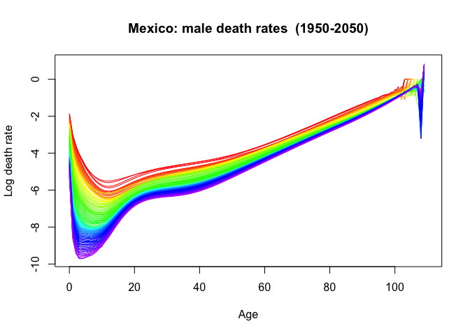

Práctica 13. Aplicaciones relacionadas a la demografía (IV)
================
Ana Escoto
14/01/2021

# Previo

## Paquetería

``` r
#install.packages("collapse")
if (!require("pacman")) install.packages("pacman") # instala pacman si se requiere
```

    ## Loading required package: pacman

``` r
pacman::p_load(tidyverse, 
               readxl,writexl, # importar hojas de cálculo
               haven, foreign, # importación de dta y sav
               janitor, skimr, #limpieza y verificación
               imputeTS, # para imputar valores
               esquisse, # para usar ggplot de manera más amigable
               demography) # para tabla de vida
```

## Directorio

En caso que no tengas un proyecto,establecer el directorio puede ayudar

``` r
rm(list=ls()) # mala práctica pero quizás necesaria porque vamos a cambiar de tema
setwd("/Users/anaescoto/Dropbox/2020/2021-1 R para Demográfos/repo/R_Demo")
```

# Construcción de la tabla de vida

Código para revisar algunos elementos de Mortalidad en México Parte de
este código está tomado de acá
<http://www.ub.edu/rfa/R/life_tables.html>

## Insumo 1. Población expuesta al riesgo

Nuestros denominadores es la población al 1 de julio, proyectada por
Conapo Contiene 1950-2050 para República Mexicana

La edad es singular Debemos llegar al formato de HMD para que el paquete
demography lo lea correctamente

### Importar desde CONAPO

Necesitamos para aproximarnos al tiempo vivido, la población a mitad del
año. Esto lo podemos importar con el siguiente código.

``` r
pob_1jul0 <- read_csv("https://github.com/aniuxa/R_Demo/raw/master/datos/pob_mit_proyecciones.csv",
                     locale = locale(encoding = "latin1"))
```

    ## 
    ## ── Column specification ────────────────────────────────────────────────────────
    ## cols(
    ##   RENGLON = col_double(),
    ##   AÑO = col_double(),
    ##   ENTIDAD = col_character(),
    ##   CVE_GEO = col_double(),
    ##   EDAD = col_double(),
    ##   SEXO = col_character(),
    ##   POBLACION = col_double()
    ## )

Vamos a limpiar los nombres

``` r
pob_1jul0<-clean_names(pob_1jul0) #limpia los nombres
```

### Dar formato a la información

Los siguientes códigos sirven para poner esta información en formado de
la HMD (por ejemplo: <http://www.ub.edu/rfa/R/Exposures_1x1SPAIN.txt> )

``` r
pob_1jul0<-pob_1jul0 %>% 
  select(-renglon) %>%  #quita la variable renglón
  filter(cve_geo==0) %>% # selecciona la República Mexicana, si se quiere otro estado se puede modificar
  select(-c(entidad,cve_geo)) # quita estas variables que no están en el formato

pob_1jul0
```

    ## # A tibble: 22,220 x 4
    ##      ano  edad sexo    poblacion
    ##    <dbl> <dbl> <chr>       <dbl>
    ##  1  1950     0 Hombres    572103
    ##  2  1950     0 Mujeres    559162
    ##  3  1950     1 Hombres    514540
    ##  4  1950     1 Mujeres    505269
    ##  5  1950     2 Hombres    478546
    ##  6  1950     2 Mujeres    469322
    ##  7  1950     3 Hombres    451932
    ##  8  1950     3 Mujeres    442707
    ##  9  1950     4 Hombres    430010
    ## 10  1950     4 Mujeres    420903
    ## # … with 22,210 more rows

Para parecerse más a nuestro formato, vamos usar un pivot\_wider:

``` r
pob_1jul_sex<-pob_1jul0 %>% 
  pivot_wider(names_from = sexo, values_from = poblacion) ## Ordena por sexo
pob_1jul_sex
```

    ## # A tibble: 11,110 x 4
    ##      ano  edad Hombres Mujeres
    ##    <dbl> <dbl>   <dbl>   <dbl>
    ##  1  1950     0  572103  559162
    ##  2  1950     1  514540  505269
    ##  3  1950     2  478546  469322
    ##  4  1950     3  451932  442707
    ##  5  1950     4  430010  420903
    ##  6  1950     5  411198  402293
    ##  7  1950     6  394520  385903
    ##  8  1950     7  379508  371222
    ##  9  1950     8  366786  358817
    ## 10  1950     9  355002  347353
    ## # … with 11,100 more rows

Nos faltan los totales:

``` r
pob_1jul_tot<-pob_1jul0 %>% 
  group_by(ano, edad) %>% 
  tally(poblacion) %>% 
  rename(Total=n) # genera el total

pob_1jul_tot
```

    ## # A tibble: 11,110 x 3
    ## # Groups:   ano [101]
    ##      ano  edad   Total
    ##    <dbl> <dbl>   <dbl>
    ##  1  1950     0 1131265
    ##  2  1950     1 1019809
    ##  3  1950     2  947868
    ##  4  1950     3  894639
    ##  5  1950     4  850913
    ##  6  1950     5  813491
    ##  7  1950     6  780423
    ##  8  1950     7  750730
    ##  9  1950     8  725603
    ## 10  1950     9  702355
    ## # … with 11,100 more rows

Juntamos y pues, renombramos

``` r
pob_1jul<-inner_join(pob_1jul_sex, pob_1jul_tot, by=c("ano", "edad")) # fusionamos los dos objetos 

names(pob_1jul)<-c( "Year",  "Age", "Male", "Female","Total") # ponemos los nombres
```

Podríamos haber hecho la suma, pero piensa que a veces hay no
especificados en sexo.

Un elemento fundamental del formato de HMD es que los datos existen
hasta la edad “110+”. El formato de CONAPO sólo tiene hasta 109. Por
ello tenemos que agregar estas líneas. De lo contario no se pueden
importar:

``` r
ages<-as.data.frame(1950:2050)
names(ages)<-"Year"
ages$Age<-110

ages
```

    ##     Year Age
    ## 1   1950 110
    ## 2   1951 110
    ## 3   1952 110
    ## 4   1953 110
    ## 5   1954 110
    ## 6   1955 110
    ## 7   1956 110
    ## 8   1957 110
    ## 9   1958 110
    ## 10  1959 110
    ## 11  1960 110
    ## 12  1961 110
    ## 13  1962 110
    ## 14  1963 110
    ## 15  1964 110
    ## 16  1965 110
    ## 17  1966 110
    ## 18  1967 110
    ## 19  1968 110
    ## 20  1969 110
    ## 21  1970 110
    ## 22  1971 110
    ## 23  1972 110
    ## 24  1973 110
    ## 25  1974 110
    ## 26  1975 110
    ## 27  1976 110
    ## 28  1977 110
    ## 29  1978 110
    ## 30  1979 110
    ## 31  1980 110
    ## 32  1981 110
    ## 33  1982 110
    ## 34  1983 110
    ## 35  1984 110
    ## 36  1985 110
    ## 37  1986 110
    ## 38  1987 110
    ## 39  1988 110
    ## 40  1989 110
    ## 41  1990 110
    ## 42  1991 110
    ## 43  1992 110
    ## 44  1993 110
    ## 45  1994 110
    ## 46  1995 110
    ## 47  1996 110
    ## 48  1997 110
    ## 49  1998 110
    ## 50  1999 110
    ## 51  2000 110
    ## 52  2001 110
    ## 53  2002 110
    ## 54  2003 110
    ## 55  2004 110
    ## 56  2005 110
    ## 57  2006 110
    ## 58  2007 110
    ## 59  2008 110
    ## 60  2009 110
    ## 61  2010 110
    ## 62  2011 110
    ## 63  2012 110
    ## 64  2013 110
    ## 65  2014 110
    ## 66  2015 110
    ## 67  2016 110
    ## 68  2017 110
    ## 69  2018 110
    ## 70  2019 110
    ## 71  2020 110
    ## 72  2021 110
    ## 73  2022 110
    ## 74  2023 110
    ## 75  2024 110
    ## 76  2025 110
    ## 77  2026 110
    ## 78  2027 110
    ## 79  2028 110
    ## 80  2029 110
    ## 81  2030 110
    ## 82  2031 110
    ## 83  2032 110
    ## 84  2033 110
    ## 85  2034 110
    ## 86  2035 110
    ## 87  2036 110
    ## 88  2037 110
    ## 89  2038 110
    ## 90  2039 110
    ## 91  2040 110
    ## 92  2041 110
    ## 93  2042 110
    ## 94  2043 110
    ## 95  2044 110
    ## 96  2045 110
    ## 97  2046 110
    ## 98  2047 110
    ## 99  2048 110
    ## 100 2049 110
    ## 101 2050 110

Hacemo un merge:

``` r
pob_1jul<-merge(pob_1jul, ages, by=c("Year","Age"), all=T)
```

Finalmente ordenamos la información:

``` r
col_order <- c( "Year",      "Age",     "Female", "Male",      "Total")
pob_1jul <- pob_1jul[, col_order]
pob_1jul <-pob_1jul[order(pob_1jul$Year,pob_1jul$Age),]

pob_1jul<-na_replace(pob_1jul, 0) # elimina los missings por ceros
```

## Archivo listo

Finalmente exportamos esto en un formado txt. Este archivo debe estar en
nuestro directorio de trabajo, o en nuestro proyecto.

``` r
write.table(pob_1jul, file = "exposure.txt", sep = "\t", row.names = F) # exporta el archivo en formato separados por tabs
```

Podemos borrar los objetos que ya no utilizamos

``` r
rm(pob_1jul_sex, pob_1jul_tot, pob_1jul0)
```

## Insumo 2 Numeradores - Muertes

### Importar desde Conapo

Al igual que con la población a mitad del año, vamos a importar las
defunciones. Es muy parecido así que seremos más escuetos con la
descripción:

``` r
defunciones0 <-read.csv("https://github.com/aniuxa/R_Demo/raw/master/datos/def_edad_proyecciones_n.csv")

defunciones0<-clean_names(defunciones0)
```

### Dar formato a la información

Los siguientes códigos sirven para poner esta información en formado de
la HMD (por ejemplo: <http://www.ub.edu/rfa/R/Mx_1x1SPAIN.txt>)

``` r
defunciones0<-defunciones0 %>% 
  select(-renglon) %>%  #quita la variable renglón
  filter(cve_geo==0) %>% # selecciona la República Mexicana, si se quiere otro estado se puede modificar
  select(-c(entidad,cve_geo)) # quita estas variables que no están en el formato

defunciones_sex<-defunciones0 %>% 
  pivot_wider(names_from = sexo, values_from = defunciones)

defunciones_tot<-defunciones0 %>% 
  group_by(ano, edad) %>% 
  tally(defunciones) %>% 
  rename(Total=n)

defunciones<-inner_join(defunciones_sex, defunciones_tot, by=c("ano", "edad"))
names(defunciones)<-c( "Year",  "Age", "Male", "Female","Total")
```

Finalmente ordenamos la información

``` r
defunciones<-merge(defunciones, ages, by=c("Year","Age"), all=T)
defunciones <- defunciones[, col_order]
defunciones <-defunciones[order(defunciones$Year,defunciones$Age),]

defunciones<-na_replace(defunciones, 0)

rm(defunciones_sex,defunciones_tot, defunciones0)
```

## Cálculo de mx

El segundo insumo nos pide las tasas de mortalidad. Por lo que podemos
calcularlas haciendo la división entre nuestros objetos (de ahí que se
muy importante haberlo ordenado bien)

``` r
mx_mex<-defunciones[,3:5]/pob_1jul[,3:5]
mx_mex<-cbind(defunciones[,1:2], mx_mex)

mx_mex<-na_replace(mx_mex,0)
write.table(mx_mex, file = "mx.txt", sep = "\t", row.names = F)
```

# Leyendo desde demography

Una vez que ya tenemos listos nuestros dos archivos de insumos, podemos
leer esta información con el comando read.demogdata().

Revisemos los argumentos:

``` r
mex<-read.demogdata("mx.txt",
                    "exposure.txt",
                    type="mortality",
                    label="Mexico",
                    skip=0,
                    popskip = 0, 
                    scale=1) 
```

Una vez que ya tenemos este objeto, podemos utilizarlo fácilmente en
distintos comandos del paquete. Revisaremos un par

## Gráfico de las tasasde mortalidad por sexo

``` r
plot(mex,series="Male", plot.type="functions")
```

<!-- -->

``` r
plot(mex,series="Female", plot.type="functions")
```

<!-- -->

## Creando y graficando Tabla de vida

El paquete, calcula la tabla de vida:

``` r
mex.ltM <- lifetable(mex, series="male")

lt2000male <- print(lifetable(mex, series="male",year=2000))
```

    ## Period lifetable for Mexico : male 
    ## 
    ## Year: 2000 
    ##         mx     qx     lx     dx     Lx      Tx      ex
    ## 0   0.0254 0.0249 1.0000 0.0249 0.9779 72.0458 72.0458
    ## 1   0.0017 0.0017 0.9751 0.0016 0.9743 71.0678 72.8803
    ## 2   0.0008 0.0008 0.9735 0.0008 0.9731 70.0935 72.0024
    ## 3   0.0006 0.0006 0.9727 0.0006 0.9724 69.1204 71.0627
    ## 4   0.0005 0.0005 0.9721 0.0005 0.9719 68.1481 70.1036
    ## 5   0.0004 0.0004 0.9716 0.0004 0.9714 67.1762 69.1369
    ## 6   0.0004 0.0004 0.9713 0.0004 0.9711 66.2047 68.1640
    ## 7   0.0004 0.0004 0.9709 0.0003 0.9707 65.2337 67.1887
    ## 8   0.0004 0.0004 0.9706 0.0003 0.9704 64.2629 66.2122
    ## 9   0.0004 0.0004 0.9702 0.0003 0.9700 63.2925 65.2352
    ## 10  0.0004 0.0004 0.9699 0.0004 0.9697 62.3225 64.2586
    ## 11  0.0004 0.0004 0.9695 0.0004 0.9693 61.3528 63.2828
    ## 12  0.0005 0.0005 0.9691 0.0004 0.9689 60.3835 62.3088
    ## 13  0.0005 0.0005 0.9687 0.0005 0.9684 59.4146 61.3374
    ## 14  0.0006 0.0006 0.9681 0.0006 0.9678 58.4462 60.3697
    ## 15  0.0007 0.0007 0.9675 0.0007 0.9672 57.4784 59.4067
    ## 16  0.0008 0.0008 0.9668 0.0008 0.9664 56.5112 58.4495
    ## 17  0.0010 0.0010 0.9660 0.0009 0.9655 55.5448 57.4985
    ## 18  0.0011 0.0011 0.9651 0.0011 0.9645 54.5792 56.5544
    ## 19  0.0013 0.0013 0.9640 0.0012 0.9634 53.6147 55.6174
    ## 20  0.0014 0.0014 0.9628 0.0014 0.9621 52.6513 54.6872
    ## 21  0.0015 0.0015 0.9614 0.0015 0.9607 51.6892 53.7636
    ## 22  0.0017 0.0017 0.9599 0.0016 0.9591 50.7285 52.8460
    ## 23  0.0018 0.0018 0.9583 0.0017 0.9575 49.7694 51.9337
    ## 24  0.0019 0.0019 0.9566 0.0018 0.9557 48.8119 51.0262
    ## 25  0.0020 0.0020 0.9548 0.0019 0.9538 47.8563 50.1225
    ## 26  0.0021 0.0021 0.9529 0.0020 0.9519 46.9024 49.2220
    ## 27  0.0022 0.0022 0.9509 0.0021 0.9498 45.9505 48.3241
    ## 28  0.0023 0.0023 0.9488 0.0021 0.9477 45.0007 47.4283
    ## 29  0.0023 0.0023 0.9467 0.0022 0.9456 44.0529 46.5342
    ## 30  0.0024 0.0024 0.9445 0.0023 0.9433 43.1074 45.6413
    ## 31  0.0025 0.0025 0.9422 0.0023 0.9411 42.1640 44.7497
    ## 32  0.0025 0.0025 0.9399 0.0024 0.9387 41.2230 43.8592
    ## 33  0.0026 0.0026 0.9375 0.0025 0.9363 40.2843 42.9699
    ## 34  0.0027 0.0027 0.9350 0.0025 0.9338 39.3480 42.0818
    ## 35  0.0028 0.0028 0.9325 0.0026 0.9312 38.4142 41.1951
    ## 36  0.0029 0.0029 0.9299 0.0027 0.9285 37.4830 40.3102
    ## 37  0.0031 0.0031 0.9271 0.0028 0.9257 36.5545 39.4272
    ## 38  0.0032 0.0032 0.9243 0.0030 0.9228 35.6288 38.5467
    ## 39  0.0034 0.0034 0.9213 0.0031 0.9198 34.7060 37.6688
    ## 40  0.0035 0.0035 0.9182 0.0032 0.9166 33.7862 36.7942
    ## 41  0.0037 0.0037 0.9150 0.0034 0.9133 32.8696 35.9230
    ## 42  0.0040 0.0040 0.9116 0.0036 0.9098 31.9563 35.0559
    ## 43  0.0042 0.0042 0.9080 0.0038 0.9061 31.0465 34.1932
    ## 44  0.0045 0.0045 0.9042 0.0040 0.9021 30.1404 33.3354
    ## 45  0.0048 0.0048 0.9001 0.0043 0.8980 29.2383 32.4828
    ## 46  0.0051 0.0051 0.8958 0.0046 0.8935 28.3403 31.6361
    ## 47  0.0055 0.0054 0.8913 0.0049 0.8888 27.4468 30.7955
    ## 48  0.0059 0.0058 0.8864 0.0052 0.8838 26.5580 29.9615
    ## 49  0.0063 0.0063 0.8812 0.0055 0.8785 25.6741 29.1345
    ## 50  0.0067 0.0067 0.8757 0.0059 0.8728 24.7957 28.3150
    ## 51  0.0073 0.0072 0.8698 0.0063 0.8667 23.9229 27.5033
    ## 52  0.0078 0.0078 0.8635 0.0067 0.8602 23.0562 26.6999
    ## 53  0.0084 0.0084 0.8568 0.0072 0.8532 22.1961 25.9051
    ## 54  0.0090 0.0090 0.8497 0.0077 0.8458 21.3428 25.1194
    ## 55  0.0097 0.0097 0.8420 0.0082 0.8379 20.4970 24.3432
    ## 56  0.0105 0.0105 0.8338 0.0087 0.8295 19.6591 23.5767
    ## 57  0.0113 0.0113 0.8251 0.0093 0.8205 18.8296 22.8204
    ## 58  0.0122 0.0121 0.8158 0.0099 0.8109 18.0091 22.0746
    ## 59  0.0132 0.0131 0.8059 0.0105 0.8007 17.1982 21.3398
    ## 60  0.0142 0.0141 0.7954 0.0112 0.7898 16.3976 20.6161
    ## 61  0.0153 0.0152 0.7842 0.0119 0.7782 15.6078 19.9040
    ## 62  0.0165 0.0164 0.7722 0.0127 0.7659 14.8296 19.2038
    ## 63  0.0179 0.0177 0.7596 0.0134 0.7528 14.0638 18.5158
    ## 64  0.0193 0.0191 0.7461 0.0142 0.7390 13.3109 17.8403
    ## 65  0.0208 0.0206 0.7319 0.0151 0.7244 12.5719 17.1775
    ## 66  0.0224 0.0222 0.7168 0.0159 0.7089 11.8476 16.5278
    ## 67  0.0242 0.0239 0.7009 0.0168 0.6925 11.1387 15.8913
    ## 68  0.0261 0.0258 0.6842 0.0176 0.6754 10.4461 15.2684
    ## 69  0.0282 0.0278 0.6665 0.0185 0.6573  9.7708 14.6591
    ## 70  0.0304 0.0299 0.6480 0.0194 0.6383  9.1135 14.0638
    ## 71  0.0328 0.0323 0.6286 0.0203 0.6185  8.4752 13.4824
    ## 72  0.0354 0.0348 0.6083 0.0211 0.5978  7.8567 12.9152
    ## 73  0.0382 0.0374 0.5872 0.0220 0.5762  7.2590 12.3622
    ## 74  0.0412 0.0403 0.5652 0.0228 0.5538  6.6828 11.8236
    ## 75  0.0444 0.0434 0.5424 0.0235 0.5306  6.1290 11.2994
    ## 76  0.0478 0.0467 0.5189 0.0242 0.5067  5.5983 10.7895
    ## 77  0.0516 0.0503 0.4946 0.0249 0.4822  5.0916 10.2939
    ## 78  0.0556 0.0541 0.4697 0.0254 0.4570  4.6094  9.8127
    ## 79  0.0599 0.0582 0.4443 0.0259 0.4314  4.1524  9.3455
    ## 80  0.0646 0.0626 0.4185 0.0262 0.4054  3.7210  8.8920
    ## 81  0.0696 0.0673 0.3923 0.0264 0.3791  3.3156  8.4523
    ## 82  0.0750 0.0723 0.3659 0.0264 0.3527  2.9365  8.0258
    ## 83  0.0808 0.0776 0.3394 0.0263 0.3263  2.5839  7.6120
    ## 84  0.0869 0.0833 0.3131 0.0261 0.3001  2.2576  7.2105
    ## 85  0.0938 0.0896 0.2870 0.0257 0.2742  1.9575  6.8205
    ## 86  0.1013 0.0964 0.2613 0.0252 0.2487  1.6834  6.4424
    ## 87  0.1095 0.1039 0.2361 0.0245 0.2239  1.4347  6.0763
    ## 88  0.1186 0.1120 0.2116 0.0237 0.1997  1.2108  5.7226
    ## 89  0.1287 0.1209 0.1879 0.0227 0.1765  1.0111  5.3812
    ## 90  0.1398 0.1307 0.1652 0.0216 0.1544  0.8346  5.0526
    ## 91  0.1521 0.1413 0.1436 0.0203 0.1334  0.6802  4.7369
    ## 92  0.1657 0.1530 0.1233 0.0189 0.1139  0.5467  4.4343
    ## 93  0.1807 0.1657 0.1044 0.0173 0.0958  0.4329  4.1450
    ## 94  0.1975 0.1797 0.0871 0.0157 0.0793  0.3371  3.8689
    ## 95  0.2159 0.1949 0.0715 0.0139 0.0645  0.2578  3.6070
    ## 96  0.2367 0.2117 0.0575 0.0122 0.0514  0.1933  3.3592
    ## 97  0.2596 0.2298 0.0454 0.0104 0.0401  0.1418  3.1269
    ## 98  0.2852 0.2496 0.0349 0.0087 0.0306  0.1017  2.9105
    ## 99  0.3129 0.2705 0.0262 0.0071 0.0227  0.0711  2.7123
    ## 100 0.3948 1.0000 0.0191 0.0191 0.0484  0.0484  2.5328

``` r
lt2000male
```

    ## $`2000`
    ##               mx           qx         lx           dx         Lx          Tx
    ## 0   0.0254296185 0.0248688353 1.00000000 0.0248688353 0.97794764 72.04578462
    ## 1   0.0016850551 0.0016836366 0.97513116 0.0016417665 0.97431028 71.06783698
    ## 2   0.0008441912 0.0008438350 0.97348940 0.0008214645 0.97307867 70.09352670
    ## 3   0.0005787986 0.0005786312 0.97266793 0.0005628160 0.97238653 69.12044803
    ## 4   0.0004781651 0.0004780508 0.97210512 0.0004647156 0.97187276 68.14806151
    ## 5   0.0003944365 0.0003943587 0.97164040 0.0003831748 0.97144881 67.17618875
    ## 6   0.0003649263 0.0003648597 0.97125723 0.0003543726 0.97108004 66.20473993
    ## 7   0.0003527407 0.0003526785 0.97090285 0.0003424165 0.97073165 65.23365989
    ## 8   0.0003507605 0.0003506990 0.97056044 0.0003403746 0.97039025 64.26292824
    ## 9   0.0003601968 0.0003601320 0.97022006 0.0003494073 0.97004536 63.29253799
    ## 10  0.0003799046 0.0003798325 0.96987066 0.0003683884 0.96968646 62.32249263
    ## 11  0.0004135281 0.0004134426 0.96950227 0.0004008335 0.96930185 61.35280617
    ## 12  0.0004626282 0.0004625212 0.96910143 0.0004482299 0.96887732 60.38350432
    ## 13  0.0005313703 0.0005312292 0.96865320 0.0005145769 0.96839592 59.41462700
    ## 14  0.0006185410 0.0006183498 0.96813863 0.0005986483 0.96783930 58.44623108
    ## 15  0.0007251510 0.0007248882 0.96753998 0.0007013583 0.96718930 57.47839178
    ## 16  0.0008463777 0.0008460196 0.96683862 0.0008179645 0.96642964 56.51120248
    ## 17  0.0009803632 0.0009798829 0.96602066 0.0009465871 0.96554736 55.54477284
    ## 18  0.0011219664 0.0011213373 0.96507407 0.0010821736 0.96453298 54.57922548
    ## 19  0.0012659516 0.0012651508 0.96399190 0.0012195951 0.96338210 53.61469250
    ## 20  0.0014084522 0.0014074611 0.96277230 0.0013550645 0.96209477 52.65131040
    ## 21  0.0015456465 0.0015444529 0.96141724 0.0014848637 0.96067480 51.68921563
    ## 22  0.0016757807 0.0016743777 0.95993237 0.0016072894 0.95912873 50.72854083
    ## 23  0.0017954149 0.0017938046 0.95832508 0.0017190480 0.95746556 49.76941210
    ## 24  0.0019044928 0.0019026810 0.95660604 0.0018201161 0.95569598 48.81194654
    ## 25  0.0020036740 0.0020016686 0.95478592 0.0019111650 0.95383034 47.85625056
    ## 26  0.0020937722 0.0020915825 0.95287475 0.0019930162 0.95187825 46.90242022
    ## 27  0.0021759065 0.0021735418 0.95088174 0.0020667812 0.94984835 45.95054198
    ## 28  0.0022529121 0.0022503772 0.94881496 0.0021351915 0.94774736 45.00069363
    ## 29  0.0023257151 0.0023230137 0.94667977 0.0021991501 0.94558019 44.05294627
    ## 30  0.0023976729 0.0023948019 0.94448062 0.0022618440 0.94334969 43.10736608
    ## 31  0.0024720030 0.0024689514 0.94221877 0.0023262924 0.94105562 42.16401639
    ## 32  0.0025482773 0.0025450346 0.93989248 0.0023920589 0.93869645 41.22296076
    ## 33  0.0026315152 0.0026280573 0.93750042 0.0024638048 0.93626852 40.28426431
    ## 34  0.0027220677 0.0027183679 0.93503662 0.0025417735 0.93376573 39.34799580
    ## 35  0.0028237989 0.0028198176 0.93249484 0.0026294653 0.93118011 38.41423007
    ## 36  0.0029361136 0.0029318095 0.92986538 0.0027261882 0.92850228 37.48304996
    ## 37  0.0030626773 0.0030579944 0.92713919 0.0028351865 0.92572159 36.55454768
    ## 38  0.0032063602 0.0032012280 0.92430400 0.0029589079 0.92282455 35.62882608
    ## 39  0.0033658615 0.0033602065 0.92134509 0.0030959098 0.91979714 34.70600153
    ## 40  0.0035444069 0.0035381366 0.91824918 0.0032488910 0.91662474 33.78620440
    ## 41  0.0037435521 0.0037365581 0.91500029 0.0034189518 0.91329082 32.86957966
    ## 42  0.0039656525 0.0039578048 0.91158134 0.0036078610 0.90977741 31.95628884
    ## 43  0.0042103349 0.0042014900 0.90797348 0.0038148415 0.90606606 31.04651143
    ## 44  0.0044817661 0.0044717454 0.90415864 0.0040431673 0.90213705 30.14044537
    ## 45  0.0047799700 0.0047685732 0.90011547 0.0042922665 0.89796934 29.23830831
    ## 46  0.0051065664 0.0050935611 0.89582320 0.0045629302 0.89354174 28.34033898
    ## 47  0.0054642727 0.0054493842 0.89126027 0.0048568197 0.88883186 27.44679724
    ## 48  0.0058553691 0.0058382765 0.88640345 0.0051750685 0.88381592 26.55796537
    ## 49  0.0062834425 0.0062637635 0.88122839 0.0055198062 0.87846848 25.67414945
    ## 50  0.0067467900 0.0067241069 0.87570858 0.0058883581 0.87276440 24.79568097
    ## 51  0.0072533946 0.0072271838 0.86982022 0.0062863506 0.86667705 23.92291657
    ## 52  0.0078043501 0.0077740145 0.86353387 0.0067131249 0.86017731 23.05623952
    ## 53  0.0083981826 0.0083630654 0.85682075 0.0071656479 0.85323792 22.19606221
    ## 54  0.0090477803 0.0090070335 0.84965510 0.0076528719 0.84582866 21.34282429
    ## 55  0.0097464078 0.0096991419 0.84200223 0.0081666991 0.83791888 20.49699563
    ## 56  0.0105050549 0.0104501651 0.83383553 0.0087137189 0.82947867 19.65907675
    ## 57  0.0113270251 0.0112632356 0.82512181 0.0092935413 0.82047504 18.82959808
    ## 58  0.0122137824 0.0121396469 0.81582827 0.0099038671 0.81087633 18.00912304
    ## 59  0.0131726664 0.0130864745 0.80592440 0.0105467091 0.80065105 17.19824671
    ## 60  0.0142111705 0.0141109043 0.79537769 0.0112234985 0.78976594 16.39759566
    ## 61  0.0153309225 0.0152142979 0.78415419 0.0119303555 0.77818901 15.60782972
    ## 62  0.0165445790 0.0164088403 0.77222384 0.0126712976 0.76588819 14.82964071
    ## 63  0.0178508386 0.0176929218 0.75955254 0.0134387037 0.75283319 14.06375252
    ## 64  0.0192592980 0.0190756066 0.74611384 0.0142325740 0.73899755 13.31091933
    ## 65  0.0207847377 0.0205709568 0.73188126 0.0150554978 0.72435351 12.57192178
    ## 66  0.0224258194 0.0221771490 0.71682576 0.0158971518 0.70887719 11.84756827
    ## 67  0.0242021196 0.0239127500 0.70092861 0.0167611307 0.69254805 11.13869108
    ## 68  0.0261119688 0.0257754450 0.68416748 0.0176347213 0.67535012 10.44614303
    ## 69  0.0281741725 0.0277827939 0.66653276 0.0185181423 0.65727369  9.77079291
    ## 70  0.0303969372 0.0299418667 0.64801462 0.0194027673 0.63831323  9.11351922
    ## 71  0.0327887918 0.0322599101 0.62861185 0.0202789618 0.61847237  8.47520599
    ## 72  0.0353692921 0.0347546681 0.60833289 0.0211424077 0.59776169  7.85673362
    ## 73  0.0381578236 0.0374434434 0.58719048 0.0219864336 0.57619726  7.25897193
    ## 74  0.0411514986 0.0403218464 0.56520405 0.0227900708 0.55380901  6.68277467
    ## 75  0.0443758421 0.0434126066 0.54241398 0.0235476046 0.53064017  6.12896566
    ## 76  0.0478492137 0.0467311884 0.51886637 0.0242472422 0.50674275  5.59832548
    ## 77  0.0515980172 0.0503003189 0.49461913 0.0248795000 0.48217938  5.09158273
    ## 78  0.0556192500 0.0541143502 0.46973963 0.0254196549 0.45702980  4.60940335
    ## 79  0.0599397964 0.0581956779 0.44431998 0.0258575022 0.43139122  4.15237355
    ## 80  0.0646088824 0.0625870430 0.41846247 0.0261903288 0.40536731  3.72098232
    ## 81  0.0695974967 0.0672570361 0.39227214 0.0263830618 0.37908061  3.31561501
    ## 82  0.0749824807 0.0722728808 0.36588908 0.0264438580 0.35266715  2.93653440
    ## 83  0.0807558010 0.0776216036 0.33944522 0.0263482827 0.32627108  2.58386725
    ## 84  0.0869430867 0.0833209945 0.31309694 0.0260875486 0.30005317  2.25759616
    ## 85  0.0937899719 0.0895887105 0.28700939 0.0257128015 0.27415299  1.95754300
    ## 86  0.1012681358 0.0963876376 0.26129659 0.0251857612 0.24870371  1.68339000
    ## 87  0.1095424177 0.1038541978 0.23611083 0.0245211009 0.22385028  1.43468629
    ## 88  0.1186358100 0.1119926411 0.21158973 0.0236964927 0.19974148  1.21083601
    ## 89  0.1286896945 0.1209097736 0.18789324 0.0227181288 0.17653417  1.01109453
    ## 90  0.1398075359 0.1306730008 0.16517511 0.0215839271 0.15438314  0.83456036
    ## 91  0.1520940485 0.1413451690 0.14359118 0.0202959198 0.13344322  0.68017721
    ## 92  0.1656668666 0.1529938599 0.12329526 0.0188634180 0.11386355  0.54673399
    ## 93  0.1806523904 0.1656865544 0.10443184 0.0173029523 0.09578037  0.43287044
    ## 94  0.1974743489 0.1797284678 0.08712889 0.0156595421 0.07929912  0.33709007
    ## 95  0.2159461664 0.1949019969 0.07146935 0.0139295189 0.06450459  0.25779095
    ## 96  0.2367357932 0.2116797110 0.05753983 0.0121800146 0.05144982  0.19328636
    ## 97  0.2595698141 0.2297515328 0.04535982 0.0104214872 0.04014907  0.14183654
    ## 98  0.2852058973 0.2496106785 0.03493833 0.0087209799 0.03057784  0.10168747
    ## 99  0.3128654971 0.2705436157 0.02621735 0.0070929363 0.02267088  0.07110963
    ## 100 0.3948164147 1.0000000000 0.01912441 0.0191244123 0.04843875  0.04843875
    ##            ex
    ## 0   72.045785
    ## 1   72.880285
    ## 2   72.002352
    ## 3   71.062740
    ## 4   70.103593
    ## 5   69.136883
    ## 6   68.163961
    ## 7   67.188658
    ## 8   66.212186
    ## 9   65.235239
    ## 10  64.258561
    ## 11  63.282788
    ## 12  62.308755
    ## 13  61.337357
    ## 14  60.369692
    ## 15  59.406736
    ## 16  58.449467
    ## 17  57.498535
    ## 18  56.554442
    ## 19  55.617368
    ## 20  54.687189
    ## 21  53.763562
    ## 22  52.845953
    ## 23  51.933747
    ## 24  51.026175
    ## 25  50.122493
    ## 26  49.222020
    ## 27  48.324140
    ## 28  47.428314
    ## 29  46.534159
    ## 30  45.641346
    ## 31  44.749710
    ## 32  43.859230
    ## 33  42.969863
    ## 34  42.081770
    ## 35  41.195113
    ## 36  40.310190
    ## 37  39.427249
    ## 38  38.546654
    ## 39  37.668841
    ## 40  36.794157
    ## 41  35.923026
    ## 42  35.055883
    ## 43  34.193192
    ## 44  33.335351
    ## 45  32.482842
    ## 46  31.636085
    ## 47  30.795490
    ## 48  29.961487
    ## 49  29.134501
    ## 50  28.314991
    ## 51  27.503289
    ## 52  26.699867
    ## 53  25.905141
    ## 54  25.119398
    ## 55  24.343161
    ## 56  23.576684
    ## 57  22.820386
    ## 58  22.074649
    ## 59  21.339777
    ## 60  20.616112
    ## 61  19.904031
    ## 62  19.203811
    ## 63  18.515839
    ## 64  17.840333
    ## 65  17.177543
    ## 66  16.527821
    ## 67  15.891335
    ## 68  15.268400
    ## 69  14.659134
    ## 70  14.063756
    ## 71  13.482415
    ## 72  12.915188
    ## 73  12.362210
    ## 74  11.823650
    ## 75  11.299424
    ## 76  10.789532
    ## 77  10.293946
    ## 78   9.812677
    ## 79   9.345458
    ## 80   8.892033
    ## 81   8.452334
    ## 82   8.025750
    ## 83   7.612030
    ## 84   7.210534
    ## 85   6.820484
    ## 86   6.442449
    ## 87   6.076326
    ## 88   5.722565
    ## 89   5.381218
    ## 90   5.052579
    ## 91   4.736901
    ## 92   4.434347
    ## 93   4.145004
    ## 94   3.868867
    ## 95   3.607014
    ## 96   3.359175
    ## 97   3.126921
    ## 98   2.910485
    ## 99   2.712312
    ## 100  2.532823

``` r
lt2000female <- print(lifetable(mex, series="female",year=2000))
```

    ## Period lifetable for Mexico : female 
    ## 
    ## Year: 2000 
    ##         mx     qx     lx     dx     Lx      Tx      ex
    ## 0   0.0205 0.0201 1.0000 0.0201 0.9821 77.4163 77.4163
    ## 1   0.0014 0.0014 0.9799 0.0014 0.9792 76.4342 78.0033
    ## 2   0.0008 0.0008 0.9785 0.0008 0.9781 75.4550 77.1134
    ## 3   0.0005 0.0005 0.9777 0.0005 0.9775 74.4769 76.1728
    ## 4   0.0004 0.0004 0.9772 0.0004 0.9770 73.4995 75.2136
    ## 5   0.0003 0.0003 0.9768 0.0003 0.9766 72.5224 74.2454
    ## 6   0.0003 0.0003 0.9765 0.0003 0.9763 71.5458 73.2701
    ## 7   0.0003 0.0003 0.9762 0.0003 0.9761 70.5695 72.2914
    ## 8   0.0002 0.0002 0.9759 0.0002 0.9758 69.5934 71.3103
    ## 9   0.0002 0.0002 0.9757 0.0002 0.9756 68.6176 70.3279
    ## 10  0.0002 0.0002 0.9754 0.0002 0.9753 67.6421 69.3446
    ## 11  0.0003 0.0003 0.9752 0.0002 0.9751 66.6667 68.3612
    ## 12  0.0003 0.0003 0.9750 0.0003 0.9748 65.6917 67.3782
    ## 13  0.0003 0.0003 0.9747 0.0003 0.9746 64.7168 66.3965
    ## 14  0.0003 0.0003 0.9744 0.0003 0.9742 63.7423 65.4163
    ## 15  0.0004 0.0004 0.9741 0.0004 0.9739 62.7680 64.4380
    ## 16  0.0004 0.0004 0.9737 0.0004 0.9735 61.7941 63.4617
    ## 17  0.0004 0.0004 0.9733 0.0004 0.9731 60.8206 62.4872
    ## 18  0.0005 0.0005 0.9729 0.0005 0.9727 59.8475 61.5143
    ## 19  0.0005 0.0005 0.9725 0.0005 0.9722 58.8748 60.5427
    ## 20  0.0005 0.0005 0.9720 0.0005 0.9717 57.9026 59.5721
    ## 21  0.0005 0.0005 0.9715 0.0005 0.9712 56.9309 58.6021
    ## 22  0.0005 0.0005 0.9710 0.0005 0.9707 55.9596 57.6326
    ## 23  0.0006 0.0006 0.9704 0.0005 0.9702 54.9889 56.6634
    ## 24  0.0006 0.0006 0.9699 0.0006 0.9696 54.0187 55.6945
    ## 25  0.0006 0.0006 0.9694 0.0006 0.9691 53.0491 54.7258
    ## 26  0.0006 0.0006 0.9688 0.0006 0.9685 52.0800 53.7576
    ## 27  0.0006 0.0006 0.9682 0.0006 0.9679 51.1115 52.7899
    ## 28  0.0007 0.0007 0.9676 0.0006 0.9673 50.1436 51.8228
    ## 29  0.0007 0.0007 0.9670 0.0007 0.9666 49.1763 50.8567
    ## 30  0.0007 0.0007 0.9663 0.0007 0.9659 48.2097 49.8918
    ## 31  0.0008 0.0008 0.9656 0.0008 0.9652 47.2438 48.9282
    ## 32  0.0008 0.0008 0.9648 0.0008 0.9644 46.2786 47.9662
    ## 33  0.0009 0.0009 0.9640 0.0009 0.9636 45.3142 47.0061
    ## 34  0.0010 0.0010 0.9631 0.0009 0.9627 44.3506 46.0481
    ## 35  0.0011 0.0011 0.9622 0.0010 0.9617 43.3879 45.0924
    ## 36  0.0011 0.0011 0.9612 0.0011 0.9606 42.4262 44.1393
    ## 37  0.0012 0.0012 0.9601 0.0012 0.9595 41.4656 43.1890
    ## 38  0.0013 0.0013 0.9589 0.0013 0.9583 40.5061 42.2418
    ## 39  0.0015 0.0015 0.9576 0.0014 0.9569 39.5478 41.2979
    ## 40  0.0016 0.0016 0.9562 0.0015 0.9555 38.5909 40.3576
    ## 41  0.0017 0.0017 0.9547 0.0017 0.9539 37.6354 39.4212
    ## 42  0.0019 0.0019 0.9530 0.0018 0.9521 36.6816 38.4887
    ## 43  0.0021 0.0021 0.9512 0.0020 0.9503 35.7294 37.5607
    ## 44  0.0023 0.0023 0.9493 0.0021 0.9482 34.7792 36.6373
    ## 45  0.0025 0.0025 0.9471 0.0023 0.9460 33.8309 35.7189
    ## 46  0.0027 0.0027 0.9448 0.0025 0.9435 32.8850 34.8057
    ## 47  0.0029 0.0029 0.9423 0.0028 0.9409 31.9414 33.8980
    ## 48  0.0032 0.0032 0.9395 0.0030 0.9380 31.0005 32.9962
    ## 49  0.0035 0.0035 0.9365 0.0033 0.9349 30.0625 32.1006
    ## 50  0.0038 0.0038 0.9332 0.0036 0.9315 29.1276 31.2115
    ## 51  0.0042 0.0042 0.9297 0.0039 0.9277 28.1962 30.3293
    ## 52  0.0046 0.0046 0.9258 0.0042 0.9237 27.2685 29.4543
    ## 53  0.0050 0.0050 0.9216 0.0046 0.9193 26.3448 28.5869
    ## 54  0.0055 0.0054 0.9170 0.0050 0.9145 25.4255 27.7275
    ## 55  0.0060 0.0059 0.9120 0.0054 0.9093 24.5110 26.8765
    ## 56  0.0065 0.0065 0.9066 0.0059 0.9036 23.6017 26.0343
    ## 57  0.0071 0.0071 0.9007 0.0064 0.8975 22.6981 25.2012
    ## 58  0.0078 0.0078 0.8943 0.0069 0.8908 21.8006 24.3778
    ## 59  0.0085 0.0085 0.8873 0.0075 0.8836 20.9098 23.5644
    ## 60  0.0093 0.0092 0.8798 0.0081 0.8758 20.0262 22.7613
    ## 61  0.0102 0.0101 0.8717 0.0088 0.8673 19.1505 21.9691
    ## 62  0.0111 0.0110 0.8629 0.0095 0.8581 18.2832 21.1883
    ## 63  0.0121 0.0121 0.8534 0.0103 0.8482 17.4250 20.4191
    ## 64  0.0132 0.0132 0.8431 0.0111 0.8375 16.5768 19.6621
    ## 65  0.0145 0.0144 0.8320 0.0120 0.8260 15.7393 18.9176
    ## 66  0.0158 0.0157 0.8200 0.0129 0.8136 14.9133 18.1862
    ## 67  0.0173 0.0171 0.8072 0.0138 0.8003 14.0997 17.4681
    ## 68  0.0189 0.0187 0.7933 0.0148 0.7859 13.2994 16.7638
    ## 69  0.0206 0.0204 0.7785 0.0159 0.7706 12.5135 16.0736
    ## 70  0.0225 0.0223 0.7626 0.0170 0.7541 11.7429 15.3979
    ## 71  0.0246 0.0243 0.7457 0.0181 0.7366 10.9888 14.7371
    ## 72  0.0269 0.0265 0.7275 0.0193 0.7179 10.2522 14.0916
    ## 73  0.0293 0.0289 0.7083 0.0205 0.6980  9.5343 13.4615
    ## 74  0.0320 0.0315 0.6878 0.0217 0.6770  8.8362 12.8471
    ## 75  0.0349 0.0343 0.6661 0.0229 0.6547  8.1593 12.2487
    ## 76  0.0381 0.0374 0.6433 0.0241 0.6312  7.5046 11.6666
    ## 77  0.0416 0.0408 0.6192 0.0253 0.6066  6.8734 11.1008
    ## 78  0.0454 0.0444 0.5939 0.0264 0.5807  6.2668 10.5515
    ## 79  0.0496 0.0484 0.5675 0.0274 0.5538  5.6861 10.0187
    ## 80  0.0540 0.0526 0.5401 0.0284 0.5259  5.1323  9.5023
    ## 81  0.0589 0.0573 0.5117 0.0293 0.4970  4.6064  9.0024
    ## 82  0.0643 0.0623 0.4824 0.0300 0.4674  4.1093  8.5188
    ## 83  0.0700 0.0677 0.4524 0.0306 0.4370  3.6420  8.0511
    ## 84  0.0763 0.0735 0.4217 0.0310 0.4062  3.2049  7.5993
    ## 85  0.0832 0.0799 0.3907 0.0312 0.3751  2.7987  7.1626
    ## 86  0.0909 0.0869 0.3595 0.0313 0.3439  2.4236  6.7413
    ## 87  0.0994 0.0947 0.3282 0.0311 0.3127  2.0797  6.3357
    ## 88  0.1087 0.1031 0.2972 0.0306 0.2819  1.7670  5.9458
    ## 89  0.1190 0.1123 0.2665 0.0299 0.2516  1.4851  5.5716
    ## 90  0.1304 0.1224 0.2366 0.0290 0.2221  1.2335  5.2134
    ## 91  0.1431 0.1335 0.2076 0.0277 0.1938  1.0114  4.8709
    ## 92  0.1571 0.1457 0.1799 0.0262 0.1668  0.8176  4.5444
    ## 93  0.1727 0.1590 0.1537 0.0244 0.1415  0.6508  4.2340
    ## 94  0.1899 0.1735 0.1293 0.0224 0.1181  0.5093  3.9397
    ## 95  0.2092 0.1894 0.1068 0.0202 0.0967  0.3913  3.6617
    ## 96  0.2303 0.2065 0.0866 0.0179 0.0777  0.2945  3.4003
    ## 97  0.2543 0.2256 0.0687 0.0155 0.0610  0.2168  3.1552
    ## 98  0.2805 0.2460 0.0532 0.0131 0.0467  0.1559  2.9287
    ## 99  0.3098 0.2683 0.0401 0.0108 0.0347  0.1092  2.7211
    ## 100 0.3944 1.0000 0.0294 0.0294 0.0744  0.0744  2.5353

``` r
lt2000female
```

    ## $`2000`
    ##               mx           qx         lx           dx         Lx          Tx
    ## 0   0.0204821053 0.0201155614 1.00000000 0.0201155614 0.98210419 77.41633224
    ## 1   0.0014200859 0.0014190783 0.97988444 0.0013905328 0.97918917 76.43422805
    ## 2   0.0007744811 0.0007741813 0.97849391 0.0007575317 0.97811514 75.45503888
    ## 3   0.0005389734 0.0005388282 0.97773637 0.0005268319 0.97747296 74.47692374
    ## 4   0.0004250616 0.0004249712 0.97720954 0.0004152859 0.97700190 73.49945078
    ## 5   0.0003351679 0.0003351117 0.97679426 0.0003273352 0.97663059 72.52244888
    ## 6   0.0002926079 0.0002925651 0.97646692 0.0002856802 0.97632408 71.54581830
    ## 7   0.0002640796 0.0002640447 0.97618124 0.0002577555 0.97605236 70.56949422
    ## 8   0.0002473663 0.0002473357 0.97592349 0.0002413807 0.97580280 69.59344185
    ## 9   0.0002390811 0.0002390526 0.97568210 0.0002332393 0.97556549 68.61763906
    ## 10  0.0002409379 0.0002409089 0.97544887 0.0002349943 0.97533137 67.64207357
    ## 11  0.0002516579 0.0002516262 0.97521387 0.0002453894 0.97509118 66.66674220
    ## 12  0.0002724453 0.0002724082 0.97496848 0.0002655894 0.97483569 65.69165103
    ## 13  0.0003011497 0.0003011044 0.97470289 0.0002934873 0.97455615 64.71681534
    ## 14  0.0003343127 0.0003342568 0.97440940 0.0003257030 0.97424655 63.74225919
    ## 15  0.0003704372 0.0003703686 0.97408370 0.0003607700 0.97390332 62.76801264
    ## 16  0.0004052959 0.0004052138 0.97372293 0.0003945659 0.97352565 61.79410932
    ## 17  0.0004370887 0.0004369932 0.97332837 0.0004253378 0.97311570 60.82058367
    ## 18  0.0004656571 0.0004655487 0.97290303 0.0004529337 0.97267656 59.84746797
    ## 19  0.0004886562 0.0004885368 0.97245009 0.0004750777 0.97221256 58.87479141
    ## 20  0.0005083007 0.0005081716 0.97197502 0.0004939301 0.97172805 57.90257886
    ## 21  0.0005239339 0.0005237967 0.97148109 0.0005088585 0.97122666 56.93085081
    ## 22  0.0005393150 0.0005391696 0.97097223 0.0005235187 0.97071047 55.95962415
    ## 23  0.0005531907 0.0005530378 0.97044871 0.0005366948 0.97018036 54.98891368
    ## 24  0.0005676266 0.0005674655 0.96991201 0.0005503916 0.96963682 54.01873332
    ## 25  0.0005856084 0.0005854370 0.96936162 0.0005675002 0.96907787 53.04909650
    ## 26  0.0006062383 0.0006060546 0.96879412 0.0005871421 0.96850055 52.08001863
    ## 27  0.0006302704 0.0006300719 0.96820698 0.0006100400 0.96790196 51.11151807
    ## 28  0.0006604897 0.0006602717 0.96759694 0.0006388768 0.96727750 50.14361611
    ## 29  0.0006958992 0.0006956571 0.96695806 0.0006726713 0.96662173 49.17633861
    ## 30  0.0007364212 0.0007361502 0.96628539 0.0007113312 0.96592973 48.20971688
    ## 31  0.0007846877 0.0007843800 0.96557406 0.0007573770 0.96519537 47.24378716
    ## 32  0.0008396186 0.0008392662 0.96481668 0.0008097381 0.96441182 46.27859178
    ## 33  0.0009024087 0.0009020017 0.96400695 0.0008695359 0.96357218 45.31417997
    ## 34  0.0009731502 0.0009726769 0.96313741 0.0009368215 0.96266900 44.35060779
    ## 35  0.0010510758 0.0010505237 0.96220059 0.0010108145 0.96169518 43.38793879
    ## 36  0.0011387194 0.0011380714 0.96118977 0.0010939026 0.96064282 42.42624361
    ## 37  0.0012358040 0.0012350409 0.96009587 0.0011857577 0.95950299 41.46560078
    ## 38  0.0013438194 0.0013429170 0.95891011 0.0012877367 0.95826625 40.50609779
    ## 39  0.0014616934 0.0014606259 0.95762238 0.0013987280 0.95692301 39.54783154
    ## 40  0.0015930509 0.0015917830 0.95622365 0.0015221006 0.95546260 38.59090853
    ## 41  0.0017349846 0.0017334808 0.95470155 0.0016549568 0.95387407 37.63544593
    ## 42  0.0018924731 0.0018906841 0.95304659 0.0018019100 0.95214564 36.68157186
    ## 43  0.0020648752 0.0020627456 0.95124468 0.0019621758 0.95026359 35.72942622
    ## 44  0.0022546217 0.0022520829 0.94928251 0.0021378629 0.94821357 34.77916263
    ## 45  0.0024621468 0.0024591194 0.94714464 0.0023291418 0.94598007 33.83094905
    ## 46  0.0026870364 0.0026834312 0.94481550 0.0025353473 0.94354783 32.88496898
    ## 47  0.0029366362 0.0029323306 0.94228015 0.0027630769 0.94089862 31.94142115
    ## 48  0.0032066972 0.0032015639 0.93951708 0.0030079240 0.93801312 31.00052254
    ## 49  0.0035030278 0.0034969030 0.93650915 0.0032748816 0.93487171 30.06250942
    ## 50  0.0038269153 0.0038196066 0.93323427 0.0035645878 0.93145198 29.12763771
    ## 51  0.0041831375 0.0041744064 0.92966968 0.0038808191 0.92772927 28.19618573
    ## 52  0.0045694290 0.0045590129 0.92578886 0.0042206834 0.92367852 27.26845646
    ## 53  0.0049932112 0.0049807762 0.92156818 0.0045901249 0.91927312 26.34477793
    ## 54  0.0054574768 0.0054426253 0.91697806 0.0049907679 0.91448267 25.42550481
    ## 55  0.0059640610 0.0059463288 0.91198729 0.0054229763 0.90927580 24.51102214
    ## 56  0.0065167928 0.0064956274 0.90656431 0.0058887040 0.90361996 23.60174634
    ## 57  0.0071223773 0.0070971032 0.90067561 0.0063921877 0.89747951 22.69812638
    ## 58  0.0077834488 0.0077532752 0.89428342 0.0069336254 0.89081661 21.80064687
    ## 59  0.0085032466 0.0084672470 0.88734980 0.0075134099 0.88359309 20.90983026
    ## 60  0.0092918112 0.0092488419 0.87983639 0.0081374676 0.87576765 20.02623717
    ## 61  0.0101549310 0.0101036301 0.87169892 0.0088073235 0.86729526 19.15046952
    ## 62  0.0110966481 0.0110354200 0.86289159 0.0095223712 0.85813041 18.28317426
    ## 63  0.0121245522 0.0120514927 0.85336922 0.0102843730 0.84822704 17.42504385
    ## 64  0.0132466895 0.0131595294 0.84308485 0.0110945999 0.83753755 16.57681682
    ## 65  0.0144763896 0.0143723596 0.83199025 0.0119576631 0.82601142 15.73927927
    ## 66  0.0158127213 0.0156886809 0.82003259 0.0128652296 0.81359997 14.91326785
    ## 67  0.0172761705 0.0171282156 0.80716736 0.0138253365 0.80025469 14.09966787
    ## 68  0.0188699529 0.0186935794 0.79334202 0.0148304021 0.78592682 13.29941319
    ## 69  0.0206112549 0.0204010097 0.77851162 0.0158824231 0.77057041 12.51348637
    ## 70  0.0225111549 0.0222605990 0.76262920 0.0169765827 0.75414090 11.74291596
    ## 71  0.0245899443 0.0242912836 0.74565261 0.0181128591 0.73659618 10.98877505
    ## 72  0.0268505287 0.0264948286 0.72753975 0.0192760411 0.71790173 10.25217887
    ## 73  0.0293177543 0.0288941978 0.70826371 0.0204647118 0.69803136  9.53427714
    ## 74  0.0320053219 0.0315012186 0.68779900 0.0216665067 0.67696575  8.83624578
    ## 75  0.0349467340 0.0343465835 0.66613249 0.0228793754 0.65469281  8.15928003
    ## 76  0.0381390137 0.0374253311 0.64325312 0.0240739609 0.63121614  7.50458723
    ## 77  0.0416293598 0.0407805262 0.61917916 0.0252504519 0.60655393  6.87337109
    ## 78  0.0454244664 0.0444156870 0.59392871 0.0263797515 0.58073883  6.26681715
    ## 79  0.0495548670 0.0483567117 0.56754895 0.0274448012 0.55382655  5.68607832
    ## 80  0.0540496563 0.0526274096 0.54010415 0.0284242825 0.52589201  5.13225177
    ## 81  0.0589428756 0.0572554745 0.51167987 0.0292964738 0.49703163  4.60635976
    ## 82  0.0642522583 0.0622523318 0.48238340 0.0300294913 0.46736865  4.10932812
    ## 83  0.0700469098 0.0676766400 0.45235391 0.0306137924 0.43704701  3.64195947
    ## 84  0.0763219643 0.0735165024 0.42174011 0.0310048581 0.40623768  3.20491246
    ## 85  0.0832449504 0.0799185428 0.39073526 0.0312269922 0.37512176  2.79867478
    ## 86  0.0909018250 0.0869498739 0.35950826 0.0312591981 0.34387866  2.42355302
    ## 87  0.0993604316 0.0946578111 0.32824907 0.0310713380 0.31271340  2.07967435
    ## 88  0.1086759897 0.1030750957 0.29717773 0.0306316227 0.28186192  1.76696096
    ## 89  0.1190081977 0.1123244335 0.26654610 0.0299396402 0.25157628  1.48509904
    ## 90  0.1303976058 0.1224162151 0.23660646 0.0289644678 0.22212423  1.23352276
    ## 91  0.1430758761 0.1335238549 0.20764200 0.0277251598 0.19377942  1.01139853
    ## 92  0.1571015690 0.1456598718 0.17991684 0.0262066633 0.16681350  0.81761911
    ## 93  0.1726924713 0.1589663273 0.15371017 0.0244347417 0.14149280  0.65080561
    ## 94  0.1899453318 0.1734703867 0.12927543 0.0224254591 0.11806270  0.50931280
    ## 95  0.2091773460 0.1893712575 0.10684997 0.0202343136 0.09673282  0.39125010
    ## 96  0.2303096143 0.2065270336 0.08661566 0.0178884751 0.07767142  0.29451729
    ## 97  0.2542787286 0.2255965293 0.06872718 0.0155046141 0.06097488  0.21684587
    ## 98  0.2805168310 0.2460116296 0.05322257 0.0130933711 0.04667588  0.15587099
    ## 99  0.3098039216 0.2682512733 0.04012920 0.0107647086 0.03474684  0.10919510
    ## 100 0.3944281525 1.0000000000 0.02936449 0.0293644899 0.07444826  0.07444826
    ##            ex
    ## 0   77.416332
    ## 1   78.003308
    ## 2   77.113448
    ## 3   76.172807
    ## 4   75.213603
    ## 5   74.245368
    ## 6   73.270089
    ## 7   72.291385
    ## 8   71.310346
    ## 9   70.327865
    ## 10  69.344561
    ## 11  68.361150
    ## 12  67.378230
    ## 13  66.396454
    ## 14  65.416301
    ## 15  64.438007
    ## 16  63.461697
    ## 17  62.487220
    ## 18  61.514320
    ## 19  60.542738
    ## 20  59.572086
    ## 21  58.602120
    ## 22  57.632569
    ## 23  56.663390
    ## 24  55.694468
    ## 25  54.725806
    ## 26  53.757571
    ## 27  52.789867
    ## 28  51.822834
    ## 29  50.856744
    ## 30  49.891799
    ## 31  48.928186
    ## 32  47.966202
    ## 33  47.006072
    ## 34  46.048058
    ## 35  45.092405
    ## 36  44.139300
    ## 37  43.189021
    ## 38  42.241809
    ## 39  41.297940
    ## 40  40.357618
    ## 41  39.421164
    ## 42  38.488750
    ## 43  37.560711
    ## 44  36.637315
    ## 45  35.718883
    ## 46  34.805704
    ## 47  33.898009
    ## 48  32.996231
    ## 49  32.100604
    ## 50  31.211496
    ## 51  30.329252
    ## 52  29.454293
    ## 53  28.586901
    ## 54  27.727495
    ## 55  26.876495
    ## 56  26.034277
    ## 57  25.201222
    ## 58  24.377783
    ## 59  23.564360
    ## 60  22.761320
    ## 61  21.969133
    ## 62  21.188263
    ## 63  20.419114
    ## 64  19.662098
    ## 65  18.917625
    ## 66  18.186189
    ## 67  17.468085
    ## 68  16.763783
    ## 69  16.073603
    ## 70  15.397937
    ## 71  14.737124
    ## 72  14.091572
    ## 73  13.461479
    ## 74  12.847134
    ## 75  12.248734
    ## 76  11.666616
    ## 77  11.100779
    ## 78  10.551464
    ## 79  10.018657
    ## 80   9.502337
    ## 81   9.002425
    ## 82   8.518801
    ## 83   8.051129
    ## 84   7.599259
    ## 85   7.162586
    ## 86   6.741300
    ## 87   6.335660
    ## 88   5.945805
    ## 89   5.571640
    ## 90   5.213394
    ## 91   4.870877
    ## 92   4.544428
    ## 93   4.233979
    ## 94   3.939749
    ## 95   3.661677
    ## 96   3.400278
    ## 97   3.155169
    ## 98   2.928663
    ## 99   2.721089
    ## 100  2.535316

## La esperanza de vida

``` r
life.expectancy(mex)
```

    ## Time Series:
    ## Start = 1950 
    ## End = 2050 
    ## Frequency = 1 
    ##     1950     1951     1952     1953     1954     1955     1956     1957 
    ## 48.73248 48.22224 50.40206 49.84592 53.45664 54.06827 55.13301 55.47839 
    ##     1958     1959     1960     1961     1962     1963     1964     1965 
    ## 56.38652 57.19104 57.62616 58.72563 58.97056 59.12482 60.21253 60.44518 
    ##     1966     1967     1968     1969     1970     1971     1972     1973 
    ## 60.80025 61.63034 61.42456 62.25012 62.16535 63.82923 64.28356 64.75434 
    ##     1974     1975     1976     1977     1978     1979     1980     1981 
    ## 66.23278 66.69809 67.19527 67.99215 68.78206 69.37520 69.70615 70.41895 
    ##     1982     1983     1984     1985     1986     1987     1988     1989 
    ## 71.23162 71.42154 71.93352 72.07228 72.76580 73.09394 73.31912 73.49307 
    ##     1990     1991     1992     1993     1994     1995     1996     1997 
    ## 73.94998 74.61362 74.90931 74.88148 75.10043 75.00921 75.37532 75.85780 
    ##     1998     1999     2000     2001     2002     2003     2004     2005 
    ## 76.26613 76.75112 77.41633 77.68988 77.73378 77.70974 78.01113 77.80523 
    ##     2006     2007     2008     2009     2010     2011     2012     2013 
    ## 78.19208 78.01398 78.06226 77.87640 77.89447 78.01131 78.01395 77.97823 
    ##     2014     2015     2016     2017     2018     2019     2020     2021 
    ## 77.83892 77.56802 77.70406 77.75011 77.87789 77.97525 78.11031 78.23605 
    ##     2022     2023     2024     2025     2026     2027     2028     2029 
    ## 78.37901 78.52115 78.67105 78.82243 78.97790 79.13285 79.29012 79.44755 
    ##     2030     2031     2032     2033     2034     2035     2036     2037 
    ## 79.60649 79.76369 79.92149 80.07906 80.23522 80.39011 80.54409 80.69810 
    ##     2038     2039     2040     2041     2042     2043     2044     2045 
    ## 80.85114 81.00124 81.14905 81.29882 81.44500 81.59008 81.73348 81.87597 
    ##     2046     2047     2048     2049     2050 
    ## 82.01893 82.15692 82.29553 82.43329 82.56838

``` r
plot(life.expectancy(mex),ylab="Esperanza de vida - México")
```

<!-- -->

\#Estandarización de tasas

Vamos a volver a nuestros grupos quinquenales, dejando la mortalidad
infantil aparte:

``` r
pob<-pob_1jul %>% 
  filter(Year%in%c(1995,2015)) %>% 
  mutate(eda5=cut(Age, # la variable a cortar
                  breaks=c(0,1, # para dejar la mortalidad infantil
                           seq(5,110, # El rango válido
                             by=5)), # El ancho del intervalo
                  include.lowest=T, # para que incluya el valor más bajo dentro del intervalo
                  right=F)) # indica si el intervalo irá abierto en la derecha, ponemos un no con "FALSE"
```

Vamos a volverlo quinquenal:

``` r
pob<-pob %>%
  group_by(Year,eda5) %>% 
    collapse::fsum() %>% 
  select(-c(Age, Total)) %>% 
  ungroup()

pob
```

    ## # A tibble: 46 x 4
    ##     Year eda5     Female    Male
    ##    <dbl> <fct>     <dbl>   <dbl>
    ##  1  1995 [0,1)   1151881 1192057
    ##  2  1995 [1,5)   4567696 4721962
    ##  3  1995 [5,10)  5545218 5695935
    ##  4  1995 [10,15) 5354658 5447734
    ##  5  1995 [15,20) 5070440 4978474
    ##  6  1995 [20,25) 4598901 4369818
    ##  7  1995 [25,30) 3957323 3745723
    ##  8  1995 [30,35) 3390861 3216946
    ##  9  1995 [35,40) 2838958 2702616
    ## 10  1995 [40,45) 2269799 2164863
    ## # … with 36 more rows

Lo mismo hacemos con las defunciones:

``` r
def<-defunciones %>% 
  filter(Year%in%c(1995,2015)) %>% 
  mutate(eda5=cut(Age, # la variable a cortar
                  breaks=c(0,1, # para dejar la mortalidad infantil
                           seq(5,110, # El rango válido
                             by=5)), # El ancho del intervalo
                  include.lowest=T, # para que incluya el valor más bajo dentro del intervalo
                  right=F)) # indica si el intervalo irá abierto en la derecha, ponemos un no con "FALSE"
def<-def %>%
  group_by(Year,eda5) %>% 
    collapse::fsum() %>% 
  select(-c(Age, Total)) %>% 
  ungroup()


def
```

    ## # A tibble: 46 x 4
    ##     Year eda5    Female  Male
    ##    <int> <fct>    <dbl> <dbl>
    ##  1  1995 [0,1)    28573 36648
    ##  2  1995 [1,5)     5086  5852
    ##  3  1995 [5,10)    2082  2727
    ##  4  1995 [10,15)   1855  3218
    ##  5  1995 [15,20)   2610  5964
    ##  6  1995 [20,25)   3051  8997
    ##  7  1995 [25,30)   3190 10284
    ##  8  1995 [30,35)   3641 10454
    ##  9  1995 [35,40)   4425 10384
    ## 10  1995 [40,45)   5354 10444
    ## # … with 36 more rows

``` r
mx5<-def[,3:4]/pob[,3:4]
mx5<-cbind(pob[,1:2], mx5)
mx5
```

    ##    Year      eda5       Female         Male
    ## 1  1995     [0,1) 0.0248055138 0.0307434963
    ## 2  1995     [1,5) 0.0011134716 0.0012393154
    ## 3  1995    [5,10) 0.0003754586 0.0004787625
    ## 4  1995   [10,15) 0.0003464274 0.0005907043
    ## 5  1995   [15,20) 0.0005147482 0.0011979574
    ## 6  1995   [20,25) 0.0006634194 0.0020588958
    ## 7  1995   [25,30) 0.0008061005 0.0027455314
    ## 8  1995   [30,35) 0.0010737686 0.0032496660
    ## 9  1995   [35,40) 0.0015586705 0.0038422033
    ## 10 1995   [40,45) 0.0023587992 0.0048243238
    ## 11 1995   [45,50) 0.0036277700 0.0064767939
    ## 12 1995   [50,55) 0.0056030602 0.0090851923
    ## 13 1995   [55,60) 0.0086526009 0.0130400390
    ## 14 1995   [60,65) 0.0133623013 0.0189200692
    ## 15 1995   [65,70) 0.0205664492 0.0274796709
    ## 16 1995   [70,75) 0.0316220232 0.0399516929
    ## 17 1995   [75,80) 0.0484379757 0.0579450437
    ## 18 1995   [80,85) 0.0739629214 0.0838195852
    ## 19 1995   [85,90) 0.1123197694 0.1211809593
    ## 20 1995   [90,95) 0.1722573460 0.1789829068
    ## 21 1995  [95,100) 0.2654455138 0.2686865022
    ## 22 1995 [100,105) 0.4091552619 0.4082321188
    ## 23 1995 [105,110] 0.6194690265 0.6117647059
    ## 24 2015     [0,1) 0.0128656013 0.0158367651
    ## 25 2015     [1,5) 0.0005179661 0.0006097131
    ## 26 2015    [5,10) 0.0002434068 0.0002983323
    ## 27 2015   [10,15) 0.0002891659 0.0004608688
    ## 28 2015   [15,20) 0.0004793730 0.0010894363
    ## 29 2015   [20,25) 0.0006247788 0.0019293214
    ## 30 2015   [25,30) 0.0007303919 0.0025129747
    ## 31 2015   [30,35) 0.0009124398 0.0028728824
    ## 32 2015   [35,40) 0.0012724010 0.0033329950
    ## 33 2015   [40,45) 0.0019008610 0.0041902328
    ## 34 2015   [45,50) 0.0029350730 0.0056895713
    ## 35 2015   [50,55) 0.0045948556 0.0081111683
    ## 36 2015   [55,60) 0.0072107566 0.0118112730
    ## 37 2015   [60,65) 0.0113328136 0.0173630779
    ## 38 2015   [65,70) 0.0178436105 0.0256417141
    ## 39 2015   [70,75) 0.0280253782 0.0378128783
    ## 40 2015   [75,80) 0.0438355323 0.0555733414
    ## 41 2015   [80,85) 0.0682305995 0.0813454524
    ## 42 2015   [85,90) 0.1057169840 0.1189776476
    ## 43 2015   [90,95) 0.1653959301 0.1776709197
    ## 44 2015  [95,100) 0.2604177280 0.2701601630
    ## 45 2015 [100,105) 0.4111044597 0.4166057950
    ## 46 2015 [105,110] 0.6403508772 0.6366906475

Nuestra “c” en este formato será más facil de calcular:

``` r
c<-pob %>% 
    group_by(Year) %>% 
    mutate(c_f=Female/(sum(Female)+sum(Male)),
           c_m=Male/(sum(Female)+sum(Male))) %>% 
    select(-c(Female, Male)) %>% 
    rename(Female=c_f, Male=c_m) %>% 
  ungroup()
```

Si “recordamos”:

\[ TBM= \sum_{n=i}^{\omega}c_i*Mx_i \]

Para año 1995:

``` r
mx5[1:23,3:4]*c[1:23, 3:4]
```

    ##          Female         Male
    ## 1  3.111039e-04 3.990248e-04
    ## 2  5.537657e-05 6.371680e-05
    ## 3  2.266890e-05 2.969168e-05
    ## 4  2.019731e-05 3.503771e-05
    ## 5  2.841778e-05 6.493626e-05
    ## 6  3.321941e-05 9.795968e-05
    ## 7  3.473284e-05 1.119726e-04
    ## 8  3.964335e-05 1.138236e-04
    ## 9  4.817957e-05 1.130614e-04
    ## 10 5.829456e-05 1.137147e-04
    ## 11 7.171951e-05 1.220658e-04
    ## 12 9.052315e-05 1.392145e-04
    ## 13 1.150866e-04 1.620793e-04
    ## 14 1.460522e-04 1.892559e-04
    ## 15 1.772137e-04 2.105747e-04
    ## 16 2.018425e-04 2.168353e-04
    ## 17 2.113259e-04 2.034974e-04
    ## 18 2.071558e-04 1.783025e-04
    ## 19 1.765060e-04 1.372873e-04
    ## 20 1.145095e-04 8.254222e-05
    ## 21 4.654637e-05 3.225037e-05
    ## 22 9.439930e-06 6.587263e-06
    ## 23 7.621627e-07 5.661780e-07

La suma de eso será la tasa:

``` r
sum(mx5[1:23,3:4]*c[1:23, 3:4])
```

    ## [1] 0.005044515

Hoy veamos para 2015:

``` r
mx5[24:46,3:4]*c[24:46, 3:4]
```

    ##          Female         Male
    ## 24 1.153709e-04 1.472050e-04
    ## 25 1.864888e-05 2.271982e-05
    ## 26 1.100968e-05 1.397636e-05
    ## 27 1.311107e-05 2.160731e-05
    ## 28 2.155787e-05 5.027697e-05
    ## 29 2.787854e-05 8.678361e-05
    ## 30 3.095235e-05 1.023175e-04
    ## 31 3.602043e-05 1.031251e-04
    ## 32 4.715372e-05 1.096023e-04
    ## 33 6.591796e-05 1.318194e-04
    ## 34 8.928056e-05 1.594673e-04
    ## 35 1.197632e-04 1.949273e-04
    ## 36 1.549266e-04 2.320355e-04
    ## 37 1.884418e-04 2.596751e-04
    ## 38 2.245035e-04 2.833096e-04
    ## 39 2.632186e-04 3.017195e-04
    ## 40 2.939237e-04 3.018349e-04
    ## 41 3.012580e-04 2.749452e-04
    ## 42 2.619825e-04 2.125214e-04
    ## 43 1.793028e-04 1.300147e-04
    ## 44 8.425369e-05 5.574061e-05
    ## 45 2.263741e-05 1.409997e-05
    ## 46 2.406307e-06 1.458617e-06

La tasa bruta de mortalidad bruta sera:

``` r
sum(mx5[24:46,3:4]*c[24:46, 3:4])
```

    ## [1] 0.005784703

Para estandarizar, cambiamos las “c”, normalmente lo que se hace usar
una \(\bar c\):

``` r
c_barra<-c[24:46, 3:4]/2+c[1:23, 3:4]/2
c_barra
```

    ##          Female         Male
    ## 1  1.075456e-02 1.113715e-02
    ## 2  4.286865e-02 4.433802e-02
    ## 3  5.280407e-02 5.443292e-02
    ## 4  5.182136e-02 5.309951e-02
    ## 5  5.008906e-02 5.017767e-02
    ## 6  4.734724e-02 4.628008e-02
    ## 7  4.273261e-02 4.074963e-02
    ## 8  3.819844e-02 3.546113e-02
    ## 9  3.398477e-02 3.115511e-02
    ## 10 2.969581e-02 2.751493e-02
    ## 11 2.509405e-02 2.343732e-02
    ## 12 2.111032e-02 1.967760e-02
    ## 13 1.739314e-02 1.603731e-02
    ## 14 1.377907e-02 1.247925e-02
    ## 15 1.059918e-02 9.355852e-03
    ## 16 7.887562e-03 6.703358e-03
    ## 17 5.533982e-03 4.471597e-03
    ## 18 3.608049e-03 2.753594e-03
    ## 19 2.024805e-03 1.459570e-03
    ## 20 8.744203e-04 5.964732e-04
    ## 21 2.494424e-04 1.631770e-04
    ## 22 3.906831e-05 2.499047e-05
    ## 23 2.494071e-06 1.608209e-06

Vamos a sacar las tasas estandarizadas.

``` r
sum(mx5[mx5$Year==1995,3:4]*c_barra) # 1995
```

    ## [1] 0.005835027

``` r
sum(mx5[mx5$Year==2015,3:4]*c_barra) # 2015
```

    ## [1] 0.005011785

¡Es muy importante estandarizas\!

\#Ejercicio

1.  con otro estado que no sea la República Mexicana, y presente todo el
    código y los resultados hasta la Esperanza de Vida en México.

2.  Compare las tasas de mortalidad de ese mismo estado entre 2005 y
    2015, usando las tasas estandarizadas de mortalidad.

Envíe los resultados por acá: <https://forms.gle/6LXmG59AZiTWmDtH7>
