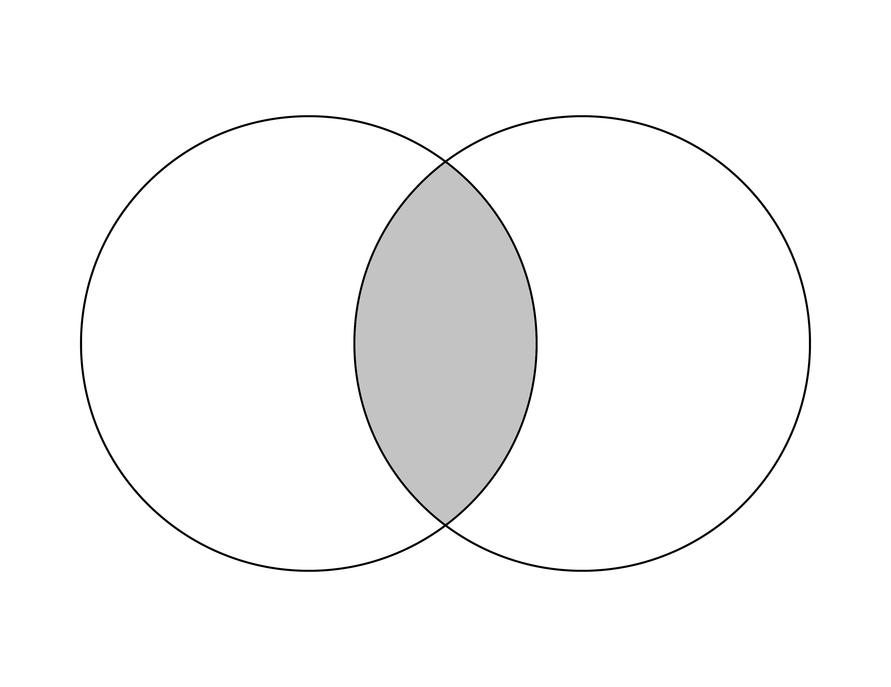
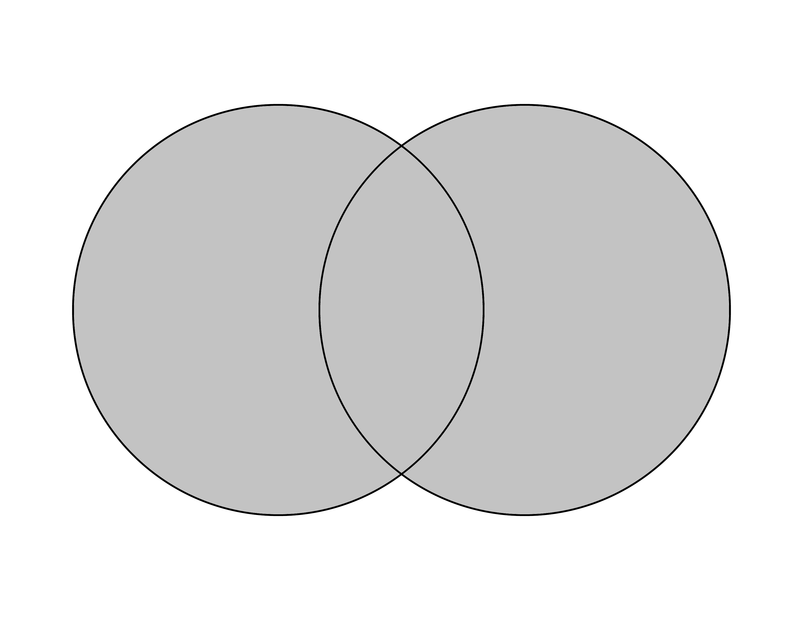
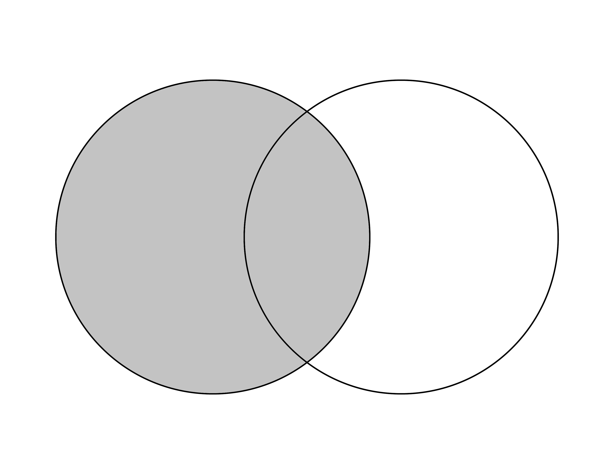
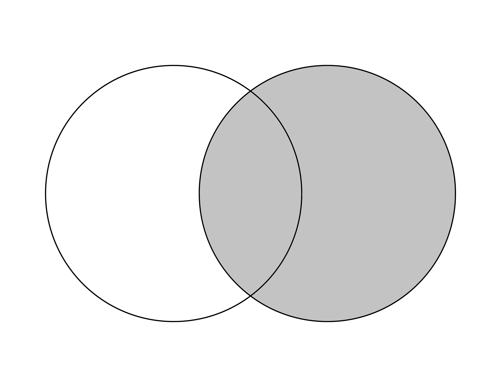

```{r setup, include=FALSE}
knitr::opts_chunk$set(echo = TRUE)
```

# Previo

## Paquetería

```{r}
if (!require("pacman")) install.packages("pacman") # instala pacman si se requiere
pacman::p_load(tidyverse, 
               readxl,writexl,googlesheets4, # importar hojas de cálculo
               haven, foreign, # importación de dta y sav
               sjlabelled, # etiquetas
               janitor, skimr, #limpieza y verificación
               imputeTS, # para imputar valores
               srvyr) # Para el diseño muestral
```

## Directorio
En caso que no tengas un proyecto,establecer el diretorio puede ayudar

<i>¡Recuerda establecer tu directorio!</i>
```{r 1}
setwd("/Users/anaescoto/Dropbox/2020/2021-1 R para Demográfos/repo/R_Demo")
```

## Bases
Base de ECOVID - ML

```{r}
ecovid0420 <- read_dta("./datos/ecovid0420.dta")
```

# Recodificando

Muchas veces queremos recodificar nuestras variables, vamos a ver dos formas de recodificación. Una con el "base" y otra usando "mutate()" con "if else()" de tidyverse. 

Primero vamos a crear una variable sobre otras actividades además del trabajo, que viene en varias variables (pregunta f3 del cuestionario <https://www.inegi.org.mx/contenidos/investigacion/ecovidml/2020/doc/ecovid_ml_cuestionario.pdf>)
```{r}
ecovid0420 %>% 
  select(starts_with("pf3")) %>% 
  summary()
```

Estas variables tiene como valores "NA" cuando la persona no contestó que realizó una de las opciones vamos a recodificar usando primero base en la primera variable:

```{r}
ecovid0420[is.na(ecovid0420$pf3_1),]$pf3_1<-0 # cambiamos los NA por 0

table(ecovid0420$pf3_1)
```

```{r}
ecovid0420 %>% 
  mutate(pf3_2=ifelse(is.na(pf3_2), 0,pf3_2)) %>% 
  tabyl(pf3_2)

```
Recuerda que este cambio quede en la base, deberíamos guardar el objeto

Para resolver más fácilmente el problema de los valores perdidos podemos usar la libreria "imputeTS", tiene una función na_replace
```{r}

ecovid0420 %>% 
  mutate(pf3_2=na_replace(pf3_2)) %>% 
  tabyl(pf3_2)
```

Un código más complejo pero muy útil
```{r}
ecovid0420<-ecovid0420 %>% 
  mutate_at(vars(starts_with("pf3")), na_replace) 


```

Repetimos el código de arriba

```{r}
ecovid0420 %>% 
  select(starts_with("pf3")) %>% 
  summary()
```


# Tabulados con tabyl()
Ya hemos utilizado el comando tabyl para hacer tabulados, pero no los hemos "enchulado"

```{r}
ecovid0420 %>%
  mutate(pb1=as_label(pb1))  %>%
  tabyl(pb1)
```

Para ver que esto es una distribución de frecuencias sería muy útil ver la proporción total, ello se realiza agregando un elemento más en nuestro código con una "tubería":
```{r}
ecovid0420 %>%
  mutate(pb1=as_label(pb1)) %>% 
  tabyl(pb1) %>%
  adorn_totals() #primer enchulamiento
```

Ahora, las proporciones son raras, y preferimos por los porcentajes.

```{r}
ecovid0420 %>%
  mutate(pb1=as_label(pb1)) %>% # cambia los valores de la variable a sus etiquetas
  tabyl(pb1) %>% # para hacer la tabla
  adorn_totals() %>% # añade totales
  adorn_pct_formatting()  # nos da porcentaje en lugar de proporción
                
```

Vamos a darle una "ojeada" a esta variable
```{r}
glimpse(ecovid0420$pb3)
```


Hoy hacemos la tabla, con las etiquetas:

```{r}
ecovid0420 %>% mutate(pb3=as_label(pb3)) %>% #esto sólo si hay etiquetas declaradas, recuerda
                tabyl(pb3)
```


Para que no nos salgan las categorías sin datos podemos poner una opción dentro del comando "tabyl()"

```{r}
ecovid0420 %>% 
  mutate(pb3=as_label(pb3)) %>% 
                tabyl(pb3, show_missing_levels=F ) %>% # esta opción elimina los valores con 0
                adorn_totals()  
```


### Cálculo de frecuencias

Las tablas de doble entrada tiene su nombre porque en las columnas entran los valores de una variable categórica, y en las filas de una segunda. Basicamente es como hacer un conteo de todas las combinaciones posibles entre los valores de una variable con la otra. 

Por ejemplo, si quisiéramos combinar las dos variables que ya estudiamos lo podemos hacer, con una tabla de doble entrada:

```{r}
ecovid0420 %>% 
  mutate(pb3=as_label(pb3)) %>% # para que las lea como factor
  mutate(pb1=as_label(pb1)) %>% # para que las lea como factor
                tabyl(pb3, pb1, show_missing_levels=F ) %>% # incluimos aquí 
                adorn_totals()  
```

Observamos que en cada celda confluyen los casos que comparten las mismas características:

```{r}
ecovid0420 %>%   
    count(pb3==1 & pb1==1) # nos da la segunda celda de la izquierda

```

### Totales y porcentajes

De esta manera se colocan todos los datos. Si observa al poner la función "adorn_totals()" lo agregó como una nueva fila de totales, pero también podemos pedirle que agregue una columna de totales. 


```{r}
ecovid0420 %>% 
  mutate(pb3=as_label(pb3)) %>% # para que las lea como factor
  mutate(pb1=as_label(pb1)) %>% # para que las lea como factor
    tabyl(pb3, pb1, show_missing_levels=F ) %>% # incluimos aquí pb1o
                adorn_totals("col")  
```

O bien agregar los dos, introduciendo en el argumento "c("col", "row")" un vector de caracteres de las dos opciones requeridas:

```{r}
ecovid0420 %>% 
  mutate(pb3=as_label(pb3)) %>% # para que las lea como factor
  mutate(pb1=as_label(pb1)) %>% # para que las lea como factor
                tabyl(pb3, pb1, show_missing_levels=F ) %>% # incluimos aquí pb1o
                adorn_totals(c("col", "row")) 
```

Del mismo modo, podemos calcular los porcentajes. Pero los podemos calcular de tres formas. Uno es que lo calculemos para los totales calculados para las filas, para las columnas o para el gran total poblacional. 

Para columnas tenemos el siguiente código y los siguientes resultados:
```{r}
ecovid0420 %>% 
  mutate(pb3=as_label(pb3)) %>% # para que las lea como factor
  mutate(pb1=as_label(pb1)) %>% # para que las lea como factor
  tabyl(pb3, pb1, show_missing_levels=F ) %>% # incluimos aquí sexo
                adorn_totals(c("col", "row")) %>% 
                adorn_percentages("col") %>% # Divide los valores entre el total de la columna
                adorn_pct_formatting() # lo vuelve porcentaje
```

Cuando se hagan cuadros de distribuciones (que todas sus partes suman 100), los porcentajes pueden ser una gran ayuda para la interpretación, sobre todos cuando se comparar poblaciones de categorías de diferente tamaño. Por lo general, queremos que los cuadros nos den información de donde están los totales y su 100%, de esta manera el lector se puede guiar de porcentaje con respecto a qué está leyendo. En este caso, vemos que el 100% es común en la última fila. 

Veamos la diferencia de cómo podemos leer la misma celda, pero hoy, hemos calculado los porcentajes a nivel de fila:
```{r}
ecovid0420 %>% 
  mutate(pb3=as_label(pb3)) %>% # para que las lea como factor
  mutate(pb1=as_label(pb1)) %>% # para que las lea como factor
                tabyl(pb3, pb1, show_missing_levels=F ) %>% 
                adorn_totals(c("col", "row")) %>% 
                adorn_percentages("row") %>% # Divide los valores entre el total de la fila
                adorn_pct_formatting() # lo vuelve porcentaje
```


Finalmente, podemos calcular los porcentajes con referencia a la población total en análisis. Es decir la celda en la esquina inferior derecha de nuestra tabla original.

```{r}
ecovid0420 %>% 
  mutate(pb3=as_label(pb3)) %>% # para que las lea como factor
  mutate(pb1=as_label(pb1)) %>% # para que las lea como factor
                tabyl(pb3, pb1, show_missing_levels=F ) %>% # incluimos aquí pb1o
                adorn_totals(c("col", "row")) %>% 
                adorn_percentages("all") %>% # Divide los valores entre el total de la población
                adorn_pct_formatting() # lo vuelve porcentaje
```


# Descriptivos para variables cuantitativas
Vamos a empezar a revisar los gráficos para variables cuantitativas.

## Medidas numéricas básicas
5 números

```{r}
summary(ecovid0420$pe10_1) ## horas trabajadas
```

Con pipes se pueden crear "indicadores" de nuestras variables es un tibble
```{r}
ecovid0420 %>% 
  summarise(nombre_indicador=mean(pe10_1, na.rm=T))
```


## Tally y los factores de expansión 

El comando "tabyl()" del paquete "janitor" es muy útil pero no es compatible con los factores del expansión. En realidad, tabyl() nos ahorra un poco el hecho de tener que agrupar nuestra base en categorías y luego hacer un conteo para cada una de ellas. "tally()" es un comando que nos hace ese conteo y "group_by" nos agrupa las observaciones de nuestra base de datos para hacer cualquier operación. 

```{r}
ecovid0420 %>% 
 group_by(as_label(pb1)) %>% 
  tally(fac_per) %>% #nombre del factor
   adorn_totals()  # Agrega total
```

Podemos usar funciones de tabyl
```{r}
ecovid0420 %>% 
 group_by(as_label(pb1)) %>% 
  tally(fac_per) %>% #nombre del factor
   adorn_totals() %>% # Agrega total
     adorn_percentages("all")  %>% 
      adorn_pct_formatting()
```


## Otras formas
La función "count()" también permite dar pesos

```{r}
ecovid0420 %>% 
  count(pb1, pb3,  wt = fac_per) 

```

Es compatible con etiquetas
```{r}
ecovid0420 %>% 
  count(as_label(pb1), as_label(pb3),  wt = fac_per) 
```

Podemos mover un poquito con pivot_wider para que se vea más a lo que acostumbramos a una tabla de frecuencias

```{r}
ecovid0420 %>% 
  mutate_at(vars(pb1, pb3), as_label) %>% 
  count(pb1, pb3,  wt = fac_per) %>% 
  pivot_wider(names_from = pb1, 
              values_from = n)
```

```{r}
ecovid0420 %>% 
  mutate_at(vars(pb1, pb3), as_label) %>% # otra forma de mutate y as_label
  count(pb1, pb3,  wt = fac_per) %>% 
  pivot_wider(names_from = pb1, 
              values_from = n) %>%
   adorn_totals() %>% # Agrega total
     adorn_percentages("col")  %>% 
      adorn_pct_formatting()
```

## Diseño muestral
Hay muchos diseños muestrales, asumiremos el diseño simple, pero hay que revisar la documentación de la base
```{r}
# simple random sample
ecovid_srvy <- ecovid0420 %>% as_survey_design(weights = fac_per)

```

Como vemos esto es un archivo bien grande, por lo que mejor vamos a seleccionar un par de variables:

```{r}
# simple random sample
ecovid_srvy <- ecovid0420 %>%
  select(starts_with("pb"), pe10_1, fac_per) %>% 
  as_survey_design(weights = fac_per)

```

Para una media ponderada
```{r}
ecovid_srvy %>%
  summarize(media_horas = survey_mean(pe10_1,
                                      na.rm=T))

```

```{r}
ecovid_srvy %>%
  summarize(media_horas = survey_mean(pe10_1,
                                      vartype = "ci", # da intervalo de confianza
                                      na.rm=T))

```

```{r}
ecovid_srvy %>%
  mutate(pb1=as_label(pb1)) %>% 
  group_by(pb1) %>% #variables cuali
  summarize(proportion = survey_mean(), # proporción
            total = survey_total() ) # totales
```
Eliminamos algunos objetos


# Fusionando, que es gerundio

## Cargando unas bases

Tenemos una sub-muestra de Veracruz, su primer municipio para hacer este ejercicio de fusión

```{r}
vera_persona <- read_dta("https://github.com/aniuxa/R_Demo/raw/master/datos/Tr_persona30_001.dta")
vera_viv <- read_dta("https://github.com/aniuxa/R_Demo/raw/master/datos/Tr_vivienda30_001.dta")

```

Para fines didácticos, separaremos algunos casos de la variables de la base de persona
```{r}
vera_persona_1<-vera_persona %>% 
  filter(sexo==1) # Hombres

vera_persona_3<-vera_persona %>% 
  filter(sexo==3) # Mujeres
```


### Fusionado uno a uno
Iniciaremos pegando las dos bases que acabamos de generar. Las dividimos según un criterio de individuo y por tanto tienen la misma unidad de análisis

Todas las variables son iguales en ambas bases, por lo que no necesitamos un identificador único

```{r}
merge0<-merge(vera_persona_1, vera_persona_3, all=T) 
dim(merge0)
merge0<-rbind(vera_persona_1, vera_persona_3)
dim(merge0)

dim(vera_persona)

```


En realidad hay cuatro formas de fusionar los objetos de tipo "dataframe", de acuerdo a los argumentos "all", "all.x" y "all.y

### Casos comunes en las dos bases

Por *default*, el comando tiene activado la opción "all = FALSE", que nos deja los casos de ambas bases comunes (tipo una intersección).
```{r}
merge0<-merge(vera_persona_1, vera_persona_3, all=F) 
dim(merge0)
```




### Todos los casos en ambas bases
Si cambiamos la opción "all = TRUE" vamos a obtener los comunes a ambas bases y los que aportan cada uno de las bases (como una unión)

```{r}
merge0<-merge(vera_persona_1, vera_persona_3, all=T) # el que usamos arriba
dim(merge0)
```




### Casos de la base 1

Si queremos quedarnos con todos los datos que hay en la primera base, x, vamos a usar a opción "all.x = TRUE".

```{r}
merge0<-merge(vera_persona_1, vera_persona_3, all.x=T) # el que usamos arriba
dim(merge0)
```



### Casos de la base 2 

Si queremos quedarnos con todos los datos que hay en la segunda base, y, vamos a usar a opción "all.x = TRUE".


```{r}
merge0<-merge(vera_persona_1, vera_persona_3, all.y=T) # el que usamos arriba
dim(merge0)
```



## Fusionando bases de diferente nivel

HeEn las bases de vivienda e individuo tenemos información que puede ser relevante a nuestro análisis. 

Vamos a fusionar la información de vivienda y persona. A una vivienda pueda corresponder varios individuos, por lo que usaremos el identificador único de vivienda. El resultado es una base a nivel de individuo, donde las variables de vivienda se repiten para cada hogar que corresponda a la misma.


```{r}
vera_total<-merge(vera_persona, vera_viv, by="id_viv")
dim(vera_total)
```

Y limpiamos la repetición de variables, lo cual es completamente opcional:
```{r warning=FALSE}
vera_total<-vera_total %>% 
  select(-ends_with(".y")) %>% #elimina las variables que terminan en .y
      rename_at(.vars = vars(ends_with(".x")), 
            .funs = funs(sub("[.]x$", "", .))) #renombra
```


# Ejercicio para entregar

1. Recodifique alguna variable de su interés, haga un análisis descriptivo de ella, de acuerdo a su tipo y los comandos vistos hoy
2. Haga un tabulado con más de una variable, con o sin diseño muestral de acuerdo a su base de datos
3. Revise la documentación de "tidyverse" y la función "join" ¿Qué diferencias tiene con el merge()

Adjunte sus respuestas en el formulario siguiente

https://forms.gle/WifzZpHRifYyZVh3A