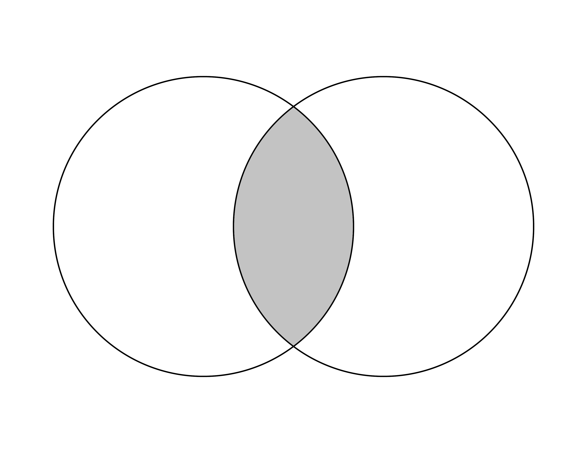
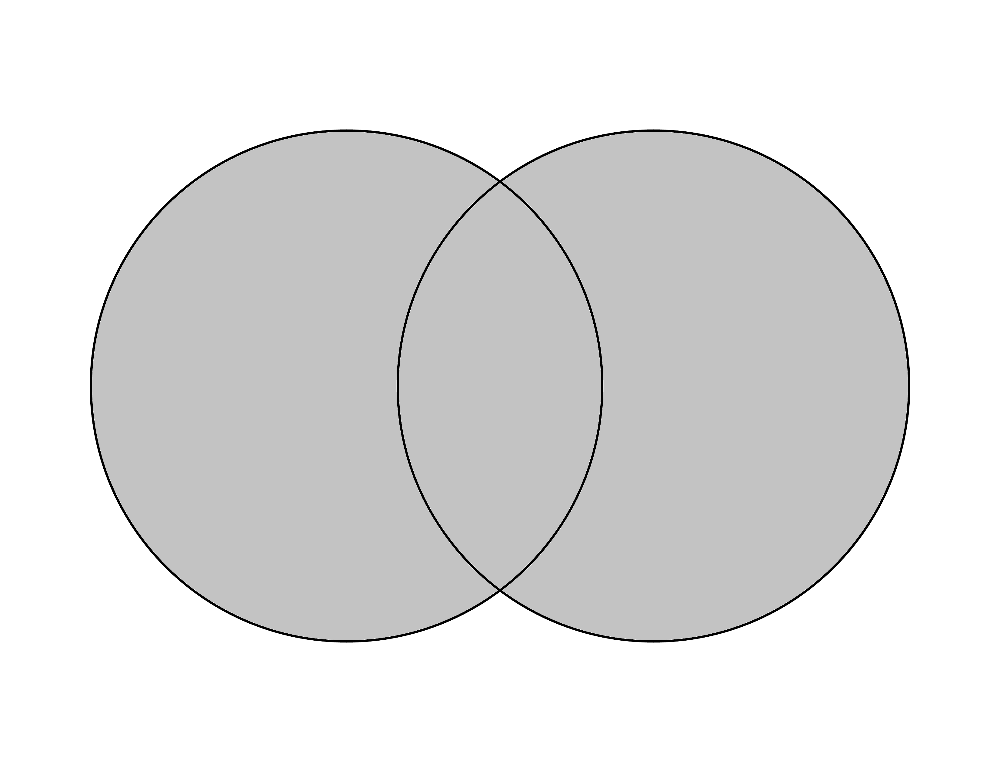
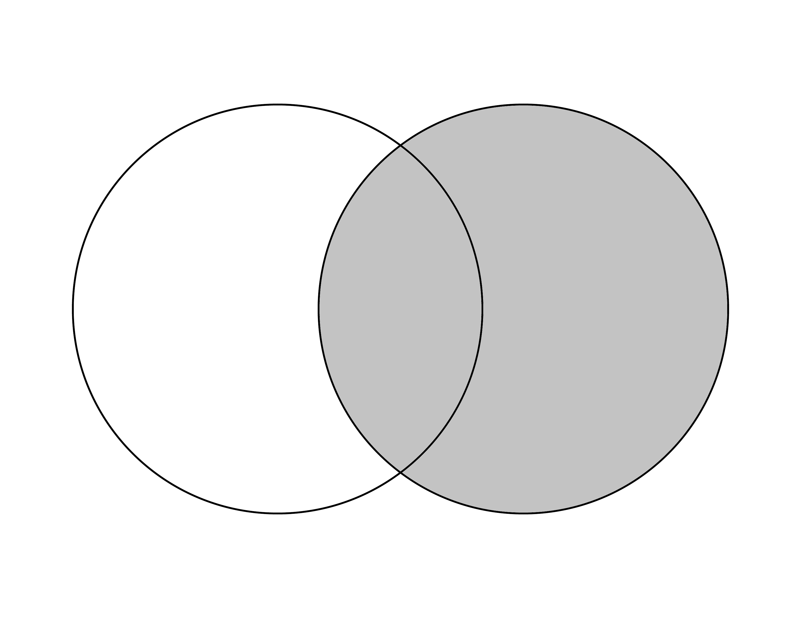

Práctica 4. Elementos básicos
================
AE
15/10/2020

# Previo

## Paquetería

``` r
if (!require("pacman")) install.packages("pacman") # instala pacman si se requiere
```

    ## Loading required package: pacman

``` r
pacman::p_load(tidyverse, 
               readxl,writexl,googlesheets4, # importar hojas de cálculo
               haven, foreign, # importación de dta y sav
               sjlabelled, # etiquetas
               janitor, skimr, #limpieza y verificación
               imputeTS, # para imputar valores
               srvyr) # Para el diseño muestral
```

## Directorio

En caso que no tengas un proyecto,establecer el diretorio puede ayudar

<i>¡Recuerda establecer tu directorio\!</i>

``` r
setwd("/Users/anaescoto/Dropbox/2020/2021-1 R para Demográfos/repo/R_Demo")
```

## Bases

Base de ECOVID - ML

``` r
ecovid0420 <- read_dta("./datos/ecovid0420.dta")
```

# Recodificando

Muchas veces queremos recodificar nuestras variables, vamos a ver dos
formas de recodificación. Una con el “base” y otra usando “mutate()” con
“if else()” de tidyverse.

Primero vamos a crear una variable sobre otras actividades además del
trabajo, que viene en varias variables (pregunta f3 del cuestionario
<https://www.inegi.org.mx/contenidos/investigacion/ecovidml/2020/doc/ecovid_ml_cuestionario.pdf>)

``` r
ecovid0420 %>% 
  select(starts_with("pf3")) %>% 
  summary()
```

    ##      pf3_1          pf3_2          pf3_3          pf3_4          pf3_5     
    ##  Min.   :1      Min.   :2      Min.   :3      Min.   :4      Min.   :5     
    ##  1st Qu.:1      1st Qu.:2      1st Qu.:3      1st Qu.:4      1st Qu.:5     
    ##  Median :1      Median :2      Median :3      Median :4      Median :5     
    ##  Mean   :1      Mean   :2      Mean   :3      Mean   :4      Mean   :5     
    ##  3rd Qu.:1      3rd Qu.:2      3rd Qu.:3      3rd Qu.:4      3rd Qu.:5     
    ##  Max.   :1      Max.   :2      Max.   :3      Max.   :4      Max.   :5     
    ##  NA's   :5444   NA's   :5361   NA's   :4987   NA's   :5422   NA's   :5298  
    ##      pf3_6     
    ##  Min.   :6     
    ##  1st Qu.:6     
    ##  Median :6     
    ##  Mean   :6     
    ##  3rd Qu.:6     
    ##  Max.   :6     
    ##  NA's   :5541

Estas variables tiene como valores “NA” cuando la persona no contestó
que realizó una de las opciones vamos a recodificar usando primero base
en la primera variable:

``` r
ecovid0420[is.na(ecovid0420$pf3_1),]$pf3_1<-0 # cambiamos los NA por 0

table(ecovid0420$pf3_1)
```

    ## 
    ##    0    1 
    ## 5444  149

``` r
ecovid0420 %>% 
  mutate(pf3_2=ifelse(is.na(pf3_2), 0,pf3_2)) %>% 
  tabyl(pf3_2)
```

    ##  pf3_2    n    percent
    ##      0 5361 0.95851958
    ##      2  232 0.04148042

Recuerda que este cambio quede en la base, deberíamos guardar el objeto

Para resolver más fácilmente el problema de los valores perdidos podemos
usar la libreria “imputeTS”, tiene una función na\_replace

``` r
ecovid0420 %>% 
  mutate(pf3_2=na_replace(pf3_2)) %>% 
  tabyl(pf3_2)
```

    ##  pf3_2    n    percent
    ##      0 5361 0.95851958
    ##      2  232 0.04148042

Un código más complejo pero muy útil

``` r
ecovid0420<-ecovid0420 %>% 
  mutate_at(vars(starts_with("pf3")), na_replace) 
```

Repetimos el código de arriba

``` r
ecovid0420 %>% 
  select(starts_with("pf3")) %>% 
  summary()
```

    ##      pf3_1             pf3_2             pf3_3           pf3_4       
    ##  Min.   :0.00000   Min.   :0.00000   Min.   :0.000   Min.   :0.0000  
    ##  1st Qu.:0.00000   1st Qu.:0.00000   1st Qu.:0.000   1st Qu.:0.0000  
    ##  Median :0.00000   Median :0.00000   Median :0.000   Median :0.0000  
    ##  Mean   :0.02664   Mean   :0.08296   Mean   :0.325   Mean   :0.1223  
    ##  3rd Qu.:0.00000   3rd Qu.:0.00000   3rd Qu.:0.000   3rd Qu.:0.0000  
    ##  Max.   :1.00000   Max.   :2.00000   Max.   :3.000   Max.   :4.0000  
    ##      pf3_5            pf3_6        
    ##  Min.   :0.0000   Min.   :0.00000  
    ##  1st Qu.:0.0000   1st Qu.:0.00000  
    ##  Median :0.0000   Median :0.00000  
    ##  Mean   :0.2637   Mean   :0.05578  
    ##  3rd Qu.:0.0000   3rd Qu.:0.00000  
    ##  Max.   :5.0000   Max.   :6.00000

# Tabulados con tabyl()

Ya hemos utilizado el comando tabyl para hacer tabulados, pero no los
hemos “enchulado”

``` r
ecovid0420 %>%
  mutate(pb1=as_label(pb1))  %>%
  tabyl(pb1)
```

    ##     pb1    n   percent
    ##  Hombre 2393 0.4278562
    ##   Mujer 3200 0.5721438

Para ver que esto es una distribución de frecuencias sería muy útil ver
la proporción total, ello se realiza agregando un elemento más en
nuestro código con una “tubería”:

``` r
ecovid0420 %>%
  mutate(pb1=as_label(pb1)) %>% 
  tabyl(pb1) %>%
  adorn_totals() #primer enchulamiento
```

    ##     pb1    n   percent
    ##  Hombre 2393 0.4278562
    ##   Mujer 3200 0.5721438
    ##   Total 5593 1.0000000

Ahora, las proporciones son raras, y preferimos por los porcentajes.

``` r
ecovid0420 %>%
  mutate(pb1=as_label(pb1)) %>% # cambia los valores de la variable a sus etiquetas
  tabyl(pb1) %>% # para hacer la tabla
  adorn_totals() %>% # añade totales
  adorn_pct_formatting()  # nos da porcentaje en lugar de proporción
```

    ##     pb1    n percent
    ##  Hombre 2393   42.8%
    ##   Mujer 3200   57.2%
    ##   Total 5593  100.0%

Vamos a darle una “ojeada” a esta variable

``` r
glimpse(ecovid0420$pb3)
```

    ##  dbl+lbl [1:5593] 3, 2, 2, 4, 3, 2, 3, 3, 2, 8, 2, 3, 1, 2, 2, 3, 8, 3, 0, ...
    ##  @ label       : chr "escolaridad"
    ##  @ format.stata: chr "%33.0g"
    ##  @ labels      : Named num [1:10] 0 1 2 3 4 5 6 7 8 9
    ##   ..- attr(*, "names")= chr [1:10] "Ninguno" "Preescolar" "Primaria" "Secundaria" ...

Hoy hacemos la tabla, con las etiquetas:

``` r
ecovid0420 %>% mutate(pb3=as_label(pb3)) %>% #esto sólo si hay etiquetas declaradas, recuerda
                tabyl(pb3)
```

    ##                               pb3    n     percent
    ##                           Ninguno  153 0.027355623
    ##                        Preescolar   34 0.006079027
    ##                          Primaria 1173 0.209726444
    ##                        Secundaria 1526 0.272841051
    ##       Preparatoria o bachillerato 1272 0.227427141
    ##  Técnicos con primaria/secundaria  165 0.029501162
    ##       Estudios técnicos con prepa   76 0.013588414
    ##             Normal con secundaria   29 0.005185053
    ##             Licenciatura o normal 1037 0.185410334
    ##                          Posgrado  128 0.022885750

Para que no nos salgan las categorías sin datos podemos poner una opción
dentro del comando “tabyl()”

``` r
ecovid0420 %>% 
  mutate(pb3=as_label(pb3)) %>% 
                tabyl(pb3, show_missing_levels=F ) %>% # esta opción elimina los valores con 0
                adorn_totals()  
```

    ##                               pb3    n     percent
    ##                           Ninguno  153 0.027355623
    ##                        Preescolar   34 0.006079027
    ##                          Primaria 1173 0.209726444
    ##                        Secundaria 1526 0.272841051
    ##       Preparatoria o bachillerato 1272 0.227427141
    ##  Técnicos con primaria/secundaria  165 0.029501162
    ##       Estudios técnicos con prepa   76 0.013588414
    ##             Normal con secundaria   29 0.005185053
    ##             Licenciatura o normal 1037 0.185410334
    ##                          Posgrado  128 0.022885750
    ##                             Total 5593 1.000000000

### Cálculo de frecuencias

Las tablas de doble entrada tiene su nombre porque en las columnas
entran los valores de una variable categórica, y en las filas de una
segunda. Basicamente es como hacer un conteo de todas las combinaciones
posibles entre los valores de una variable con la otra.

Por ejemplo, si quisiéramos combinar las dos variables que ya estudiamos
lo podemos hacer, con una tabla de doble entrada:

``` r
ecovid0420 %>% 
  mutate(pb3=as_label(pb3)) %>% # para que las lea como factor
  mutate(pb1=as_label(pb1)) %>% # para que las lea como factor
                tabyl(pb3, pb1, show_missing_levels=F ) %>% # incluimos aquí 
                adorn_totals()  
```

    ##                               pb3 Hombre Mujer
    ##                           Ninguno     58    95
    ##                        Preescolar     16    18
    ##                          Primaria    465   708
    ##                        Secundaria    592   934
    ##       Preparatoria o bachillerato    600   672
    ##  Técnicos con primaria/secundaria     41   124
    ##       Estudios técnicos con prepa     27    49
    ##             Normal con secundaria     13    16
    ##             Licenciatura o normal    510   527
    ##                          Posgrado     71    57
    ##                             Total   2393  3200

Observamos que en cada celda confluyen los casos que comparten las
mismas características:

``` r
ecovid0420 %>%   
    count(pb3==1 & pb1==1) # nos da la segunda celda de la izquierda
```

    ## # A tibble: 2 x 2
    ##   `pb3 == 1 & pb1 == 1`     n
    ##   <lgl>                 <int>
    ## 1 FALSE                  5577
    ## 2 TRUE                     16

### Totales y porcentajes

De esta manera se colocan todos los datos. Si observa al poner la
función “adorn\_totals()” lo agregó como una nueva fila de totales,
pero también podemos pedirle que agregue una columna de totales.

``` r
ecovid0420 %>% 
  mutate(pb3=as_label(pb3)) %>% # para que las lea como factor
  mutate(pb1=as_label(pb1)) %>% # para que las lea como factor
    tabyl(pb3, pb1, show_missing_levels=F ) %>% # incluimos aquí pb1o
                adorn_totals("col")  
```

    ##                               pb3 Hombre Mujer Total
    ##                           Ninguno     58    95   153
    ##                        Preescolar     16    18    34
    ##                          Primaria    465   708  1173
    ##                        Secundaria    592   934  1526
    ##       Preparatoria o bachillerato    600   672  1272
    ##  Técnicos con primaria/secundaria     41   124   165
    ##       Estudios técnicos con prepa     27    49    76
    ##             Normal con secundaria     13    16    29
    ##             Licenciatura o normal    510   527  1037
    ##                          Posgrado     71    57   128

O bien agregar los dos, introduciendo en el argumento “c(”col“,”row“)”
un vector de caracteres de las dos opciones requeridas:

``` r
ecovid0420 %>% 
  mutate(pb3=as_label(pb3)) %>% # para que las lea como factor
  mutate(pb1=as_label(pb1)) %>% # para que las lea como factor
                tabyl(pb3, pb1, show_missing_levels=F ) %>% # incluimos aquí pb1o
                adorn_totals(c("col", "row")) 
```

    ##                               pb3 Hombre Mujer Total
    ##                           Ninguno     58    95   153
    ##                        Preescolar     16    18    34
    ##                          Primaria    465   708  1173
    ##                        Secundaria    592   934  1526
    ##       Preparatoria o bachillerato    600   672  1272
    ##  Técnicos con primaria/secundaria     41   124   165
    ##       Estudios técnicos con prepa     27    49    76
    ##             Normal con secundaria     13    16    29
    ##             Licenciatura o normal    510   527  1037
    ##                          Posgrado     71    57   128
    ##                             Total   2393  3200  5593

Del mismo modo, podemos calcular los porcentajes. Pero los podemos
calcular de tres formas. Uno es que lo calculemos para los totales
calculados para las filas, para las columnas o para el gran total
poblacional.

Para columnas tenemos el siguiente código y los siguientes resultados:

``` r
ecovid0420 %>% 
  mutate(pb3=as_label(pb3)) %>% # para que las lea como factor
  mutate(pb1=as_label(pb1)) %>% # para que las lea como factor
  tabyl(pb3, pb1, show_missing_levels=F ) %>% # incluimos aquí sexo
                adorn_totals(c("col", "row")) %>% 
                adorn_percentages("col") %>% # Divide los valores entre el total de la columna
                adorn_pct_formatting() # lo vuelve porcentaje
```

    ##                               pb3 Hombre  Mujer  Total
    ##                           Ninguno   2.4%   3.0%   2.7%
    ##                        Preescolar   0.7%   0.6%   0.6%
    ##                          Primaria  19.4%  22.1%  21.0%
    ##                        Secundaria  24.7%  29.2%  27.3%
    ##       Preparatoria o bachillerato  25.1%  21.0%  22.7%
    ##  Técnicos con primaria/secundaria   1.7%   3.9%   3.0%
    ##       Estudios técnicos con prepa   1.1%   1.5%   1.4%
    ##             Normal con secundaria   0.5%   0.5%   0.5%
    ##             Licenciatura o normal  21.3%  16.5%  18.5%
    ##                          Posgrado   3.0%   1.8%   2.3%
    ##                             Total 100.0% 100.0% 100.0%

Cuando se hagan cuadros de distribuciones (que todas sus partes suman
100), los porcentajes pueden ser una gran ayuda para la interpretación,
sobre todos cuando se comparar poblaciones de categorías de diferente
tamaño. Por lo general, queremos que los cuadros nos den información de
donde están los totales y su 100%, de esta manera el lector se puede
guiar de porcentaje con respecto a qué está leyendo. En este caso, vemos
que el 100% es común en la última fila.

Veamos la diferencia de cómo podemos leer la misma celda, pero hoy,
hemos calculado los porcentajes a nivel de fila:

``` r
ecovid0420 %>% 
  mutate(pb3=as_label(pb3)) %>% # para que las lea como factor
  mutate(pb1=as_label(pb1)) %>% # para que las lea como factor
                tabyl(pb3, pb1, show_missing_levels=F ) %>% 
                adorn_totals(c("col", "row")) %>% 
                adorn_percentages("row") %>% # Divide los valores entre el total de la fila
                adorn_pct_formatting() # lo vuelve porcentaje
```

    ##                               pb3 Hombre Mujer  Total
    ##                           Ninguno  37.9% 62.1% 100.0%
    ##                        Preescolar  47.1% 52.9% 100.0%
    ##                          Primaria  39.6% 60.4% 100.0%
    ##                        Secundaria  38.8% 61.2% 100.0%
    ##       Preparatoria o bachillerato  47.2% 52.8% 100.0%
    ##  Técnicos con primaria/secundaria  24.8% 75.2% 100.0%
    ##       Estudios técnicos con prepa  35.5% 64.5% 100.0%
    ##             Normal con secundaria  44.8% 55.2% 100.0%
    ##             Licenciatura o normal  49.2% 50.8% 100.0%
    ##                          Posgrado  55.5% 44.5% 100.0%
    ##                             Total  42.8% 57.2% 100.0%

Finalmente, podemos calcular los porcentajes con referencia a la
población total en análisis. Es decir la celda en la esquina inferior
derecha de nuestra tabla original.

``` r
ecovid0420 %>% 
  mutate(pb3=as_label(pb3)) %>% # para que las lea como factor
  mutate(pb1=as_label(pb1)) %>% # para que las lea como factor
                tabyl(pb3, pb1, show_missing_levels=F ) %>% # incluimos aquí pb1o
                adorn_totals(c("col", "row")) %>% 
                adorn_percentages("all") %>% # Divide los valores entre el total de la población
                adorn_pct_formatting() # lo vuelve porcentaje
```

    ##                               pb3 Hombre Mujer  Total
    ##                           Ninguno   1.0%  1.7%   2.7%
    ##                        Preescolar   0.3%  0.3%   0.6%
    ##                          Primaria   8.3% 12.7%  21.0%
    ##                        Secundaria  10.6% 16.7%  27.3%
    ##       Preparatoria o bachillerato  10.7% 12.0%  22.7%
    ##  Técnicos con primaria/secundaria   0.7%  2.2%   3.0%
    ##       Estudios técnicos con prepa   0.5%  0.9%   1.4%
    ##             Normal con secundaria   0.2%  0.3%   0.5%
    ##             Licenciatura o normal   9.1%  9.4%  18.5%
    ##                          Posgrado   1.3%  1.0%   2.3%
    ##                             Total  42.8% 57.2% 100.0%

# Descriptivos para variables cuantitativas

Vamos a empezar a revisar los gráficos para variables cuantitativas.

## Medidas numéricas básicas

5 números

``` r
summary(ecovid0420$pe10_1) ## horas trabajadas
```

    ##    Min. 1st Qu.  Median    Mean 3rd Qu.    Max.    NA's 
    ##    1.00   16.00   35.00   32.65   48.00   99.00    3131

Con pipes se pueden crear “indicadores” de nuestras variables es un
tibble

``` r
ecovid0420 %>% 
  summarise(nombre_indicador=mean(pe10_1, na.rm=T))
```

    ## # A tibble: 1 x 1
    ##   nombre_indicador
    ##              <dbl>
    ## 1             32.7

## Tally y los factores de expansión

El comando “tabyl()” del paquete “janitor” es muy útil pero no es
compatible con los factores del expansión. En realidad, tabyl() nos
ahorra un poco el hecho de tener que agrupar nuestra base en categorías
y luego hacer un conteo para cada una de ellas. “tally()” es un comando
que nos hace ese conteo y “group\_by” nos agrupa las observaciones de
nuestra base de datos para hacer cualquier operación.

``` r
ecovid0420 %>% 
 group_by(as_label(pb1)) %>% 
  tally(fac_per) %>% #nombre del factor
   adorn_totals()  # Agrega total
```

    ##  as_label(pb1)        n
    ##         Hombre 30991536
    ##          Mujer 37192894
    ##          Total 68184430

Podemos usar funciones de tabyl

``` r
ecovid0420 %>% 
 group_by(as_label(pb1)) %>% 
  tally(fac_per) %>% #nombre del factor
   adorn_totals() %>% # Agrega total
     adorn_percentages("all")  %>% 
      adorn_pct_formatting()
```

    ##  as_label(pb1)      n
    ##         Hombre  45.5%
    ##          Mujer  54.5%
    ##          Total 100.0%

## Otras formas

La función “count()” también permite dar pesos

``` r
ecovid0420 %>% 
  count(pb1, pb3,  wt = fac_per) 
```

    ## # A tibble: 20 x 3
    ##           pb1                                  pb3        n
    ##     <dbl+lbl>                            <dbl+lbl>    <dbl>
    ##  1 1 [Hombre] 0 [Ninguno]                            729656
    ##  2 1 [Hombre] 1 [Preescolar]                         182642
    ##  3 1 [Hombre] 2 [Primaria]                          5980612
    ##  4 1 [Hombre] 3 [Secundaria]                        7670692
    ##  5 1 [Hombre] 4 [Preparatoria o bachillerato]       7818923
    ##  6 1 [Hombre] 5 [Técnicos con primaria/secundaria]   645877
    ##  7 1 [Hombre] 6 [Estudios técnicos con prepa]        399437
    ##  8 1 [Hombre] 7 [Normal con secundaria]              190144
    ##  9 1 [Hombre] 8 [Licenciatura o normal]             6429995
    ## 10 1 [Hombre] 9 [Posgrado]                           943558
    ## 11 2 [Mujer]  0 [Ninguno]                           1231834
    ## 12 2 [Mujer]  1 [Preescolar]                         229128
    ## 13 2 [Mujer]  2 [Primaria]                          8735227
    ## 14 2 [Mujer]  3 [Secundaria]                       10565361
    ## 15 2 [Mujer]  4 [Preparatoria o bachillerato]       7264899
    ## 16 2 [Mujer]  5 [Técnicos con primaria/secundaria]  1682893
    ## 17 2 [Mujer]  6 [Estudios técnicos con prepa]        608542
    ## 18 2 [Mujer]  7 [Normal con secundaria]              207497
    ## 19 2 [Mujer]  8 [Licenciatura o normal]             5975764
    ## 20 2 [Mujer]  9 [Posgrado]                           691749

Es compatible con etiquetas

``` r
ecovid0420 %>% 
  count(as_label(pb1), as_label(pb3),  wt = fac_per) 
```

    ## # A tibble: 20 x 3
    ##    `as_label(pb1)` `as_label(pb3)`                         n
    ##    <fct>           <fct>                               <dbl>
    ##  1 Hombre          Ninguno                            729656
    ##  2 Hombre          Preescolar                         182642
    ##  3 Hombre          Primaria                          5980612
    ##  4 Hombre          Secundaria                        7670692
    ##  5 Hombre          Preparatoria o bachillerato       7818923
    ##  6 Hombre          Técnicos con primaria/secundaria   645877
    ##  7 Hombre          Estudios técnicos con prepa        399437
    ##  8 Hombre          Normal con secundaria              190144
    ##  9 Hombre          Licenciatura o normal             6429995
    ## 10 Hombre          Posgrado                           943558
    ## 11 Mujer           Ninguno                           1231834
    ## 12 Mujer           Preescolar                         229128
    ## 13 Mujer           Primaria                          8735227
    ## 14 Mujer           Secundaria                       10565361
    ## 15 Mujer           Preparatoria o bachillerato       7264899
    ## 16 Mujer           Técnicos con primaria/secundaria  1682893
    ## 17 Mujer           Estudios técnicos con prepa        608542
    ## 18 Mujer           Normal con secundaria              207497
    ## 19 Mujer           Licenciatura o normal             5975764
    ## 20 Mujer           Posgrado                           691749

Podemos mover un poquito con pivot\_wider para que se vea más a lo que
acostumbramos a una tabla de frecuencias

``` r
ecovid0420 %>% 
  mutate_at(vars(pb1, pb3), as_label) %>% 
  count(pb1, pb3,  wt = fac_per) %>% 
  pivot_wider(names_from = pb1, 
              values_from = n)
```

    ## # A tibble: 10 x 3
    ##    pb3                               Hombre    Mujer
    ##    <fct>                              <dbl>    <dbl>
    ##  1 Ninguno                           729656  1231834
    ##  2 Preescolar                        182642   229128
    ##  3 Primaria                         5980612  8735227
    ##  4 Secundaria                       7670692 10565361
    ##  5 Preparatoria o bachillerato      7818923  7264899
    ##  6 Técnicos con primaria/secundaria  645877  1682893
    ##  7 Estudios técnicos con prepa       399437   608542
    ##  8 Normal con secundaria             190144   207497
    ##  9 Licenciatura o normal            6429995  5975764
    ## 10 Posgrado                          943558   691749

``` r
ecovid0420 %>% 
  mutate_at(vars(pb1, pb3), as_label) %>% # otra forma de mutate y as_label
  count(pb1, pb3,  wt = fac_per) %>% 
  pivot_wider(names_from = pb1, 
              values_from = n) %>%
   adorn_totals() %>% # Agrega total
     adorn_percentages("col")  %>% 
      adorn_pct_formatting()
```

    ##                               pb3 Hombre  Mujer
    ##                           Ninguno   2.4%   3.3%
    ##                        Preescolar   0.6%   0.6%
    ##                          Primaria  19.3%  23.5%
    ##                        Secundaria  24.8%  28.4%
    ##       Preparatoria o bachillerato  25.2%  19.5%
    ##  Técnicos con primaria/secundaria   2.1%   4.5%
    ##       Estudios técnicos con prepa   1.3%   1.6%
    ##             Normal con secundaria   0.6%   0.6%
    ##             Licenciatura o normal  20.7%  16.1%
    ##                          Posgrado   3.0%   1.9%
    ##                             Total 100.0% 100.0%

## Diseño muestral

Hay muchos diseños muestrales, asumiremos el diseño simple, pero hay que
revisar la documentación de la base

``` r
# simple random sample
ecovid_srvy <- ecovid0420 %>% as_survey_design(weights = fac_per)
```

Como vemos esto es un archivo bien grande, por lo que mejor vamos a
seleccionar un par de variables:

``` r
# simple random sample
ecovid_srvy <- ecovid0420 %>%
  select(starts_with("pb"), pe10_1, fac_per) %>% 
  as_survey_design(weights = fac_per)
```

Para una media ponderada

``` r
ecovid_srvy %>%
  summarize(media_horas = survey_mean(pe10_1,
                                      na.rm=T))
```

    ## # A tibble: 1 x 2
    ##   media_horas media_horas_se
    ##         <dbl>          <dbl>
    ## 1        33.3          0.486

``` r
ecovid_srvy %>%
  summarize(media_horas = survey_mean(pe10_1,
                                      vartype = "ci", # da intervalo de confianza
                                      na.rm=T))
```

    ## # A tibble: 1 x 3
    ##   media_horas media_horas_low media_horas_upp
    ##         <dbl>           <dbl>           <dbl>
    ## 1        33.3            32.4            34.3

``` r
ecovid_srvy %>%
  mutate(pb1=as_label(pb1)) %>% 
  group_by(pb1) %>% #variables cuali
  summarize(proportion = survey_mean(), # proporción
            total = survey_total() ) # totales
```

    ## # A tibble: 2 x 5
    ##   pb1    proportion proportion_se    total total_se
    ##   <fct>       <dbl>         <dbl>    <dbl>    <dbl>
    ## 1 Hombre      0.455       0.00865 30991536  701507.
    ## 2 Mujer       0.545       0.00865 37192894  692281.

Eliminamos algunos objetos

# Fusionando, que es gerundio

## Cargando unas bases

Tenemos una sub-muestra de Veracruz, su primer municipio para hacer este
ejercicio de fusión

``` r
vera_persona <- read_dta("https://github.com/aniuxa/R_Demo/raw/master/datos/Tr_persona30_001.dta")
vera_viv <- read_dta("https://github.com/aniuxa/R_Demo/raw/master/datos/Tr_vivienda30_001.dta")
```

Para fines didácticos, separaremos algunos casos de la variables de la
base de persona

``` r
vera_persona_1<-vera_persona %>% 
  filter(sexo==1) # Hombres

vera_persona_3<-vera_persona %>% 
  filter(sexo==3) # Mujeres
```

### Fusionado uno a uno

Iniciaremos pegando las dos bases que acabamos de generar. Las dividimos
según un criterio de individuo y por tanto tienen la misma unidad de
análisis

Todas las variables son iguales en ambas bases, por lo que no
necesitamos un identificador único

``` r
merge0<-merge(vera_persona_1, vera_persona_3, all=T) 
dim(merge0)
```

    ## [1] 5219   95

``` r
merge0<-rbind(vera_persona_1, vera_persona_3)
dim(merge0)
```

    ## [1] 5219   95

``` r
dim(vera_persona)
```

    ## [1] 5219   95

En realidad hay cuatro formas de fusionar los objetos de tipo
“dataframe”, de acuerdo a los argumentos “all”, “all.x” y "all.y

### Casos comunes en las dos bases

Por *default*, el comando tiene activado la opción “all = FALSE”, que
nos deja los casos de ambas bases comunes (tipo una intersección).

``` r
merge0<-merge(vera_persona_1, vera_persona_3, all=F) 
dim(merge0)
```

    ## [1]  0 95



### Todos los casos en ambas bases

Si cambiamos la opción “all = TRUE” vamos a obtener los comunes a ambas
bases y los que aportan cada uno de las bases (como una unión)

``` r
merge0<-merge(vera_persona_1, vera_persona_3, all=T) # el que usamos arriba
dim(merge0)
```

    ## [1] 5219   95



### Casos de la base 1

Si queremos quedarnos con todos los datos que hay en la primera base, x,
vamos a usar a opción “all.x = TRUE”.

``` r
merge0<-merge(vera_persona_1, vera_persona_3, all.x=T) # el que usamos arriba
dim(merge0)
```

    ## [1] 2615   95


### Casos de la base 2

Si queremos quedarnos con todos los datos que hay en la segunda base, y,
vamos a usar a opción “all.x = TRUE”.

``` r
merge0<-merge(vera_persona_1, vera_persona_3, all.y=T) # el que usamos arriba
dim(merge0)
```

    ## [1] 2604   95



## Fusionando bases de diferente nivel

HeEn las bases de vivienda e individuo tenemos información que puede ser
relevante a nuestro análisis.

Vamos a fusionar la información de vivienda y persona. A una vivienda
pueda corresponder varios individuos, por lo que usaremos el
identificador único de vivienda. El resultado es una base a nivel de
individuo, donde las variables de vivienda se repiten para cada hogar
que corresponda a la misma.

``` r
vera_total<-merge(vera_persona, vera_viv, by="id_viv")
dim(vera_total)
```

    ## [1] 5219  182

Y limpiamos la repetición de variables, lo cual es completamente
opcional:

``` r
vera_total<-vera_total %>% 
  select(-ends_with(".y")) %>% #elimina las variables que terminan en .y
      rename_at(.vars = vars(ends_with(".x")), 
            .funs = funs(sub("[.]x$", "", .))) #renombra
```

# Ejercicio para entregar

1.  Recodifique alguna variable de su interés, haga un análisis
    descriptivo de ella, de acuerdo a su tipo y los comandos vistos hoy
2.  Haga un tabulado con más de una variable, con o sin diseño muestral
    de acuerdo a su base de datos
3.  Revise la documentación de “tidyverse” y la función “join” ¿Qué
    diferencias tiene con el merge()

Adjunte sus respuestas en el formulario siguiente

<https://forms.gle/WifzZpHRifYyZVh3A>
