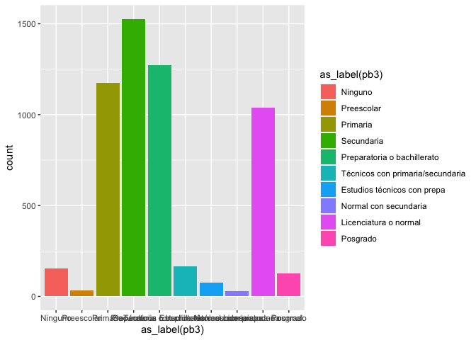

Práctica 5 - Parte 1. Un poquito de visualización
================
AE
22/10/2020

# Previo

## Paquetería

``` r
if (!require("pacman")) install.packages("pacman") # instala pacman si se requiere
```

    ## Loading required package: pacman

``` r
pacman::p_load(tidyverse, 
               readxl,writexl,googlesheets4, # importar hojas de cálculo
               haven, foreign, # importación de dta y sav
               sjlabelled, # etiquetas
               janitor, skimr, #limpieza y verificación
               imputeTS, # para imputar valores
               srvyr, # Para el diseño muestral
               esquisse) # para usar ggplot de manera más amigable
```

## Directorio

En caso que no tengas un proyecto,establecer el diretorio puede ayudar

<i>¡Recuerda establecer tu directorio\!</i>

``` r
setwd("/Users/anaescoto/Dropbox/2020/2021-1 R para Demográfos/repo/R_Demo")
```

## Bases

Base de ECOVID - ML

``` r
ecovid0420 <- read_dta("https://github.com/aniuxa/R_Demo/raw/master/datos/ecovid0420.dta")
```

También vamos usar la base de Índice de Competitividad Estatal,
desarrollado por el Instituto Mexicano de Competitividad. (véase
<http://imco.org.mx/indices/que-no-vuelva-a-pasar-estados-prevenidos-valen-por-dos/>)

``` r
url <- "https://github.com/aniuxa/R_Demo/raw/master/datos/ICE_2018.xlsx"
destfile <- "ICE_2018.xlsx"
curl::curl_download(url, destfile)
ICE_2018 <- read_excel(destfile, sheet="para_importar")
```

    ## New names:
    ## * `` -> ...102
    ## * `` -> ...105

Una vez “bajado”, a limpiar

``` r
ICE_2018 <- clean_names(ICE_2018) # limpia los nombres
```

# ¿Cuál es el mejor gráfico?

Hay cursos específicos de visualización de datos. Es maravilloso pero
también requiere que estudiemos bien qué tipo de datos tenemos y cuáles
son nuestros objetivos.

Me gusta mucho este recurso: <https://www.data-to-viz.com/>

# Gráficos de base

“plot()” Es la función más simple. Y es otro comando “listo”

``` r
  plot(as_label(ecovid0420$pb3))
```

<!-- -->

Esto es igual que:

``` r
barplot(table(as_label(ecovid0420$pb3)))
```

<!-- -->

Histograma y el boxplot

``` r
hist(ICE_2018$esperanza_de_vida)
```

<!-- -->

``` r
boxplot(ICE_2018$esperanza_de_vida)
```

<!-- -->

# Gráficos con ggplot

Hoy vamos a presentar a un gran paquete ¡Es de los famosos\! Y tiene más
de diez años.

  - <https://qz.com/1007328/all-hail-ggplot2-the-code-powering-all-those-excellent-charts-is-10-years-old/>

“gg” proviene de “Grammar of Graphics”, funciona un poco como
sintácticamente, de ahí su nombre.

Algunos recursos para aprender ggplot

  - <https://ggplot2-book.org/> hecha por el mero mero.

  - <http://sape.inf.usi.ch/quick-reference/ggplot2>

  - <https://raw.githubusercontent.com/rstudio/cheatsheets/master/data-visualization-2.1.pdf>

Vamos a revisar una presentación que es muy interesante

  - <https://evamaerey.github.io/ggplot2_grammar_guide/ggplot2_grammar_guide.html>

  - <https://huygens.science.uva.nl/ggPlotteR/> Hace gráficos de ggplot
    con la base de datos de Gapminder

# Un lienzo para dibujar

Para hacer un gráfico, ggplot2 tiene el comando “ggplot()”. Hacer
gráficos con esta función tiene una lógica aditiva. Lo ideal es que
iniciemos estableciendo el mapeo estético de nuestro gráfico, con el
comando aes()

``` r
g1<-ecovid0420 %>%
  ggplot(aes(as_label(pb3)))

g1 # imprime el lienzo
```

<!-- -->

# Gráficos univariados

## Para cualitativas

``` r
g1 + geom_bar()
```

<!-- -->

``` r
g1 +  geom_bar(aes(
  fill = as_label(pb3)
  )) # colorea la geometría
```

<!-- -->

``` r
# Esto es equivalente

ecovid0420 %>%
  ggplot(aes(as_label(pb3),
             fill = as_label(pb3)
             )
         ) + geom_bar()
```

<!-- --> \#\# Para
variables cuantitativas Podemos hacer histogramas y gráficos de
densidad, de manera fácil. La idea es agregar en nuestro “lienzo” una
geometría, un valor para dibujar en él. Esto se agrega con un “+” y con
la figura que se añadirá a nuestro gráfico.

``` r
g2<-ecovid0420 %>%
  ggplot(aes(pb2))

g2 # imprime el lienzo
```

<!-- -->

### Histograma

``` r
g2 + geom_histogram() 
```

    ## `stat_bin()` using `bins = 30`. Pick better value with `binwidth`.

    ## Warning: Removed 25 rows containing non-finite values (stat_bin).

<!-- -->

### Densidad

``` r
g2 + geom_density()
```

    ## Warning: Removed 25 rows containing non-finite values (stat_density).

<!-- -->

# Gráficos bivariados

## Cuali-cuali

``` r
g1 +  geom_bar(aes(fill = as_label(pb1)),
              position="dodge") #pone las categorías lado a lado y no apiladas
```

<!-- -->

Otra manera interesante de observar estas variables, es que estándo
apiladas, cada categoría de escolaridad se entendiera como una unidad:

``` r
g_bivariado <- g1 +  geom_bar(aes(fill = as_label(pb1)),
              position="fill") # cada categoría "llena" a una unidad

g_bivariado
```

<!-- -->

Escalas de color: RcolorBrewer es el más famoso.

``` r
g_bivariado + scale_fill_brewer(palette = "Dark2")
```

<!-- -->

Cambiamos el tema:

``` r
g_bivariado + scale_fill_brewer(palette = "Dark2") + theme_minimal()
```

<!-- -->

# Un atajo “esquisse”

Si la lógica de las capas y lienzos parece un poco complicada para
graficar con ggplot, el paquete “esquisse” tiene un complemento. Cuando
lo instalamos con pacman más arriba, se puede observar el complemento:

``` r
#library(esquisse)
```

Hoy desde el complemento podemos acceder a el siguiente menú y
seleccionar nuestra base.


Una vez seleccionada, puedes hacer “drag and drop” de las variables y
elegir el tipo de gráfico, incluso puedes hacer filtro con las variables
disponibles

Puedes exportar esto a una imagen, a powerpoint o como código a ejecutar
en RStudio. Esta herramienta es muy útil para irnos acostumbrando al
código de ggplot que puede ser bastante complicado en los primeros
acercamientos

# Gráficos bivariados

Para los gráficos “cuanti-cuanti”, iniciamos con un gráfico de
dispersión o *scatter*

``` r
ICE_2018 %>% 
  ggplot(aes(homicidios,percepcion_de_seguridad)) +
  geom_point() #puntito
```

<!-- -->

Modificaciones

``` r
 # geometría "jitter"
ICE_2018 %>% 
  ggplot(aes(homicidios,percepcion_de_seguridad)) +
  geom_jitter() # puntito pero "separado"
```

<!-- -->

``` r
# geometría "text"

ICE_2018 %>% 
  ggplot(aes(homicidios,percepcion_de_seguridad)) +
  geom_text(aes(label=edo2)) # un texto en lugar de punto
```

<!-- -->

``` r
# geometría "label"

ICE_2018 %>% 
  ggplot(aes(homicidios,percepcion_de_seguridad)) +
  geom_label(aes(label=edo2)) # etiqueta
```

<!-- -->

## Ya no es tan bivariado

Con *color*

``` r
ICE_2018 %>% 
  ggplot(aes(x=homicidios,
             y=percepcion_de_seguridad,
             color=region2)
         ) +
  geom_point()
```

<!-- -->

Con *shape*

``` r
ICE_2018 %>% 
  ggplot(aes(x=homicidios,
             y=percepcion_de_seguridad,
             shape=region2)
  ) +
  geom_point() # ojo, nos da un "warning"
```

    ## Warning: The shape palette can deal with a maximum of 6 discrete values because
    ## more than 6 becomes difficult to discriminate; you have 8. Consider
    ## specifying shapes manually if you must have them.

    ## Warning: Removed 7 rows containing missing values (geom_point).

<!-- -->

## *facets*

Con *facet\_wrap*

``` r
ICE_2018 %>% 
  ggplot(aes(x=homicidios,
             y=percepcion_de_seguridad)) +
  geom_point() + facet_wrap(~region2)
```

<!-- -->

Con *facet\_wrap*, columna

``` r
ICE_2018 %>% 
  ggplot(aes(x=homicidios,
             y=percepcion_de_seguridad)) +
  geom_point() + facet_grid(.~region2)
```

<!-- -->

Con *facet\_wrap*, fila

``` r
ICE_2018 %>% 
  ggplot(aes(x=homicidios,
             y=percepcion_de_seguridad)) +
  geom_point() +
  facet_grid(region2~.)
```

<!-- -->

## Ajustes *smooth*

``` r
ICE_2018 %>% 
  ggplot(aes(x=homicidios,
             y=percepcion_de_seguridad)) +
  geom_point() +
  geom_smooth(method="lm") +
  facet_grid(region2~.)
```

    ## `geom_smooth()` using formula 'y ~ x'

    ## Warning in qt((1 - level)/2, df): NaNs produced

    ## Warning in max(ids, na.rm = TRUE): no non-missing arguments to max; returning -
    ## Inf

<!-- -->

Enchulando tantito:

``` r
ICE_2018 %>% 
  ggplot(aes(x=homicidios,
             y=percepcion_de_seguridad,
             color=region2)) +
  geom_text(aes(label=edo2)) +
  geom_smooth(method="lm") + scale_fill_brewer(palette = "Dark2") +
  theme_minimal()
```

    ## `geom_smooth()` using formula 'y ~ x'

    ## Warning in qt((1 - level)/2, df): NaNs produced

    ## Warning in max(ids, na.rm = TRUE): no non-missing arguments to max; returning -
    ## Inf

<!-- -->

## Una cuarta variable

``` r
ICE_2018 %>% 
  ggplot(aes(x=homicidios,
             y=percepcion_de_seguridad,
             color=region2)) +
  geom_point(aes(size=costos_del_delito))+ # ojo
  theme_minimal()
```

<!-- -->

No es lo mismo, pero es igual:

``` r
ICE_2018 %>% 
  ggplot(aes(x=homicidios,
             y=percepcion_de_seguridad,
             color=region2,
             size=costos_del_delito)) +
  geom_point()+ 
  theme_minimal()
```

<!-- -->

Algunas opciones interesantes:

``` r
ICE_2018 %>% 
  ggplot(aes(x=homicidios,
             y=percepcion_de_seguridad,
             color=region2,
             size=costos_del_delito)) +
  geom_text(aes(label=edo2),
            check_overlap = TRUE)+
  theme_minimal()
```

<!-- -->

# Tarea

1.  Realiza dos gráficos. Uno de una sola variable y otro con dos
    variables, el que sea de tu agrado, con las variables que te sientes
    cómoda o cómodo, en la base de datos de tu elección

<!-- end list -->

  - Puedes modificarlo usando el paquete “esquisse”. Envía las imágenes
    en el primer reactivo

<!-- end list -->

2.  Envía el script, en el segundo reactivo

<https://forms.gle/sqqhPxjxQLLLJRgAA>
