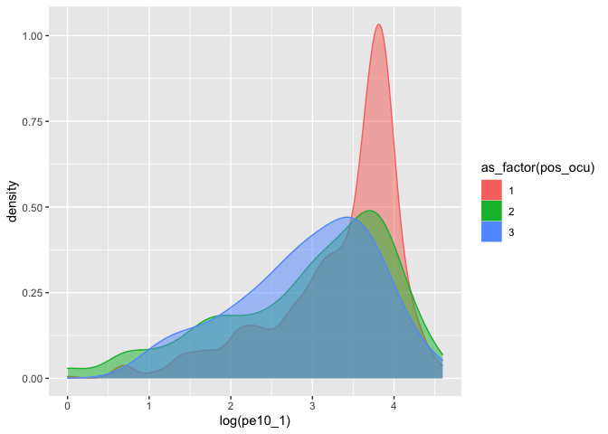

Práctica 6. Inferencia
================
AE
28/10/2020

# Previo

## Paquetería

``` r
if (!require("pacman")) install.packages("pacman") # instala pacman si se requiere
```

    ## Loading required package: pacman

``` r
pacman::p_load(tidyverse, 
               readxl,writexl,googlesheets4, # importar hojas de cálculo
               haven, foreign, # importación de dta y sav
               sjlabelled, # etiquetas
               janitor, skimr, #limpieza y verificación
               imputeTS, # para imputar valores
               srvyr, # Para el diseño muestral
               esquisse, # para usar ggplot de manera más amigable
               DescTools, # Paquete para estimaciones y pruebas
               infer, # tidy way 
               broom) # Una escobita para limpiar (pero es para arreglar)
```

## Directorio

En caso que no tengas un proyecto,establecer el diretorio puede ayudar

<i>¡Recuerda establecer tu directorio\!</i>

``` r
setwd("/Users/anaescoto/Dropbox/2020/2021-1 R para Demográfos/repo/R_Demo")
```

## Bases

Base de ECOVID - ML

``` r
ecovid0420 <- read_dta("https://github.com/aniuxa/R_Demo/raw/master/datos/ecovid0420.dta")
```

# Hipótesis e intervalos de confianza

## t-test

Este comando nos sirve para calcular diferentes tipos de test, que
tienen como base la distribución t

<b>Univariado para estimación</b>

``` r
t.test(ecovid0420$pe10_1)
```

    ## 
    ##  One Sample t-test
    ## 
    ## data:  ecovid0420$pe10_1
    ## t = 82.56, df = 2461, p-value < 2.2e-16
    ## alternative hypothesis: true mean is not equal to 0
    ## 95 percent confidence interval:
    ##  31.87638 33.42744
    ## sample estimates:
    ## mean of x 
    ##  32.65191

<b>Univariado para hipótesis específica</b>

``` r
t.test(ecovid0420$pe10_1, mu=40)
```

    ## 
    ##  One Sample t-test
    ## 
    ## data:  ecovid0420$pe10_1
    ## t = -18.58, df = 2461, p-value < 2.2e-16
    ## alternative hypothesis: true mean is not equal to 40
    ## 95 percent confidence interval:
    ##  31.87638 33.42744
    ## sample estimates:
    ## mean of x 
    ##  32.65191

``` r
t.test(ecovid0420$pe10_1, mu=40, alternative = "two.sided") #default y de dos colas
```

    ## 
    ##  One Sample t-test
    ## 
    ## data:  ecovid0420$pe10_1
    ## t = -18.58, df = 2461, p-value < 2.2e-16
    ## alternative hypothesis: true mean is not equal to 40
    ## 95 percent confidence interval:
    ##  31.87638 33.42744
    ## sample estimates:
    ## mean of x 
    ##  32.65191

``` r
t.test(ecovid0420$pe10_1, mu=40, alternative = "less") # cola izquierda
```

    ## 
    ##  One Sample t-test
    ## 
    ## data:  ecovid0420$pe10_1
    ## t = -18.58, df = 2461, p-value < 2.2e-16
    ## alternative hypothesis: true mean is less than 40
    ## 95 percent confidence interval:
    ##      -Inf 33.30268
    ## sample estimates:
    ## mean of x 
    ##  32.65191

``` r
t.test(ecovid0420$pe10_1, mu=40, alternative = "greater") #cola derecha 
```

    ## 
    ##  One Sample t-test
    ## 
    ## data:  ecovid0420$pe10_1
    ## t = -18.58, df = 2461, p-value = 1
    ## alternative hypothesis: true mean is greater than 40
    ## 95 percent confidence interval:
    ##  32.00114      Inf
    ## sample estimates:
    ## mean of x 
    ##  32.65191

## Enchulando un poquito

Los resultados tienen la info, pero la podemos almacenar en un objeto.
Con los cálculos de modelos es muy útil guardarlos para compararlos.

``` r
t.test0<-t.test(ecovid0420$pe10_1, mu=40, alternative = "less")
```

Veamos si lo imprimimos

``` r
t.test0
```

    ## 
    ##  One Sample t-test
    ## 
    ## data:  ecovid0420$pe10_1
    ## t = -18.58, df = 2461, p-value < 2.2e-16
    ## alternative hypothesis: true mean is less than 40
    ## 95 percent confidence interval:
    ##      -Inf 33.30268
    ## sample estimates:
    ## mean of x 
    ##  32.65191

``` r
tidy(t.test0)
```

    ## # A tibble: 1 x 8
    ##   estimate statistic  p.value parameter conf.low conf.high method    alternative
    ##      <dbl>     <dbl>    <dbl>     <dbl>    <dbl>     <dbl> <chr>     <chr>      
    ## 1     32.7     -18.6 1.63e-72      2461     -Inf      33.3 One Samp… less

La función “tidy()” hace que el resultado se vuelva un “tibble”, una
tabla muy compatible con el tidyverse. Esto puede ser útil cuando
queremos ir comparando estimaciones.

Anteriormente vimos con base cómo hacer inferencia. El paquete “infer”
tiene también elementos para inferencia, pero en formato más compatible
con tidyverse.

``` r
ecovid0420 %>% 
t_test( response = pe10_1, mu = 40)
```

    ## # A tibble: 1 x 6
    ##   statistic  t_df  p_value alternative lower_ci upper_ci
    ##       <dbl> <dbl>    <dbl> <chr>          <dbl>    <dbl>
    ## 1     -18.6  2461 3.26e-72 two.sided       31.9     33.4

Como vemos nos da el mismo resultado anterior, pero nos da directamente
el resultado en formato tidy.

Si solo queremos el estimador de “t”

``` r
ecovid0420 %>% 
t_stat(response = pe10_1, mu = 40)
```

    ##        t 
    ## -18.5796

Más de este paquete <https://infer.netlify.app/>

## Proporciones

Para una proporción en realidad el comando de base es muy sencillo,
puesto que necesita

``` r
table(ecovid0420$clase1)
```

    ## 
    ##    1    2 
    ## 3095 2498

``` r
prop.test(table(ecovid0420$clase1))
```

    ## 
    ##  1-sample proportions test with continuity correction
    ## 
    ## data:  table(ecovid0420$clase1), null probability 0.5
    ## X-squared = 63.511, df = 1, p-value = 1.595e-15
    ## alternative hypothesis: true p is not equal to 0.5
    ## 95 percent confidence interval:
    ##  0.5402196 0.5664472
    ## sample estimates:
    ##         p 
    ## 0.5533703

Ojo, R no utiliza Z para las proporciones. ¿Qué usará?

# Estimaciones bivariadas

## Diferencias de medias por grupos

¿Podemos decir, con significancia estadística que los valores medios de
una variable son diferentes entre los grupos?

``` r
ecovid0420 %>% 
    filter(ecovid0420$clase2==1) %>% # nos quedamos con los trabajadores
      group_by(as_label(pb1)) %>%
      summarise(avg_hrs = mean(pe10_1, na.rm=T))
```

    ## `summarise()` ungrouping output (override with `.groups` argument)

    ## # A tibble: 2 x 2
    ##   `as_label(pb1)` avg_hrs
    ##   <fct>             <dbl>
    ## 1 Hombre             35.6
    ## 2 Mujer              28.6

``` r
ecovid0420 %>% 
    filter(ecovid0420$clase2==1) %>%
      with(t.test(pe10_1~pb1))
```

    ## 
    ##  Welch Two Sample t-test
    ## 
    ## data:  pe10_1 by pb1
    ## t = 8.8818, df = 2279.4, p-value < 2.2e-16
    ## alternative hypothesis: true difference in means is not equal to 0
    ## 95 percent confidence interval:
    ##  5.431047 8.508840
    ## sample estimates:
    ## mean in group 1 mean in group 2 
    ##        35.60465        28.63471

Con “infer” sería:

``` r
ecovid0420 %>% 
  mutate(pb1=as_label(pb1)) %>% 
  t_test(pe10_1 ~ pb1, order = c("Hombre", "Mujer") )
```

    ## # A tibble: 1 x 6
    ##   statistic  t_df  p_value alternative lower_ci upper_ci
    ##       <dbl> <dbl>    <dbl> <chr>          <dbl>    <dbl>
    ## 1      8.88 2279. 1.30e-18 two.sided       5.43     8.51

# Estimación de varianzas y sus pruebas de hipótesis

Para poder hacer inferencia sobre la varianza utilizamos el comando
varTest() del paquete “DescTools”

``` r
ecovid0420 %>% 
    filter(clase2==1) %>% 
      with(VarTest(pe10_1))
```

    ## 
    ##  One Sample Chi-Square test on variance
    ## 
    ## data:  pe10_1
    ## X-squared = 947711, df = 2461, p-value < 2.2e-16
    ## alternative hypothesis: true variance is not equal to 1
    ## 95 percent confidence interval:
    ##  364.4495 407.5476
    ## sample estimates:
    ## variance of x 
    ##      385.0917

Podemos también decir algo sobre el valor objetivo de nuestra hipótesis

``` r
ecovid0420 %>% 
    filter(clase2==1) %>% 
      with(VarTest(pe10_1, sigma.squared = 100))
```

    ## 
    ##  One Sample Chi-Square test on variance
    ## 
    ## data:  pe10_1
    ## X-squared = 9477.1, df = 2461, p-value < 2.2e-16
    ## alternative hypothesis: true variance is not equal to 100
    ## 95 percent confidence interval:
    ##  364.4495 407.5476
    ## sample estimates:
    ## variance of x 
    ##      385.0917

Guardar como objeto nuestros resultados, siempres muy conveniente para
pedir después o para realizar operaciones con ellos

``` r
test2<-ecovid0420 %>% 
    filter(clase2==1) %>% 
      with(VarTest(pe10_1))
test2$conf.int
```

    ## [1] 364.4495 407.5476
    ## attr(,"conf.level")
    ## [1] 0.95

``` r
sqrt(test2$conf.int) ## sacamos la raíz cuadrada para tener las
```

    ## [1] 19.09056 20.18781
    ## attr(,"conf.level")
    ## [1] 0.95

``` r
#desviaciones estándar y sea más fácil de interpretar
```

Con tidy de “broom”

``` r
tidy(test2)
```

    ## # A tibble: 1 x 8
    ##   estimate statistic p.value parameter conf.low conf.high method     alternative
    ##      <dbl>     <dbl>   <dbl>     <dbl>    <dbl>     <dbl> <chr>      <chr>      
    ## 1     385.   947711.       0      2461     364.      408. One Sampl… two.sided

# Estimación de diferencias de varianzas y sus pruebas de hipótesis

Para comparar varianza, usamos su “ratio”, esto nos da un estadístico de
prueba F, para comparar dos muestras de poblaciones normales.

``` r
ecovid0420 %>% 
    filter(clase2==1) %>% 
      with(var.test(x=pe10_1, y=pb2, ratio=1))
```

    ## 
    ##  F test to compare two variances
    ## 
    ## data:  pe10_1 and pb2
    ## F = 2.0918, num df = 2461, denom df = 2882, p-value < 2.2e-16
    ## alternative hypothesis: true ratio of variances is not equal to 1
    ## 95 percent confidence interval:
    ##  1.938722 2.257404
    ## sample estimates:
    ## ratio of variances 
    ##           2.091761

“x=” declara al numerador “y=” declara al denominador

``` r
ecovid0420 %>% 
    filter(clase2==1) %>% 
      with(var.test(x=pe10_1, y=pb2, ratio=1, conf.level = 0.98))
```

    ## 
    ##  F test to compare two variances
    ## 
    ## data:  pe10_1 and pb2
    ## F = 2.0918, num df = 2461, denom df = 2882, p-value < 2.2e-16
    ## alternative hypothesis: true ratio of variances is not equal to 1
    ## 98 percent confidence interval:
    ##  1.911391 2.289825
    ## sample estimates:
    ## ratio of variances 
    ##           2.091761

Si lo que queremos es comparar la varianza entre dos grupos, usamos el
signo \~

``` r
ecovid0420 %>% 
    filter(clase2==1) %>% 
      with(var.test(pe10_1 ~ as_label(pb1), ratio=1))
```

    ## 
    ##  F test to compare two variances
    ## 
    ## data:  pe10_1 by as_label(pb1)
    ## F = 1.0575, num df = 1418, denom df = 1042, p-value = 0.3351
    ## alternative hypothesis: true ratio of variances is not equal to 1
    ## 95 percent confidence interval:
    ##  0.9438743 1.1835813
    ## sample estimates:
    ## ratio of variances 
    ##           1.057478

# Prueba chi-cuadrado chi-sq. Una aplicación más común

Cuando tenemos dos variables cualitativas o nominales podemos hacer esta
la prueba chi-cuadrado, o prueba de independencia. Esta tiene una lógica
un poco diferente a las pruebas que hacemos, porque proviene de comparar
la distribución de los datos dado que no hay independencia entre las
variables y los datos que tenemos.

La hipótesis nula postula una distribución de probabilidad totalmente
especificada como el modelo matemático de la población que ha generado
la muestra, por lo que si la rechazamos hemos encontrado evidencia
estadística sobre la dependencia de las dos variables.

``` r
table(ecovid0420$clase2, ecovid0420$pb1)
```

    ##    
    ##        1    2
    ##   1 1652 1241
    ##   2   89  113
    ##   3  398  682
    ##   4  254 1164

``` r
chisq.test(ecovid0420$clase2, ecovid0420$pb1)
```

    ## 
    ##  Pearson's Chi-squared test
    ## 
    ## data:  ecovid0420$clase2 and ecovid0420$pb1
    ## X-squared = 616.3, df = 3, p-value < 2.2e-16

Con tabyl:

``` r
ecovid0420 %>% 
  mutate_all(vars(clase2, pb1), as_label) %>% 
  tabyl(clase2, pb1) %>% 
  janitor::chisq.test() #ojo
```

    ## Warning: The `...` argument of `mutate_all()` can't contain quosures. as of dplyr 0.8.3.
    ## Please use a one-sided formula, a function, or a function name.
    ## This warning is displayed once every 8 hours.
    ## Call `lifecycle::last_warnings()` to see where this warning was generated.

    ## 
    ##  Pearson's Chi-squared test
    ## 
    ## data:  .
    ## X-squared = 616.3, df = 3, p-value < 2.2e-16

# Análisis de varianza

Análisis de varianza. Haremos la versión más simple. Para ver el efecto
de un factor sobre una variable cualitativa (oneway). Revisaremos si la
región de residencia de los trabajadores tiene un efecto en la
distribución de los ingresos por trabajo.

## Primero un gráfico

la ANOVA se basa en que nuestra variable es normal. Quitaremos los
outliers

``` r
lienzo_bi <-ecovid0420 %>% 
           filter(clase2==1  & !pe10_1==0) %>% 
           ggplot(aes(x=log(pe10_1), fill=as_factor(pos_ocu), 
           color=as_factor(pos_ocu),
           alpha=I(0.5)))

lienzo_bi + geom_density()
```

<!-- -->

La prueba ANOVA o análisis de varianza, nos dice cuánto de nuestra
variable se ve explicado por un factor. En los modelos es mul útil
guardar nuestros resultados como un objeto

``` r
anova<-ecovid0420 %>% 
    filter(clase2==1) %>% 
      with(aov(pe10_1 ~ as_factor(pos_ocu)))

summary(anova)
```

    ##                      Df Sum Sq Mean Sq F value   Pr(>F)    
    ## as_factor(pos_ocu)    2  25993   12996   34.67 1.41e-15 ***
    ## Residuals          2459 921718     375                     
    ## ---
    ## Signif. codes:  0 '***' 0.001 '**' 0.01 '*' 0.05 '.' 0.1 ' ' 1
    ## 431 observations deleted due to missingness

Con tidy:

``` r
tidy(anova)
```

    ## # A tibble: 2 x 6
    ##   term                  df   sumsq meansq statistic   p.value
    ##   <chr>              <dbl>   <dbl>  <dbl>     <dbl>     <dbl>
    ## 1 as_factor(pos_ocu)     2  25993. 12996.      34.7  1.41e-15
    ## 2 Residuals           2459 921718.   375.      NA   NA

### Comparación entre grupos

¿si es significativo cuáles diferencias entre los grupos lo son?

``` r
TukeyHSD(anova)
```

    ##   Tukey multiple comparisons of means
    ##     95% family-wise confidence level
    ## 
    ## Fit: aov(formula = pe10_1 ~ as_factor(pos_ocu))
    ## 
    ## $`as_factor(pos_ocu)`
    ##          diff        lwr       upr     p adj
    ## 2-1 -6.700874  -8.694986 -4.706761 0.0000000
    ## 3-1 -9.927257 -16.786459 -3.068054 0.0020207
    ## 3-2 -3.226383 -10.193983  3.741217 0.5228956

## Supuestos de ANOVA

  - Las observaciones se obtienen de forma independiente y aleatoria de
    la población definida por los niveles del factor
  - Los datos de cada nivel de factor se distribuyen normalmente.
  - Estas poblaciones normales tienen una varianza común.

<!-- end list -->

``` r
#Prueba Bartlett para ver si las varianzas son iguales

ecovid0420 %>% 
    filter(clase2==1) %>% 
      with(bartlett.test(pe10_1 ~ as_factor(pos_ocu)))
```

    ## 
    ##  Bartlett test of homogeneity of variances
    ## 
    ## data:  pe10_1 by as_factor(pos_ocu)
    ## Bartlett's K-squared = 14.821, df = 2, p-value = 0.0006047

La prueba tiene una Ho “Las varianzas son iguales”

``` r
#Test Normalidad 
ecovid0420 %>% 
    filter(clase2==1) %>% 
      with(shapiro.test(pe10_1))
```

    ## 
    ##  Shapiro-Wilk normality test
    ## 
    ## data:  pe10_1
    ## W = 0.96169, p-value < 2.2e-16

La prueba tiene una Ho “La variable es normal”

**¿Qué hacer?**

## Kruskal-Wallis test

Hay una prueba muy parecida que se basa en el orden de las
observaciones, y se lee muy parecida a la ANOVA

``` r
kruskal<-ecovid0420 %>% 
    filter(clase2==1) %>% 
      with(kruskal.test(pe10_1 ~ as_factor(pos_ocu)))

kruskal
```

    ## 
    ##  Kruskal-Wallis rank sum test
    ## 
    ## data:  pe10_1 by as_factor(pos_ocu)
    ## Kruskal-Wallis chi-squared = 84.7, df = 2, p-value < 2.2e-16

Para ver las comparaciones tenemos que usar el dunn.test(), del paquet
DescTools

``` r
ecovid0420 %>% 
    filter(clase2==1) %>% 
      with(DunnTest(pe10_1 ~ as_factor(pos_ocu)))
```

    ## 
    ##  Dunn's test of multiple comparisons using rank sums : holm  
    ## 
    ##     mean.rank.diff    pval    
    ## 2-1      -272.4425 < 2e-16 ***
    ## 3-1      -391.6628 0.00052 ***
    ## 3-2      -119.2203 0.27353    
    ## ---
    ## Signif. codes:  0 '***' 0.001 '**' 0.01 '*' 0.05 '.' 0.1 ' ' 1

# Ejercicio

Este es un ejercicio más libre y para que revisen más la base de datos.

Presente **dos** pruebas de hipótesis revisadas en esta práctica con
otras variables de su elección.

\!Revise la ayuda de las pruebas para mejor interpretación de sus
resultados.

Envíelo a la siguiente liga.

<https://docs.google.com/forms/d/e/1FAIpQLSc_2-K-hJcMug1p62d3KKG6Px9h0MtU88YfP4a9ijZq8qWsLA/viewform?usp=sf_link>
