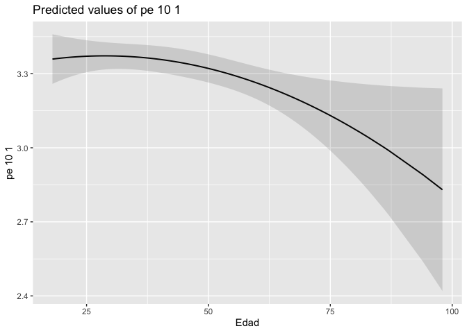

Práctica 8. Regresión lineal y más
================
Ana Escoto
12/11/2020

# Previo

## Paquetería

``` r
#install.packages("sjPlot", dependencies=T) # solito porque da problmas

library(sjPlot)

if (!require("pacman")) install.packages("pacman") # instala pacman si se requiere
```

    ## Loading required package: pacman

``` r
pacman::p_load(tidyverse, 
               readxl,writexl,googlesheets4, # importar hojas de cálculo
               haven, foreign, # importación de dta y sav
               sjlabelled, # etiquetas
               janitor, skimr, #limpieza y verificación
               imputeTS, # para imputar valores
               srvyr, # Para el diseño muestral
               esquisse, # para usar ggplot de manera más amigable
               DescTools, # Paquete para estimaciones y pruebas
               infer, # tidy way 
               broom,  # Una escobita para limpiar (pero es para arreglar)
               estimatr, car, stargazer, ggpubr, # Para la regresión práctica 7
               jtools, lm.beta, robustbase, sandwich, 
               officer,flextable,huxtable, ggstance, kableExtra) # Para la regresión práctica 8
```

## Directorio

En caso que no tengas un proyecto,establecer el directorio puede ayudar

``` r
setwd("/Users/anaescoto/Dropbox/2020/2021-1 R para Demográfos/repo/R_Demo")
```

## Bases

Base de ECOVID - ML

``` r
ecovid0420 <- read_dta("https://github.com/aniuxa/R_Demo/raw/master/datos/ecovid0420.dta")
```

## Base cortada y modelo práctica pasada

``` r
mydata<- ecovid0420 %>% 
  filter(clase2==1) %>% # me quedo con los ocupados
  mutate(pb1=as_label(pb1)) %>%  # Para hacer gráficos sin problemas
  select(ent, pa1,starts_with("pb"), pos_ocu, pe10_1, fac_per, pa4_1)

mydata$log_hrs<-log(mydata$pe10_1)
```

``` r
modelo2<-lm(log_hrs ~ pb2 + pb1 + pa1, data = mydata, # es ligeramente diferente al de la clse pasada
    na.action = na.exclude)
summary(modelo2)
```

    ## 
    ## Call:
    ## lm(formula = log_hrs ~ pb2 + pb1 + pa1, data = mydata, na.action = na.exclude)
    ## 
    ## Residuals:
    ##     Min      1Q  Median      3Q     Max 
    ## -3.4002 -0.4101  0.3072  0.6057  1.6455 
    ## 
    ## Coefficients:
    ##              Estimate Std. Error t value Pr(>|t|)    
    ## (Intercept)  3.503327   0.073489  47.671   <2e-16 ***
    ## pb2         -0.003639   0.001304  -2.791   0.0053 ** 
    ## pb1Mujer    -0.311466   0.035743  -8.714   <2e-16 ***
    ## pa1         -0.005274   0.008930  -0.591   0.5548    
    ## ---
    ## Signif. codes:  0 '***' 0.001 '**' 0.01 '*' 0.05 '.' 0.1 ' ' 1
    ## 
    ## Residual standard error: 0.8733 on 2448 degrees of freedom
    ##   (441 observations deleted due to missingness)
    ## Multiple R-squared:  0.03216,    Adjusted R-squared:  0.03097 
    ## F-statistic: 27.11 on 3 and 2448 DF,  p-value: < 2.2e-16

``` r
summ(modelo2)
```

<table class="table table-striped table-hover table-condensed table-responsive" style="width: auto !important; margin-left: auto; margin-right: auto;">

<tbody>

<tr>

<td style="text-align:left;font-weight: bold;">

Observations

</td>

<td style="text-align:right;">

2452 (441 missing obs. deleted)

</td>

</tr>

<tr>

<td style="text-align:left;font-weight: bold;">

Dependent variable

</td>

<td style="text-align:right;">

log\_hrs

</td>

</tr>

<tr>

<td style="text-align:left;font-weight: bold;">

Type

</td>

<td style="text-align:right;">

OLS linear regression

</td>

</tr>

</tbody>

</table>

<table class="table table-striped table-hover table-condensed table-responsive" style="width: auto !important; margin-left: auto; margin-right: auto;">

<tbody>

<tr>

<td style="text-align:left;font-weight: bold;">

F(3,2448)

</td>

<td style="text-align:right;">

27.11

</td>

</tr>

<tr>

<td style="text-align:left;font-weight: bold;">

R²

</td>

<td style="text-align:right;">

0.03

</td>

</tr>

<tr>

<td style="text-align:left;font-weight: bold;">

Adj. R²

</td>

<td style="text-align:right;">

0.03

</td>

</tr>

</tbody>

</table>

<table class="table table-striped table-hover table-condensed table-responsive" style="width: auto !important; margin-left: auto; margin-right: auto;border-bottom: 0;">

<thead>

<tr>

<th style="text-align:left;">

</th>

<th style="text-align:right;">

Est.

</th>

<th style="text-align:right;">

S.E.

</th>

<th style="text-align:right;">

t val.

</th>

<th style="text-align:right;">

p

</th>

</tr>

</thead>

<tbody>

<tr>

<td style="text-align:left;font-weight: bold;">

(Intercept)

</td>

<td style="text-align:right;">

3.50

</td>

<td style="text-align:right;">

0.07

</td>

<td style="text-align:right;">

47.67

</td>

<td style="text-align:right;">

0.00

</td>

</tr>

<tr>

<td style="text-align:left;font-weight: bold;">

pb2

</td>

<td style="text-align:right;">

\-0.00

</td>

<td style="text-align:right;">

0.00

</td>

<td style="text-align:right;">

\-2.79

</td>

<td style="text-align:right;">

0.01

</td>

</tr>

<tr>

<td style="text-align:left;font-weight: bold;">

pb1Mujer

</td>

<td style="text-align:right;">

\-0.31

</td>

<td style="text-align:right;">

0.04

</td>

<td style="text-align:right;">

\-8.71

</td>

<td style="text-align:right;">

0.00

</td>

</tr>

<tr>

<td style="text-align:left;font-weight: bold;">

pa1

</td>

<td style="text-align:right;">

\-0.01

</td>

<td style="text-align:right;">

0.01

</td>

<td style="text-align:right;">

\-0.59

</td>

<td style="text-align:right;">

0.55

</td>

</tr>

</tbody>

<tfoot>

<tr>

<td style="padding: 0; " colspan="100%">

<sup></sup> Standard errors: OLS

</td>

</tr>

</tfoot>

</table>

``` r
tidy(modelo2)%>%
  kbl() %>%
  kable_paper("hover", full_width = F)
```

<table class=" lightable-paper lightable-hover" style='font-family: "Arial Narrow", arial, helvetica, sans-serif; width: auto !important; margin-left: auto; margin-right: auto;'>

<thead>

<tr>

<th style="text-align:left;">

term

</th>

<th style="text-align:right;">

estimate

</th>

<th style="text-align:right;">

std.error

</th>

<th style="text-align:right;">

statistic

</th>

<th style="text-align:right;">

p.value

</th>

</tr>

</thead>

<tbody>

<tr>

<td style="text-align:left;">

(Intercept)

</td>

<td style="text-align:right;">

3.5033269

</td>

<td style="text-align:right;">

0.0734892

</td>

<td style="text-align:right;">

47.6712937

</td>

<td style="text-align:right;">

0.0000000

</td>

</tr>

<tr>

<td style="text-align:left;">

pb2

</td>

<td style="text-align:right;">

\-0.0036388

</td>

<td style="text-align:right;">

0.0013040

</td>

<td style="text-align:right;">

\-2.7905476

</td>

<td style="text-align:right;">

0.0053027

</td>

</tr>

<tr>

<td style="text-align:left;">

pb1Mujer

</td>

<td style="text-align:right;">

\-0.3114661

</td>

<td style="text-align:right;">

0.0357426

</td>

<td style="text-align:right;">

\-8.7141396

</td>

<td style="text-align:right;">

0.0000000

</td>

</tr>

<tr>

<td style="text-align:left;">

pa1

</td>

<td style="text-align:right;">

\-0.0052739

</td>

<td style="text-align:right;">

0.0089297

</td>

<td style="text-align:right;">

\-0.5906034

</td>

<td style="text-align:right;">

0.5548407

</td>

</tr>

</tbody>

</table>

# Estandarizando que es gerundio

Comparar los resultados de los coeficientes es díficil, porque el efecto
está medido en las unidades que fueron medidas. Por lo que no sería tan
comparable el efecto que tenemos de nuestro índice sumativo (proporción
de lugares con inseguridad declarada) con respecto a la eda (que se mide
en años). Por lo que a veces es mejor usar las medida estandarizadas (es
decir, nuestra puntajes z).

Podemos hacerlo transormando nuestras variables de origen e
introducirlas al modelo. O bien, podemos usar un paquete que lo hace
directamente. Los coeficientes calculados se les conoce como “beta”

Simplemente aplicamos el comando a nuestros modelos ya calculados

``` r
lm.beta(modelo2)
```

    ## 
    ## Call:
    ## lm(formula = log_hrs ~ pb2 + pb1 + pa1, data = mydata, na.action = na.exclude)
    ## 
    ## Standardized Coefficients::
    ## (Intercept)         pb2    pb1Mujer         pa1 
    ##  0.00000000 -0.05630726 -0.17352597 -0.01189996

Hoy la comparación será mucho más clara y podemos ver qué variable tiene
mayor efecto en nuestra dependiente.

``` r
modelo_beta<-lm.beta(modelo2)
modelo_beta
```

    ## 
    ## Call:
    ## lm(formula = log_hrs ~ pb2 + pb1 + pa1, data = mydata, na.action = na.exclude)
    ## 
    ## Standardized Coefficients::
    ## (Intercept)         pb2    pb1Mujer         pa1 
    ##  0.00000000 -0.05630726 -0.17352597 -0.01189996

Para graficarlos, podemos usar de nuevo el comando plot\_model(), con
una opción

``` r
plot_model(modelo2, type="std")
```

<!-- -->

¿Qué podemos concluir de estos resultados?

\#Post-estimación \#\# Las predicciones

Unos de los usos más comunes de los modelos estadísticos es la
predicción

``` r
sjPlot::plot_model(modelo2, type="pred", terms = "pb2")
```

<!-- -->

También podemos incluir la predecciones para los distintos valores de
las variables

``` r
plot_model(modelo2, type="pred", terms = c("pb2","pb1")) + theme_blank()
```

<!-- -->

El orden de los términos importa:

``` r
plot_model(modelo2, type="pred", terms = c("pb1","pb2")) + theme_blank()
```

<!-- -->

## Efectos marginales

Con los efectos marginales, por otro lado medimos el efecto promedio,
dejando el resto de variables constantes.

``` r
plot_model(modelo2, type="eff", terms = "pb2")
```

    ## Package `effects` is not available, but needed for `ggeffect()`. Either install package `effects`, or use `ggpredict()`. Calling `ggpredict()` now.FALSE

<!-- -->

``` r
plot_model(modelo2, type="eff", terms = "pb1")
```

    ## Package `effects` is not available, but needed for `ggeffect()`. Either install package `effects`, or use `ggpredict()`. Calling `ggpredict()` now.FALSE

<!-- --> ¿Es el mismo
gráfico que con “pred”? Veamos la ayuda

¿Y si queremos ver esta informaicón graficada?

``` r
eff<-plot_model(modelo2, type="eff", terms = "pb2")
```

    ## Package `effects` is not available, but needed for `ggeffect()`. Either install package `effects`, or use `ggpredict()`. Calling `ggpredict()` now.FALSE

``` r
eff$data
```

    ## Warning in knit_print.huxtable(ht): Unrecognized output format "gfm". Using `to_screen` to print huxtables.
    ## Set options("huxtable.knitr_output_format") manually to "latex", "html", "rtf", "docx", "pptx", "md" or "screen".

┌────────────────────────────────────────────────────────────────────┐ │
x predicte std.erro conf.low conf.hig group group\_co │ │ d r h l │
├────────────────────────────────────────────────────────────────────┤
│ 10 3.45 0.0466 3.35 3.54 1 1 │ │ 20 3.41 0.0359 3.34 3.48 1 1 │ │ 30
3.37 0.0273 3.32 3.43 1 1 │ │ 40 3.34 0.0233 3.29 3.38 1 1 │ │ 50 3.3 
0.026  3.25 3.35 1 1 │ │ 60 3.26 0.034  3.2  3.33 1 1 │ │ 70 3.23 0.0444
3.14 3.31 1 1 │ │ 80 3.19 0.0559 3.08 3.3  1 1 │ │ 90 3.15 0.068  3.02
3.29 1 1 │ │ 100 3.12 0.0804 2.96 3.28 1 1 │
└────────────────────────────────────────────────────────────────────┘

Column names: x, predicted, std.error, conf.low, conf.high, group,
group\_col

``` r
eff<-plot_model(modelo2, type="pred", terms = "pb2")
eff$data
```

    ## Warning in knit_print.huxtable(ht): Unrecognized output format "gfm". Using `to_screen` to print huxtables.
    ## Set options("huxtable.knitr_output_format") manually to "latex", "html", "rtf", "docx", "pptx", "md" or "screen".

┌────────────────────────────────────────────────────────────────────┐ │
x predicte std.erro conf.low conf.hig group group\_co │ │ d r h l │
├────────────────────────────────────────────────────────────────────┤
│ 10 3.45 0.0466 3.35 3.54 1 1 │ │ 20 3.41 0.0359 3.34 3.48 1 1 │ │ 30
3.37 0.0273 3.32 3.43 1 1 │ │ 40 3.34 0.0233 3.29 3.38 1 1 │ │ 50 3.3 
0.026  3.25 3.35 1 1 │ │ 60 3.26 0.034  3.2  3.33 1 1 │ │ 70 3.23 0.0444
3.14 3.31 1 1 │ │ 80 3.19 0.0559 3.08 3.3  1 1 │ │ 90 3.15 0.068  3.02
3.29 1 1 │ │ 100 3.12 0.0804 2.96 3.28 1 1 │
└────────────────────────────────────────────────────────────────────┘

Column names: x, predicted, std.error, conf.low, conf.high, group,
group\_col

# Extensiones del modelo de regresión

\#\#Introducción a las interacciones

Muchas veces las variables explicativas van a tener relación entre sí.
Por ejemplo ¿Las horas tendrá que ver con el sexo y afectan no sólo en
intercepto si no también la pendiente? Para ello podemos introducir una
interacción

``` r
modelo_int1<-lm(log_hrs ~ pb2 * pb1 , data = mydata, na.action=na.exclude)
summary(modelo_int1)
```

    ## 
    ## Call:
    ## lm(formula = log_hrs ~ pb2 * pb1, data = mydata, na.action = na.exclude)
    ## 
    ## Residuals:
    ##     Min      1Q  Median      3Q     Max 
    ## -3.3857 -0.3984  0.3084  0.5994  1.6844 
    ## 
    ## Coefficients:
    ##               Estimate Std. Error t value Pr(>|t|)    
    ## (Intercept)   3.441687   0.070620  48.735   <2e-16 ***
    ## pb2          -0.002667   0.001627  -1.640   0.1011    
    ## pb1Mujer     -0.220596   0.112375  -1.963   0.0498 *  
    ## pb2:pb1Mujer -0.002263   0.002659  -0.851   0.3948    
    ## ---
    ## Signif. codes:  0 '***' 0.001 '**' 0.01 '*' 0.05 '.' 0.1 ' ' 1
    ## 
    ## Residual standard error: 0.8732 on 2448 degrees of freedom
    ##   (441 observations deleted due to missingness)
    ## Multiple R-squared:  0.03231,    Adjusted R-squared:  0.03112 
    ## F-statistic: 27.24 on 3 and 2448 DF,  p-value: < 2.2e-16

Esta interacción lo que asume es que las pendientes pueden moverse
(aunque en este caso específico no lo hacen tanto porque no nos salió
significativa)

``` r
plot_model(modelo_int1, type="int", terms = c("pb1", "pb2"))
```

<!-- -->

## Efectos no lineales

### Explicitando el logaritmo

``` r
modelo_log<-lm(log_hrs ~ log(pb2) + pb1, data = mydata, na.action = na.exclude)
summary(modelo_log)
```

    ## 
    ## Call:
    ## lm(formula = log_hrs ~ log(pb2) + pb1, data = mydata, na.action = na.exclude)
    ## 
    ## Residuals:
    ##     Min      1Q  Median      3Q     Max 
    ## -3.4075 -0.4062  0.3133  0.6031  1.6269 
    ## 
    ## Coefficients:
    ##             Estimate Std. Error t value Pr(>|t|)    
    ## (Intercept)  3.78425    0.18815  20.113   <2e-16 ***
    ## log(pb2)    -0.12375    0.05112  -2.421   0.0156 *  
    ## pb1Mujer    -0.30965    0.03573  -8.667   <2e-16 ***
    ## ---
    ## Signif. codes:  0 '***' 0.001 '**' 0.01 '*' 0.05 '.' 0.1 ' ' 1
    ## 
    ## Residual standard error: 0.8735 on 2449 degrees of freedom
    ##   (441 observations deleted due to missingness)
    ## Multiple R-squared:  0.03139,    Adjusted R-squared:  0.0306 
    ## F-statistic: 39.68 on 2 and 2449 DF,  p-value: < 2.2e-16

``` r
plot_model(modelo_log, type="pred", terms ="pb2")
```

<!-- --> \#\#\# Efecto
cuadrático (ojo con la sintaxis)

``` r
modelo_quadr<-lm(log_hrs ~ pb2 + I(pb2^2) + pb1, 
                 data=mydata, 
                 na.action=na.exclude)
summary(modelo_quadr)
```

    ## 
    ## Call:
    ## lm(formula = log_hrs ~ pb2 + I(pb2^2) + pb1, data = mydata, na.action = na.exclude)
    ## 
    ## Residuals:
    ##     Min      1Q  Median      3Q     Max 
    ## -3.3723 -0.3798  0.3174  0.6172  1.6754 
    ## 
    ## Coefficients:
    ##               Estimate Std. Error t value Pr(>|t|)    
    ## (Intercept)  3.279e+00  1.399e-01  23.437   <2e-16 ***
    ## pb2          6.507e-03  6.590e-03   0.987    0.324    
    ## I(pb2^2)    -1.131e-04  7.295e-05  -1.551    0.121    
    ## pb1Mujer    -3.142e-01  3.578e-02  -8.783   <2e-16 ***
    ## ---
    ## Signif. codes:  0 '***' 0.001 '**' 0.01 '*' 0.05 '.' 0.1 ' ' 1
    ## 
    ## Residual standard error: 0.8729 on 2448 degrees of freedom
    ##   (441 observations deleted due to missingness)
    ## Multiple R-squared:  0.03297,    Adjusted R-squared:  0.03178 
    ## F-statistic: 27.82 on 3 and 2448 DF,  p-value: < 2.2e-16

Quizás con un gráfico de lo predicho tenemos más claro lo que hace ese
término

``` r
plot_model(modelo_quadr, type="pred", terms = c("pb2"))
```

<!-- -->

En efecto, lo que nos da el signo del cuadrático puede hablarnos del
comportamiento cóncavo hacia arriba o hacia abajo. La edad muchas veces
tiene este comportamiento en algunos fenómenos.

# No cumplo los supuestos

## Heterocedasticidad

El problema de la heterocedasticidad es que los errores estándar de
subestiman, por lo que si estos están en el cociente de nuestro
estadístico de prueba t, esto implicaría que nuestras pruebas podrían
estar arrojando valores significativos cuando no lo son.

Una forma muy sencilla es pedir los errores robustos, esto se puede
desarrollar con el paquete “estimatr”
<https://declaredesign.org/r/estimatr/articles/getting-started.html>

``` r
modelo2rob1 <- lm_robust(log_hrs ~ pb2 + as_label(pb1) + pa1, data = mydata)
summary(modelo2rob1)
```

    ## 
    ## Call:
    ## lm_robust(formula = log_hrs ~ pb2 + as_label(pb1) + pa1, data = mydata)
    ## 
    ## Standard error type:  HC2 
    ## 
    ## Coefficients:
    ##                     Estimate Std. Error t value  Pr(>|t|)  CI Lower  CI Upper
    ## (Intercept)         3.503327   0.070701 49.5511 0.000e+00  3.364686  3.641968
    ## pb2                -0.003639   0.001309 -2.7801 5.475e-03 -0.006205 -0.001072
    ## as_label(pb1)Mujer -0.311466   0.036542 -8.5236 2.662e-17 -0.383122 -0.239811
    ## pa1                -0.005274   0.008725 -0.6045 5.456e-01 -0.022383  0.011835
    ##                      DF
    ## (Intercept)        2448
    ## pb2                2448
    ## as_label(pb1)Mujer 2448
    ## pa1                2448
    ## 
    ## Multiple R-squared:  0.03216 ,   Adjusted R-squared:  0.03097 
    ## F-statistic: 26.04 on 3 and 2448 DF,  p-value: < 2.2e-16

``` r
tidy(modelo2rob1)
```

    ## Warning in knit_print.huxtable(ht): Unrecognized output format "gfm". Using `to_screen` to print huxtables.
    ## Set options("huxtable.knitr_output_format") manually to "latex", "html", "rtf", "docx", "pptx", "md" or "screen".

┌─────────────────────────────────────────────────────────────────────────────
│ term estimate std.erro statisti p.value conf.low conf.hig  
│ r c h  
├─────────────────────────────────────────────────────────────────────────────
│ (Interce 3.5     0.0707  49.6   0        3.36    3.64     
│ pt)  
│ pb2 -0.00364 0.00131 -2.78  0.00548  -0.00621 -0.00107  
│ as\_label -0.311   0.0365  -8.52  2.66e-17 -0.383   -0.24     
│ (pb1)Muj  
│ er  
│ pa1 -0.00527 0.00872 -0.604 0.546    -0.0224  0.0118   
└─────────────────────────────────────────────────────────────────────────────

Column names: term, estimate, std.error, statistic, p.value, conf.low,
conf.high, df, outcome

7/9 columns shown.

## Errores en clúster

Cuando tenemos individuos que pertenecen a una misma unidad, podemos
crear errores anidados en clúster:

``` r
# cluster robust standard errors
modelo2rob2<- lm_robust(log_hrs ~ pb2 + as_label(pb1) + pa1, data = mydata, clusters = ent)
# standard summary view also available
summary(modelo2rob2)
```

    ## 
    ## Call:
    ## lm_robust(formula = log_hrs ~ pb2 + as_label(pb1) + pa1, data = mydata, 
    ##     clusters = ent)
    ## 
    ## Standard error type:  CR2 
    ## 
    ## Coefficients:
    ##                     Estimate Std. Error t value  Pr(>|t|)  CI Lower  CI Upper
    ## (Intercept)         3.503327   0.073977 47.3568 7.560e-29  3.351974  3.654680
    ## pb2                -0.003639   0.001191 -3.0550 4.838e-03 -0.006077 -0.001201
    ## as_label(pb1)Mujer -0.311466   0.041013 -7.5943 2.223e-08 -0.395338 -0.227594
    ## pa1                -0.005274   0.009214 -0.5724 5.719e-01 -0.024194  0.013646
    ##                       DF
    ## (Intercept)        28.77
    ## pb2                28.57
    ## as_label(pb1)Mujer 29.07
    ## pa1                26.56
    ## 
    ## Multiple R-squared:  0.03216 ,   Adjusted R-squared:  0.03097 
    ## F-statistic: 25.27 on 3 and 31 DF,  p-value: 1.824e-08

## ¡Nuevo\! jtools

Jacob Long is back\!

<https://cran.r-project.org/web/packages/jtools/vignettes/summ.html>

``` r
summ(modelo2, robust = "HC1")
```

<table class="table table-striped table-hover table-condensed table-responsive" style="width: auto !important; margin-left: auto; margin-right: auto;">

<tbody>

<tr>

<td style="text-align:left;font-weight: bold;">

Observations

</td>

<td style="text-align:right;">

2452 (441 missing obs. deleted)

</td>

</tr>

<tr>

<td style="text-align:left;font-weight: bold;">

Dependent variable

</td>

<td style="text-align:right;">

log\_hrs

</td>

</tr>

<tr>

<td style="text-align:left;font-weight: bold;">

Type

</td>

<td style="text-align:right;">

OLS linear regression

</td>

</tr>

</tbody>

</table>

<table class="table table-striped table-hover table-condensed table-responsive" style="width: auto !important; margin-left: auto; margin-right: auto;">

<tbody>

<tr>

<td style="text-align:left;font-weight: bold;">

F(3,2448)

</td>

<td style="text-align:right;">

27.11

</td>

</tr>

<tr>

<td style="text-align:left;font-weight: bold;">

R²

</td>

<td style="text-align:right;">

0.03

</td>

</tr>

<tr>

<td style="text-align:left;font-weight: bold;">

Adj. R²

</td>

<td style="text-align:right;">

0.03

</td>

</tr>

</tbody>

</table>

<table class="table table-striped table-hover table-condensed table-responsive" style="width: auto !important; margin-left: auto; margin-right: auto;border-bottom: 0;">

<thead>

<tr>

<th style="text-align:left;">

</th>

<th style="text-align:right;">

Est.

</th>

<th style="text-align:right;">

S.E.

</th>

<th style="text-align:right;">

t val.

</th>

<th style="text-align:right;">

p

</th>

</tr>

</thead>

<tbody>

<tr>

<td style="text-align:left;font-weight: bold;">

(Intercept)

</td>

<td style="text-align:right;">

3.50

</td>

<td style="text-align:right;">

0.07

</td>

<td style="text-align:right;">

49.58

</td>

<td style="text-align:right;">

0.00

</td>

</tr>

<tr>

<td style="text-align:left;font-weight: bold;">

pb2

</td>

<td style="text-align:right;">

\-0.00

</td>

<td style="text-align:right;">

0.00

</td>

<td style="text-align:right;">

\-2.78

</td>

<td style="text-align:right;">

0.01

</td>

</tr>

<tr>

<td style="text-align:left;font-weight: bold;">

pb1Mujer

</td>

<td style="text-align:right;">

\-0.31

</td>

<td style="text-align:right;">

0.04

</td>

<td style="text-align:right;">

\-8.52

</td>

<td style="text-align:right;">

0.00

</td>

</tr>

<tr>

<td style="text-align:left;font-weight: bold;">

pa1

</td>

<td style="text-align:right;">

\-0.01

</td>

<td style="text-align:right;">

0.01

</td>

<td style="text-align:right;">

\-0.61

</td>

<td style="text-align:right;">

0.55

</td>

</tr>

</tbody>

<tfoot>

<tr>

<td style="padding: 0; " colspan="100%">

<sup></sup> Standard errors: Robust, type = HC1

</td>

</tr>

</tfoot>

</table>

También “summ” funciona para estandarizar:

``` r
summ(modelo2, scale = TRUE)
```

<table class="table table-striped table-hover table-condensed table-responsive" style="width: auto !important; margin-left: auto; margin-right: auto;">

<tbody>

<tr>

<td style="text-align:left;font-weight: bold;">

Observations

</td>

<td style="text-align:right;">

2452 (441 missing obs. deleted)

</td>

</tr>

<tr>

<td style="text-align:left;font-weight: bold;">

Dependent variable

</td>

<td style="text-align:right;">

log\_hrs

</td>

</tr>

<tr>

<td style="text-align:left;font-weight: bold;">

Type

</td>

<td style="text-align:right;">

OLS linear regression

</td>

</tr>

</tbody>

</table>

<table class="table table-striped table-hover table-condensed table-responsive" style="width: auto !important; margin-left: auto; margin-right: auto;">

<tbody>

<tr>

<td style="text-align:left;font-weight: bold;">

F(3,2448)

</td>

<td style="text-align:right;">

27.11

</td>

</tr>

<tr>

<td style="text-align:left;font-weight: bold;">

R²

</td>

<td style="text-align:right;">

0.03

</td>

</tr>

<tr>

<td style="text-align:left;font-weight: bold;">

Adj. R²

</td>

<td style="text-align:right;">

0.03

</td>

</tr>

</tbody>

</table>

<table class="table table-striped table-hover table-condensed table-responsive" style="width: auto !important; margin-left: auto; margin-right: auto;border-bottom: 0;">

<thead>

<tr>

<th style="text-align:left;">

</th>

<th style="text-align:right;">

Est.

</th>

<th style="text-align:right;">

S.E.

</th>

<th style="text-align:right;">

t val.

</th>

<th style="text-align:right;">

p

</th>

</tr>

</thead>

<tbody>

<tr>

<td style="text-align:left;font-weight: bold;">

(Intercept)

</td>

<td style="text-align:right;">

3.33

</td>

<td style="text-align:right;">

0.02

</td>

<td style="text-align:right;">

143.44

</td>

<td style="text-align:right;">

0.00

</td>

</tr>

<tr>

<td style="text-align:left;font-weight: bold;">

pb2

</td>

<td style="text-align:right;">

\-0.05

</td>

<td style="text-align:right;">

0.02

</td>

<td style="text-align:right;">

\-2.79

</td>

<td style="text-align:right;">

0.01

</td>

</tr>

<tr>

<td style="text-align:left;font-weight: bold;">

pb1

</td>

<td style="text-align:right;">

\-0.31

</td>

<td style="text-align:right;">

0.04

</td>

<td style="text-align:right;">

\-8.71

</td>

<td style="text-align:right;">

0.00

</td>

</tr>

<tr>

<td style="text-align:left;font-weight: bold;">

pa1

</td>

<td style="text-align:right;">

\-0.01

</td>

<td style="text-align:right;">

0.02

</td>

<td style="text-align:right;">

\-0.59

</td>

<td style="text-align:right;">

0.55

</td>

</tr>

</tbody>

<tfoot>

<tr>

<td style="padding: 0; " colspan="100%">

<sup></sup> Standard errors: OLS; Continuous predictors are
mean-centered and scaled by 1 s.d.

</td>

</tr>

</tfoot>

</table>

## Regresión robusta

``` r
library(robustbase)
modelo2rob3<-lmrob(log_hrs ~ pb2 + as_label(pb1) + pa1, data = mydata, 
    na.action = na.exclude)
summary(modelo2rob3)
```

    ## 
    ## Call:
    ## lmrob(formula = log_hrs ~ pb2 + as_label(pb1) + pa1, data = mydata, na.action = na.exclude)
    ##  \--> method = "MM"
    ## Residuals:
    ##     Min      1Q  Median      3Q     Max 
    ## -3.5902 -0.6094  0.1037  0.4044  1.4290 
    ## 
    ## Coefficients:
    ##                     Estimate Std. Error t value Pr(>|t|)    
    ## (Intercept)         3.689804   0.060293  61.198  < 2e-16 ***
    ## pb2                -0.004233   0.001103  -3.837 0.000128 ***
    ## as_label(pb1)Mujer -0.254069   0.033397  -7.607 3.96e-14 ***
    ## pa1                -0.001523   0.007460  -0.204 0.838227    
    ## ---
    ## Signif. codes:  0 '***' 0.001 '**' 0.01 '*' 0.05 '.' 0.1 ' ' 1
    ## 
    ## Robust residual standard error: 0.5922 
    ##   (441 observations deleted due to missingness)
    ## Multiple R-squared:  0.03833,    Adjusted R-squared:  0.03715 
    ## Convergence in 13 IRWLS iterations
    ## 
    ## Robustness weights: 
    ##  31 observations c(23,233,245,268,285,435,457,478,689,977,991,1041,1080,1133,1274,1280,1490,1512,1621,1723,1761,1797,1823,1896,2102,2103,2165,2187,2302,2316,2402)
    ##   are outliers with |weight| <= 1.9e-05 ( < 4.1e-05); 
    ##  81 weights are ~= 1. The remaining 2340 ones are summarized as
    ##      Min.   1st Qu.    Median      Mean   3rd Qu.      Max. 
    ## 0.0001029 0.8437000 0.9463000 0.8496000 0.9786000 0.9990000 
    ## Algorithmic parameters: 
    ##        tuning.chi                bb        tuning.psi        refine.tol 
    ##         1.548e+00         5.000e-01         4.685e+00         1.000e-07 
    ##           rel.tol         scale.tol         solve.tol       eps.outlier 
    ##         1.000e-07         1.000e-10         1.000e-07         4.078e-05 
    ##             eps.x warn.limit.reject warn.limit.meanrw 
    ##         1.783e-10         5.000e-01         5.000e-01 
    ##      nResample         max.it       best.r.s       k.fast.s          k.max 
    ##            500             50              2              1            200 
    ##    maxit.scale      trace.lev            mts     compute.rd fast.s.large.n 
    ##            200              0           1000              0           2000 
    ##                   psi           subsampling                   cov 
    ##            "bisquare"         "nonsingular"         ".vcov.avar1" 
    ## compute.outlier.stats 
    ##                  "SM" 
    ## seed : int(0)

No es lo mismo la regresión robusta que los errores robustos. La
regresión robusta es más robusta a los outliers. No confundir.

La regresión robusta, es esto, robusta a los outliers, porque pesa el
valor de las observaciones de tal manera que los outliers tenga menor
influencia.

## Comparando modelos

Usaremos “stargazer” para revisar nuestros modelos. Los modelos que
usamos con “estimatr” al tener más información (como los intervalos de
confianza), no podemos introducirlos directamente.

``` r
stargazer(modelo2, modelo2rob3, type = 'text', header=FALSE)
```

    ## 
    ## ==================================================================
    ##                                        Dependent variable:        
    ##                                 ----------------------------------
    ##                                              log_hrs              
    ##                                           OLS             MM-type 
    ##                                                           linear  
    ##                                           (1)               (2)   
    ## ------------------------------------------------------------------
    ## pb2                                    -0.004***         -0.004***
    ##                                         (0.001)           (0.001) 
    ##                                                                   
    ## pb1Mujer                               -0.311***                  
    ##                                         (0.036)                   
    ##                                                                   
    ## as_label(pb1)Mujer                                       -0.254***
    ##                                                           (0.033) 
    ##                                                                   
    ## pa1                                      -0.005           -0.002  
    ##                                         (0.009)           (0.007) 
    ##                                                                   
    ## Constant                                3.503***         3.690*** 
    ##                                         (0.073)           (0.060) 
    ##                                                                   
    ## ------------------------------------------------------------------
    ## Observations                             2,452             2,452  
    ## R2                                       0.032             0.038  
    ## Adjusted R2                              0.031             0.037  
    ## Residual Std. Error (df = 2448)          0.873             0.592  
    ## F Statistic                     27.113*** (df = 3; 2448)          
    ## ==================================================================
    ## Note:                                  *p<0.1; **p<0.05; ***p<0.01

Así que ni modo. Stargazer nos acompañó mucho mucho tiempo. Pero parece
ser que quién lo creó no lo quiere cambiar ¿qué hacer? Pues Jacob Long
nos salvó la vida:

``` r
jtools:::export_summs(modelo2, modelo2rob1, modelo2rob2, modelo2rob3)
```

    ## Warning in knit_print.huxtable(x, ...): Unrecognized output format "gfm". Using `to_screen` to print huxtables.
    ## Set options("huxtable.knitr_output_format") manually to "latex", "html", "rtf", "docx", "pptx", "md" or "screen".

────────────────────────────────────────────────────────────────────────
Model 1 Model 2 Model 3 Model 4  
───────────────────────────────────────────────────────── (Intercept)
3.50 \*\*\* 3.50 \*\*\* 3.50 \*\*\* 3.69 \*\*\*  
(0.07)    (0.07)    (0.07)    (0.06)     
pb2 -0.00 **  -0.00 **  -0.00 **  -0.00 **\*  
(0.00)    (0.00)    (0.00)    (0.00)     
pb1Mujer -0.31 \*\*\*                          
(0.04)                             
pa1 -0.01     -0.01     -0.01     -0.00      
(0.01)    (0.01)    (0.01)    (0.01)     
as\_label(pb1         -0.31 \*\*\* -0.31 \*\*\* -0.25 \*\*\*  
)Mujer  
        (0.04)    (0.04)    (0.03)     
───────────────────────────────────────────────────────── N 2452       
2452        2452        2452         
R2 0.03     0.03     0.03     0.04      
────────────────────────────────────────────────────────────────────────
\*\*\* p \< 0.001; \*\* p \< 0.01; \* p \< 0.05.

Column names: names, Model 1, Model 2, Model 3, Model 4

Estas tablas también están muy lindas y pueden exportarse a otros
formatos:

``` r
#jtools::export_summs(modelo2, modelo2rob1, modelo2rob2, modelo2rob3, to.file = "PDF", file.name = "test.pdf")
```

## Extra:

Revisando jtools:

``` r
plot_summs(modelo2,
          scale=T,
          plot.distributions = TRUE, 
          inner_ci_level = .9)
```

    ## Loading required namespace: broom.mixed
    ## Loading required namespace: broom.mixed

<!-- -->

## Un poquito de reflexión

Se pueden usar métodos no paramétricos, como la regresión mediana. O
como ya vimos podemos transformar la variable a logaritmo, seleccionar
casos.

Es recomendable mejor utilizar otro tipo de modelos más robustos a la
presencia de outliers (i.e. regresión robusta) y menos dependientes de
una distribución normal (i.e. regresión mediana).

# Ejercicio

Se le pedirá revisar o ajustar el modelo que entregó la semana pasada de
acuerdo a si tuvo problemas de heterocedasticidad o algún otro elemento
en los diagnósticos.

Posteriormente:

1.  Incluir un efecto no lineal en su ajuste

2.  Luego se le pide revisar los efectos de su modelo

Adjunte sus respuestas (con screenshot de sus resultados), acá:

<https://forms.gle/2xJHC3qbcDYSjtuS6>
