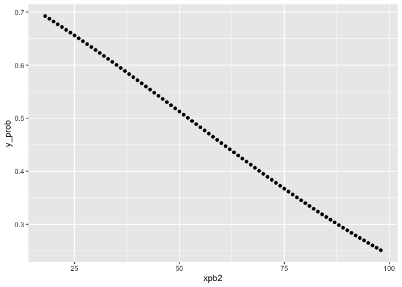
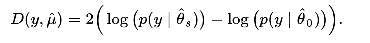
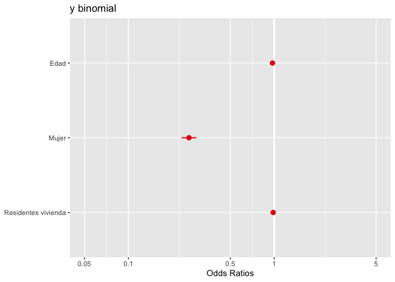
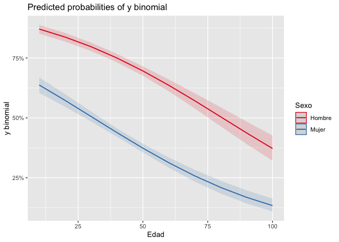
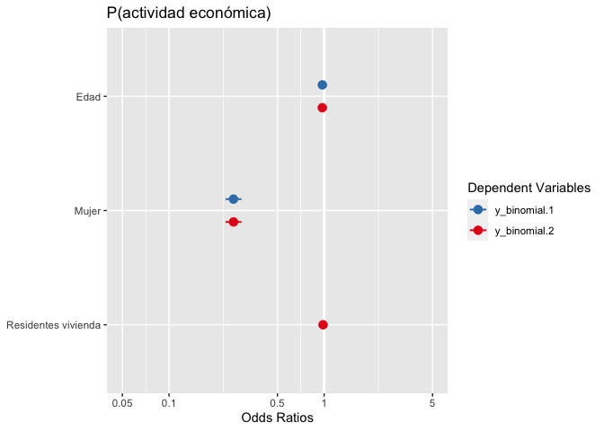
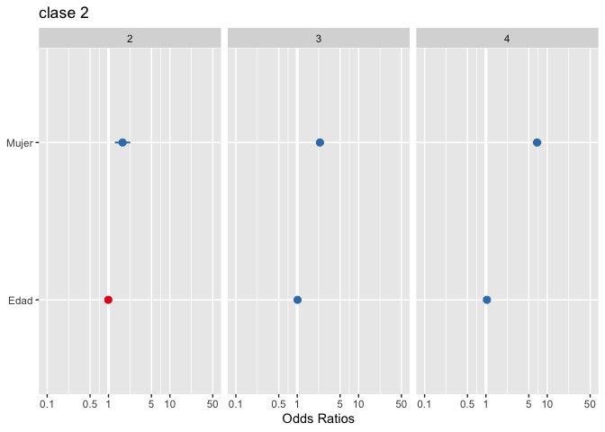
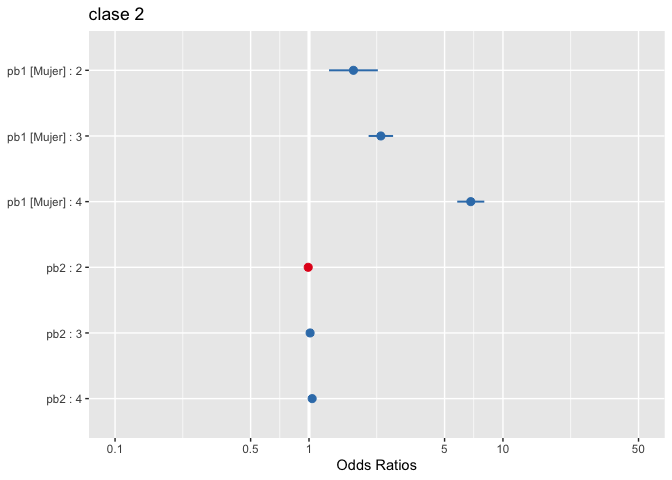

Práctica 9. Generalizados: logit y más
================
Ana Escoto
19/11/2020

# Previo

## Paquetería

``` r
#install.packages("sjPlot", dependencies=T) # solito porque da problmas

library(sjPlot)

if (!require("pacman")) install.packages("pacman") # instala pacman si se requiere
```

    ## Loading required package: pacman

``` r
pacman::p_load(tidyverse, 
               readxl,writexl,googlesheets4, # importar hojas de cálculo
               haven, foreign, # importación de dta y sav
               sjlabelled, # etiquetas
               janitor, skimr, #limpieza y verificación
               imputeTS, # para imputar valores
               srvyr, # Para el diseño muestral
               esquisse, # para usar ggplot de manera más amigable
               DescTools, # Paquete para estimaciones y pruebas
               infer, # tidy way 
               broom,  # Una escobita para limpiar (pero es para arreglar)
               estimatr, car, stargazer, ggpubr, # Para la regresión práctica 7
               jtools, lm.beta, robustbase, sandwich, effects,
               officer,flextable,huxtable, ggstance, kableExtra, # Para la regresión práctica 8
               ResourceSelection, lmtest, mlogit, nnet) # Práctica 9
```

## Directorio

En caso que no tengas un proyecto,establecer el directorio puede ayudar

``` r
setwd("/Users/anaescoto/Dropbox/2020/2021-1 R para Demográfos/repo/R_Demo")
```

## Bases

Base de ECOVID - ML

``` r
ecovid0420 <- read_dta("https://github.com/aniuxa/R_Demo/raw/master/datos/ecovid0420.dta")
```

## Base cortada y modelo práctica pasada

``` r
mydata<- ecovid0420 %>% 
  mutate(pb1=as_label(pb1)) %>%  # Para hacer gráficos sin problemas
  select(ent, pa1,starts_with("pb"), clase1, clase2, clase3, fac_per)
```

Vamos a volver dicotómica (0,1) nuestra variable \[y de paso repasamos
cómo se recodifica en R\]

``` r
mydata$y_binomial<-NA
mydata$y_binomial[mydata$clase1==1]<-1
mydata$y_binomial[mydata$clase1==2]<-0

newdata <- na.omit(mydata)
```

# Intro

En esta práctica vamos a revisar los elementos básicos para la regresión
logística. El proceso en R para todos los modelos generalizados se
parece mucho. Por tanto, no será difícil que luego pupb2s utilizar otras
funciones de enlace. Vamos a hacer una sub-base de nuestras posibles
variables explicativas. Esto es importante porque sólo podemos comparar
modelos con la misma cantidad de observaciones. Intentaremos predecir la
participación económica

# Regresión Logística

## Un solo predictor

``` r
modelo0<-glm(y_binomial ~ pb2, family = binomial("logit"), data=newdata, na.action=na.exclude)
summary(modelo0)
```

    ## 
    ## Call:
    ## glm(formula = y_binomial ~ pb2, family = binomial("logit"), data = newdata, 
    ##     na.action = na.exclude)
    ## 
    ## Deviance Residuals: 
    ##     Min       1Q   Median       3Q      Max  
    ## -1.5356  -1.2191   0.9052   1.0578   1.6622  
    ## 
    ## Coefficients:
    ##              Estimate Std. Error z value Pr(>|z|)    
    ## (Intercept)  1.239754   0.080982   15.31   <2e-16 ***
    ## pb2         -0.023795   0.001765  -13.48   <2e-16 ***
    ## ---
    ## Signif. codes:  0 '***' 0.001 '**' 0.01 '*' 0.05 '.' 0.1 ' ' 1
    ## 
    ## (Dispersion parameter for binomial family taken to be 1)
    ## 
    ##     Null deviance: 7654.5  on 5567  degrees of freedom
    ## Residual deviance: 7465.7  on 5566  degrees of freedom
    ## AIC: 7469.7
    ## 
    ## Number of Fisher Scoring iterations: 4

``` r
confint(modelo0)
```

    ## Waiting for profiling to be done...

    ##                 2.5 %      97.5 %
    ## (Intercept)  1.081616  1.39909969
    ## pb2         -0.027267 -0.02034802

Con jtools:

``` r
summ(modelo0)
```

<table class="table table-striped table-hover table-condensed table-responsive" style="width: auto !important; margin-left: auto; margin-right: auto;">

<tbody>

<tr>

<td style="text-align:left;font-weight: bold;">

Observations

</td>

<td style="text-align:right;">

5568

</td>

</tr>

<tr>

<td style="text-align:left;font-weight: bold;">

Dependent variable

</td>

<td style="text-align:right;">

y\_binomial

</td>

</tr>

<tr>

<td style="text-align:left;font-weight: bold;">

Type

</td>

<td style="text-align:right;">

Generalized linear model

</td>

</tr>

<tr>

<td style="text-align:left;font-weight: bold;">

Family

</td>

<td style="text-align:right;">

binomial

</td>

</tr>

<tr>

<td style="text-align:left;font-weight: bold;">

Link

</td>

<td style="text-align:right;">

logit

</td>

</tr>

</tbody>

</table>

<table class="table table-striped table-hover table-condensed table-responsive" style="width: auto !important; margin-left: auto; margin-right: auto;">

<tbody>

<tr>

<td style="text-align:left;font-weight: bold;">

𝛘²(1)

</td>

<td style="text-align:right;">

188.80

</td>

</tr>

<tr>

<td style="text-align:left;font-weight: bold;">

Pseudo-R² (Cragg-Uhler)

</td>

<td style="text-align:right;">

0.04

</td>

</tr>

<tr>

<td style="text-align:left;font-weight: bold;">

Pseudo-R² (McFadden)

</td>

<td style="text-align:right;">

0.02

</td>

</tr>

<tr>

<td style="text-align:left;font-weight: bold;">

AIC

</td>

<td style="text-align:right;">

7469.74

</td>

</tr>

<tr>

<td style="text-align:left;font-weight: bold;">

BIC

</td>

<td style="text-align:right;">

7482.99

</td>

</tr>

</tbody>

</table>

<table class="table table-striped table-hover table-condensed table-responsive" style="width: auto !important; margin-left: auto; margin-right: auto;border-bottom: 0;">

<thead>

<tr>

<th style="text-align:left;">

</th>

<th style="text-align:right;">

Est.

</th>

<th style="text-align:right;">

S.E.

</th>

<th style="text-align:right;">

z val.

</th>

<th style="text-align:right;">

p

</th>

</tr>

</thead>

<tbody>

<tr>

<td style="text-align:left;font-weight: bold;">

(Intercept)

</td>

<td style="text-align:right;">

1.24

</td>

<td style="text-align:right;">

0.08

</td>

<td style="text-align:right;">

15.31

</td>

<td style="text-align:right;">

0.00

</td>

</tr>

<tr>

<td style="text-align:left;font-weight: bold;">

pb2

</td>

<td style="text-align:right;">

\-0.02

</td>

<td style="text-align:right;">

0.00

</td>

<td style="text-align:right;">

\-13.48

</td>

<td style="text-align:right;">

0.00

</td>

</tr>

</tbody>

<tfoot>

<tr>

<td style="padding: 0; " colspan="100%">

<sup></sup> Standard errors: MLE

</td>

</tr>

</tfoot>

</table>

## Predicción de probabilidades

Para predecir la probabilidad, primero chequemos el rango de nuestra
variabe explicativa

``` r
range(newdata$pb2)
```

    ## [1] 18 98

Hacemos un vector con los valores que queremos predecir

``` r
xpb2 <- 18:98
```

Vamos a utilizar el comando “predict” para predecir los valores. Podemos
el argumento “response” para que nos dé el logito

``` r
y_logito <- predict(modelo0, list(pb2 = xpb2))
y_prob<- predict(modelo0, list(pb2 = xpb2), type= "response")

results_m0<-cbind(y_logito, y_prob, xpb2)
results_m0<-as.data.frame(results_m0)
```

Hoy podemos graficar

``` r
ggplot(data=results_m0, aes(x=xpb2, y=y_prob)) +
  geom_point()
```

<!-- -->

## Coeficientes exponenciados

Para interpretar mejor los coeficientes suelen exponenciarse y hablar de
las veces que aumentan o disminuyen los momios con respecto a la unidad
como base

``` r
exp(coef(modelo0))
```

    ## (Intercept)         pb2 
    ##   3.4547646   0.9764862

Es muy fácil con la librería jtools, sacar los coeficientes
exponenciados. La ventaja es que nos dan también los intervalos:

``` r
summ(modelo0, exp=T )
```

<table class="table table-striped table-hover table-condensed table-responsive" style="width: auto !important; margin-left: auto; margin-right: auto;">

<tbody>

<tr>

<td style="text-align:left;font-weight: bold;">

Observations

</td>

<td style="text-align:right;">

5568

</td>

</tr>

<tr>

<td style="text-align:left;font-weight: bold;">

Dependent variable

</td>

<td style="text-align:right;">

y\_binomial

</td>

</tr>

<tr>

<td style="text-align:left;font-weight: bold;">

Type

</td>

<td style="text-align:right;">

Generalized linear model

</td>

</tr>

<tr>

<td style="text-align:left;font-weight: bold;">

Family

</td>

<td style="text-align:right;">

binomial

</td>

</tr>

<tr>

<td style="text-align:left;font-weight: bold;">

Link

</td>

<td style="text-align:right;">

logit

</td>

</tr>

</tbody>

</table>

<table class="table table-striped table-hover table-condensed table-responsive" style="width: auto !important; margin-left: auto; margin-right: auto;">

<tbody>

<tr>

<td style="text-align:left;font-weight: bold;">

𝛘²(1)

</td>

<td style="text-align:right;">

188.80

</td>

</tr>

<tr>

<td style="text-align:left;font-weight: bold;">

Pseudo-R² (Cragg-Uhler)

</td>

<td style="text-align:right;">

0.04

</td>

</tr>

<tr>

<td style="text-align:left;font-weight: bold;">

Pseudo-R² (McFadden)

</td>

<td style="text-align:right;">

0.02

</td>

</tr>

<tr>

<td style="text-align:left;font-weight: bold;">

AIC

</td>

<td style="text-align:right;">

7469.74

</td>

</tr>

<tr>

<td style="text-align:left;font-weight: bold;">

BIC

</td>

<td style="text-align:right;">

7482.99

</td>

</tr>

</tbody>

</table>

<table class="table table-striped table-hover table-condensed table-responsive" style="width: auto !important; margin-left: auto; margin-right: auto;border-bottom: 0;">

<thead>

<tr>

<th style="text-align:left;">

</th>

<th style="text-align:right;">

exp(Est.)

</th>

<th style="text-align:right;">

2.5%

</th>

<th style="text-align:right;">

97.5%

</th>

<th style="text-align:right;">

z val.

</th>

<th style="text-align:right;">

p

</th>

</tr>

</thead>

<tbody>

<tr>

<td style="text-align:left;font-weight: bold;">

(Intercept)

</td>

<td style="text-align:right;">

3.45

</td>

<td style="text-align:right;">

2.95

</td>

<td style="text-align:right;">

4.05

</td>

<td style="text-align:right;">

15.31

</td>

<td style="text-align:right;">

0.00

</td>

</tr>

<tr>

<td style="text-align:left;font-weight: bold;">

pb2

</td>

<td style="text-align:right;">

0.98

</td>

<td style="text-align:right;">

0.97

</td>

<td style="text-align:right;">

0.98

</td>

<td style="text-align:right;">

\-13.48

</td>

<td style="text-align:right;">

0.00

</td>

</tr>

</tbody>

<tfoot>

<tr>

<td style="padding: 0; " colspan="100%">

<sup></sup> Standard errors: MLE

</td>

</tr>

</tfoot>

</table>

## Agregando una variable

``` r
modelo1<-glm(y_binomial ~ pb2 + pb1, family = binomial("logit"), data=newdata, na.action=na.exclude)
summary(modelo1)
```

    ## 
    ## Call:
    ## glm(formula = y_binomial ~ pb2 + pb1, family = binomial("logit"), 
    ##     data = newdata, na.action = na.exclude)
    ## 
    ## Deviance Residuals: 
    ##     Min       1Q   Median       3Q      Max  
    ## -1.9239  -1.0845   0.6517   1.0415   1.9702  
    ## 
    ## Coefficients:
    ##              Estimate Std. Error z value Pr(>|z|)    
    ## (Intercept)  2.156692   0.097371   22.15   <2e-16 ***
    ## pb2         -0.026496   0.001868  -14.18   <2e-16 ***
    ## pb1Mujer    -1.345811   0.059955  -22.45   <2e-16 ***
    ## ---
    ## Signif. codes:  0 '***' 0.001 '**' 0.01 '*' 0.05 '.' 0.1 ' ' 1
    ## 
    ## (Dispersion parameter for binomial family taken to be 1)
    ## 
    ##     Null deviance: 7654.5  on 5567  degrees of freedom
    ## Residual deviance: 6922.0  on 5565  degrees of freedom
    ## AIC: 6928
    ## 
    ## Number of Fisher Scoring iterations: 4

``` r
confint(modelo1)
```

    ## Waiting for profiling to be done...

    ##                   2.5 %      97.5 %
    ## (Intercept)  1.96717062  2.34891309
    ## pb2         -0.03017362 -0.02284992
    ## pb1Mujer    -1.46383780 -1.22879234

Este modelo tiene coeficientes que deben leerse “condicionados”. Es
decir, en este caso tenemos que el coeficiente asociado a la pb2,
mantiene constante el sexo y viceversa.

Veamos con los valores exponenciados:

## Bondad de Ajuste

### Devianza

La devianza es una medida de la bondad de ajuste de los modelos lineales
generalizados. O más bien, es una medida de la no-bondad del ajust,
puesto que valores más altos indican un peor ajuste.

R nos da medidas de devianza: la devianza nula y la desviación residual.
La devianza nula muestra qué tan bien la variable de respuesta se
predice mediante un modelo que incluye solo la intersección (gran
media).

### Prueba de Verosimilitud



¿Cómo saber si ha mejorado nuestro modelo? Podemos hacer un test que
compare las devianzas(tendría la misma lógica que nuestra prueba F del
modelo lineal). Para esto tenemos que instalar un paquete “lmtest”

``` r
lrtest0<-lrtest(modelo0, modelo1)
lrtest0
```

    ## Warning in knit_print.huxtable(ht): Unrecognized output format "gfm". Using `to_screen` to print huxtables.
    ## Set options("huxtable.knitr_output_format") manually to "latex", "html", "rtf", "docx", "pptx", "md" or "screen".

``` 
          ┌────────────────────────────────────────────┐
             │ #Df      LogLik    Df   Chisq   Pr(>Chisq) │
             ├────────────────────────────────────────────┤
             │   2   -3.73e+03                            │
             │   3   -3.46e+03     1     544    2.97e-120 │
             └────────────────────────────────────────────┘
```

Column names: \#Df, LogLik, Df, Chisq, Pr(\>Chisq)

Como puedes ver, el resultado muestra un valor p muy pequeño (\<.001).
Esto significa que agregar el sexo al modelo lleva a un ajuste
significativamente mejor sobre el modelo original.

Podemos seguir añadiendo variables sólo “sumando” en la función

``` r
modelo2<-glm(y_binomial ~ pb2 + pb1 + pa1,
             family = binomial("logit"), 
             data=newdata, 
             na.action=na.exclude)
summary(modelo2)
```

    ## 
    ## Call:
    ## glm(formula = y_binomial ~ pb2 + pb1 + pa1, family = binomial("logit"), 
    ##     data = newdata, na.action = na.exclude)
    ## 
    ## Deviance Residuals: 
    ##     Min       1Q   Median       3Q      Max  
    ## -1.9446  -1.0818   0.6455   1.0439   1.9818  
    ## 
    ## Coefficients:
    ##              Estimate Std. Error z value Pr(>|z|)    
    ## (Intercept)  2.245549   0.127450  17.619   <2e-16 ***
    ## pb2         -0.027027   0.001932 -13.988   <2e-16 ***
    ## pb1Mujer    -1.345440   0.059963 -22.438   <2e-16 ***
    ## pa1         -0.016020   0.014734  -1.087    0.277    
    ## ---
    ## Signif. codes:  0 '***' 0.001 '**' 0.01 '*' 0.05 '.' 0.1 ' ' 1
    ## 
    ## (Dispersion parameter for binomial family taken to be 1)
    ## 
    ##     Null deviance: 7654.5  on 5567  degrees of freedom
    ## Residual deviance: 6920.9  on 5564  degrees of freedom
    ## AIC: 6928.9
    ## 
    ## Number of Fisher Scoring iterations: 4

Y podemos ver si introducir esta variable afectó al ajuste global del
modelo

``` r
lrtest1<-lrtest(modelo1, modelo2)
lrtest1
```

    ## Warning in knit_print.huxtable(ht): Unrecognized output format "gfm". Using `to_screen` to print huxtables.
    ## Set options("huxtable.knitr_output_format") manually to "latex", "html", "rtf", "docx", "pptx", "md" or "screen".

``` 
          ┌────────────────────────────────────────────┐
             │ #Df      LogLik    Df   Chisq   Pr(>Chisq) │
             ├────────────────────────────────────────────┤
             │   3   -3.46e+03                            │
             │   4   -3.46e+03     1    1.18        0.277 │
             └────────────────────────────────────────────┘
```

Column names: \#Df, LogLik, Df, Chisq, Pr(\>Chisq)

### Test Hosmer-Lemeshow Goodness of Fit “GOF”

El teste Homer-Lemeshow se calcula sobre los datos una vez que las
observaciones se han segmentado en grupos basados en probabilidades
predichas similares. Este teste examina si las proporciones observadas
de eventos son similares a las probabilidades predichas de ocurrencia en
subgrupos del conjunto de datos, y lo hace con una prueba de chi
cuadrado de Pearson.

¡Ojo\! No queremos rechazar la hipótesis nula. LoLa hipótesis nula
sostiene que el modelo se ajusta a los datos y en el siguiente ejemplo
rechazamos H0.

``` r
hoslem.test(newdata$y_binomial, fitted(modelo2))
```

    ## 
    ##  Hosmer and Lemeshow goodness of fit (GOF) test
    ## 
    ## data:  newdata$y_binomial, fitted(modelo2)
    ## X-squared = 119.2, df = 8, p-value < 2.2e-16

No obstante, esta prueba ha sido criticada. Checa la postura de Paul
Allison <https://statisticalhorizons.com/hosmer-lemeshow>

Es un problema que tenemos en muestras grandes. Casi siempre preferimos
el enfoque de la devianza.

## Tabla de modelos estimados

``` r
#stargazer(modelo0, modelo1,modelo2, type = 'latex', header=FALSE)
```

``` r
stargazer(modelo0, modelo1,modelo2, 
          type = 'text', header=FALSE)
```

    ## 
    ## ==================================================
    ##                         Dependent variable:       
    ##                   --------------------------------
    ##                              y_binomial           
    ##                      (1)        (2)        (3)    
    ## --------------------------------------------------
    ## pb2               -0.024***  -0.026***  -0.027*** 
    ##                    (0.002)    (0.002)    (0.002)  
    ##                                                   
    ## pb1Mujer                     -1.346***  -1.345*** 
    ##                               (0.060)    (0.060)  
    ##                                                   
    ## pa1                                       -0.016  
    ##                                          (0.015)  
    ##                                                   
    ## Constant           1.240***   2.157***   2.246*** 
    ##                    (0.081)    (0.097)    (0.127)  
    ##                                                   
    ## --------------------------------------------------
    ## Observations        5,568      5,568      5,568   
    ## Log Likelihood    -3,732.868 -3,461.022 -3,460.431
    ## Akaike Inf. Crit. 7,469.737  6,928.044  6,928.862 
    ## ==================================================
    ## Note:                  *p<0.1; **p<0.05; ***p<0.01

Para sacar los coeficientes exponenciados

``` r
stargazer(modelo0, modelo1,modelo2, 
          type = 'text', header=FALSE,
          apply.coef = exp,
          apply.se   = exp)
```

    ## 
    ## ==================================================
    ##                         Dependent variable:       
    ##                   --------------------------------
    ##                              y_binomial           
    ##                      (1)        (2)        (3)    
    ## --------------------------------------------------
    ## pb2                 0.976      0.974      0.973   
    ##                    (1.002)    (1.002)    (1.002)  
    ##                                                   
    ## pb1Mujer                       0.260      0.260   
    ##                               (1.062)    (1.062)  
    ##                                                   
    ## pa1                                       0.984   
    ##                                          (1.015)  
    ##                                                   
    ## Constant           3.455***   8.642***   9.446*** 
    ##                    (1.084)    (1.102)    (1.136)  
    ##                                                   
    ## --------------------------------------------------
    ## Observations        5,568      5,568      5,568   
    ## Log Likelihood    -3,732.868 -3,461.022 -3,460.431
    ## Akaike Inf. Crit. 7,469.737  6,928.044  6,928.862 
    ## ==================================================
    ## Note:                  *p<0.1; **p<0.05; ***p<0.01

Veamos con jtools:

``` r
export_summs(modelo0, modelo1,modelo2, exp=T)
```

    ## Warning in knit_print.huxtable(x, ...): Unrecognized output format "gfm". Using `to_screen` to print huxtables.
    ## Set options("huxtable.knitr_output_format") manually to "latex", "html", "rtf", "docx", "pptx", "md" or "screen".

``` 
    ─────────────────────────────────────────────────────────
                           Model 1       Model 2       Model 3  
                     ───────────────────────────────────────────
         (Intercept)      3.45 ***      8.64 ***      9.45 ***  
                         (0.08)        (0.10)        (0.13)     
         pb2              0.98 ***      0.97 ***      0.97 ***  
                         (0.00)        (0.00)        (0.00)     
         pb1Mujer                       0.26 ***      0.26 ***  
                                       (0.06)        (0.06)     
         pa1                                          0.98      
                                                     (0.01)     
                     ───────────────────────────────────────────
         N             5568          5568          5568         
         AIC           7469.74       6928.04       6928.86      
         BIC           7482.99       6947.92       6955.36      
         Pseudo R2        0.04          0.16          0.17      
       ─────────────────────────────────────────────────────────
         *** p < 0.001; ** p < 0.01; * p < 0.05.                
```

Column names: names, Model 1, Model 2, Model 3

También la librería “sjPlot” tiene el comando “plot\_model()”

``` r
plot_model(modelo2)
```

<!-- -->

Por default nos da los coeficientes exponenciados.

¿Cómo saber lo que tiene esos gráficos? Es bueno guardar siempre estos
resultados en un objeto. Este objeto es una lista de dos listas

``` r
get<-plot_model(modelo2)
get$data
```

    ## Warning in knit_print.huxtable(ht): Unrecognized output format "gfm". Using `to_screen` to print huxtables.
    ## Set options("huxtable.knitr_output_format") manually to "latex", "html", "rtf", "docx", "pptx", "md" or "screen".

┌───────────────────────────────────────────────────────────────────────────
│ term estimate std.erro conf.low conf.hig statisti den.df  
│ r h c  
├───────────────────────────────────────────────────────────────────────────
│ pb2 0.973 0.00193 0.97  0.977 -14    Inf  
│ pb1Mujer 0.26  0.06    0.232 0.293 -22.4  Inf  
│ pa1 0.984 0.0147  0.956 1.01  -1.09 Inf  
└───────────────────────────────────────────────────────────────────────────

Column names: term, estimate, std.error, conf.low, conf.high, statistic,
den.df, p.value, p.stars, p.label, group, xpos, xmin, xmax

7/14 columns shown.

``` r
plot_model(modelo2, terms= c("pb2", "pb1"), type="pred")
```

    ## Data were 'prettified'. Consider using `terms="pb2 [all]"` to get smooth plots.

<!-- -->

Para poner más de un modelo:

``` r
plot_models(modelo1, modelo2) + ggtitle("P(actividad económica)")
```

<!-- -->

# Regresión Probit

## Un solo predictor

``` r
mprobit<-glm(y_binomial ~ pb2, family = binomial("probit"), data=newdata, na.action=na.exclude)
summary(mprobit)
```

    ## 
    ## Call:
    ## glm(formula = y_binomial ~ pb2, family = binomial("probit"), 
    ##     data = newdata, na.action = na.exclude)
    ## 
    ## Deviance Residuals: 
    ##     Min       1Q   Median       3Q      Max  
    ## -1.5351  -1.2180   0.9065   1.0596   1.6680  
    ## 
    ## Coefficients:
    ##              Estimate Std. Error z value Pr(>|z|)    
    ## (Intercept)  0.767632   0.049766   15.43   <2e-16 ***
    ## pb2         -0.014754   0.001087  -13.57   <2e-16 ***
    ## ---
    ## Signif. codes:  0 '***' 0.001 '**' 0.01 '*' 0.05 '.' 0.1 ' ' 1
    ## 
    ## (Dispersion parameter for binomial family taken to be 1)
    ## 
    ##     Null deviance: 7654.5  on 5567  degrees of freedom
    ## Residual deviance: 7466.7  on 5566  degrees of freedom
    ## AIC: 7470.7
    ## 
    ## Number of Fisher Scoring iterations: 4

Comparando probit con logit:

``` r
stargazer(modelo0, mprobit,   type = 'text', header=FALSE)
```

    ## 
    ## ==============================================
    ##                       Dependent variable:     
    ##                   ----------------------------
    ##                            y_binomial         
    ##                      logistic       probit    
    ##                        (1)            (2)     
    ## ----------------------------------------------
    ## pb2                 -0.024***      -0.015***  
    ##                      (0.002)        (0.001)   
    ##                                               
    ## Constant             1.240***      0.768***   
    ##                      (0.081)        (0.050)   
    ##                                               
    ## ----------------------------------------------
    ## Observations          5,568          5,568    
    ## Log Likelihood      -3,732.868    -3,733.372  
    ## Akaike Inf. Crit.   7,469.737      7,470.744  
    ## ==============================================
    ## Note:              *p<0.1; **p<0.05; ***p<0.01

¿Cuál es la diferencia?

<https://tutorials.methodsconsultants.com/posts/what-is-the-difference-between-logit-and-probit-models>.

Y Allison:

<https://statisticalhorizons.com/in-defense-of-logit-part-1>
<https://statisticalhorizons.com/in-defense-of-logit-part-2>

*Más sobre modelos generalizados*
<https://www.statmethods.net/advstats/glm.html>

# Regresión logística multinomial

Hay varias librerías que nos permiten hacer este tipo de modelos:

  - mlogit, necesita que configuremos nuestros datos.

  - nnet, no necesita que los cambiemos, pero no funcionaran algunas
    herramientas como el “summ” de jtools.

Unas por otras.

Veamos:

``` r
mlogit <- multinom(clase2 ~ pb1 + pb2, data = newdata)
```

    ## # weights:  16 (9 variable)
    ## initial  value 7718.887003 
    ## iter  10 value 5911.387509
    ## final  value 5790.776045 
    ## converged

``` r
summary(mlogit)
```

    ## Call:
    ## multinom(formula = clase2 ~ pb1 + pb2, data = newdata)
    ## 
    ## Coefficients:
    ##   (Intercept)  pb1Mujer          pb2
    ## 2   -2.561370 0.5276773 -0.009417317
    ## 3   -1.978881 0.8530845  0.012969517
    ## 4   -3.601349 1.9205192  0.037325911
    ## 
    ## Std. Errors:
    ##   (Intercept)   pb1Mujer         pb2
    ## 2   0.2310810 0.14788142 0.005173569
    ## 3   0.1181259 0.07409986 0.002371817
    ## 4   0.1317935 0.08192990 0.002280577
    ## 
    ## Residual Deviance: 11581.55 
    ## AIC: 11599.55

Veamos con “broom”

``` r
 #summ(mlogit)
tidy(mlogit)
```

    ## Warning in knit_print.huxtable(ht): Unrecognized output format "gfm". Using `to_screen` to print huxtables.
    ## Set options("huxtable.knitr_output_format") manually to "latex", "html", "rtf", "docx", "pptx", "md" or "screen".

┌─────────────────────────────────────────────────────────────────────┐
│ y.level term estimate std.error statistic p.value │
├─────────────────────────────────────────────────────────────────────┤
│ 2 (Intercept -2.56    0.231   -11.1  1.5e-28   │ │ ) │ │ 2 pb1Mujer
0.528   0.148   3.57 0.000359  │ │ 2 pb2 -0.00942 0.00517 -1.82
0.0687    │ │ 3 (Intercept -1.98    0.118   -16.8  5.45e-63  │ │ ) │
│ 3 pb1Mujer 0.853   0.0741  11.5  1.14e-30  │ │ 3 pb2 0.013   0.00237
5.47 4.55e-08  │ │ 4 (Intercept -3.6     0.132   -27.3  2.1e-164  │ │ )
│ │ 4 pb1Mujer 1.92    0.0819  23.4  1.63e-121 │ │ 4 pb2 0.0373 
0.00228 16.4  3.3e-60   │
└─────────────────────────────────────────────────────────────────────┘

Column names: y.level, term, estimate, std.error, statistic, p.value

``` r
glance(mlogit)
```

    ## Warning in knit_print.huxtable(ht): Unrecognized output format "gfm". Using `to_screen` to print huxtables.
    ## Set options("huxtable.knitr_output_format") manually to "latex", "html", "rtf", "docx", "pptx", "md" or "screen".

``` 
              ┌───────────────────────────────────┐
                 │  edf   deviance        AIC   nobs │
                 ├───────────────────────────────────┤
                 │    9   1.16e+04   1.16e+04   5568 │
                 └───────────────────────────────────┘
```

Column names: edf, deviance, AIC, nobs

``` r
plot_model(mlogit)
```

<!-- -->

Con el otro paquete, primero tenemos que modificar los datos

``` r
mlogit_dat<-mlogit.data(newdata, shape="wide", choice="clase2")
head(mlogit_dat)
```

    ## ~~~~~~~
    ##  first 10 observations out of 22272 
    ## ~~~~~~~
    ##    ent pa1    pb1 pb2 pb3 clase1 clase2 clase3 fac_per y_binomial chid alt idx
    ## 1   24   4 Hombre  38   3      1   TRUE      0    6851          1    1   1 1:1
    ## 2   24   4 Hombre  38   3      1  FALSE      0    6851          1    1   2 1:2
    ## 3   24   4 Hombre  38   3      1  FALSE      0    6851          1    1   3 1:3
    ## 4   24   4 Hombre  38   3      1  FALSE      0    6851          1    1   4 1:4
    ## 5   10   1 Hombre  82   2      1   TRUE      0    7820          1    2   1 2:1
    ## 6   10   1 Hombre  82   2      1  FALSE      0    7820          1    2   2 2:2
    ## 7   10   1 Hombre  82   2      1  FALSE      0    7820          1    2   3 2:3
    ## 8   10   1 Hombre  82   2      1  FALSE      0    7820          1    2   4 2:4
    ## 9   18   8 Hombre  50   2      2  FALSE      1    3488          0    3   1 3:1
    ## 10  18   8 Hombre  50   2      2  FALSE      1    3488          0    3   2 3:2
    ## 
    ## ~~~ indexes ~~~~
    ##    chid alt
    ## 1     1   1
    ## 2     1   2
    ## 3     1   3
    ## 4     1   4
    ## 5     2   1
    ## 6     2   2
    ## 7     2   3
    ## 8     2   4
    ## 9     3   1
    ## 10    3   2
    ## indexes:  1, 2

``` r
mlogit2 <- mlogit(clase2 ~ 0 |pb1 + pb2, data = mlogit_dat)
summary(mlogit2)
```

    ## 
    ## Call:
    ## mlogit(formula = clase2 ~ 0 | pb1 + pb2, data = mlogit_dat, method = "nr")
    ## 
    ## Frequencies of alternatives:choice
    ##       1       2       3       4 
    ## 0.51778 0.03592 0.19307 0.25323 
    ## 
    ## nr method
    ## 6 iterations, 0h:0m:2s 
    ## g'(-H)^-1g = 0.00125 
    ## successive function values within tolerance limits 
    ## 
    ## Coefficients :
    ##                 Estimate Std. Error  z-value  Pr(>|z|)    
    ## (Intercept):2 -2.5615273  0.2310836 -11.0848 < 2.2e-16 ***
    ## (Intercept):3 -1.9788746  0.1181255 -16.7523 < 2.2e-16 ***
    ## (Intercept):4 -3.6012908  0.1317922 -27.3255 < 2.2e-16 ***
    ## pb1Mujer:2     0.5276598  0.1478831   3.5681 0.0003596 ***
    ## pb1Mujer:3     0.8530783  0.0740997  11.5126 < 2.2e-16 ***
    ## pb1Mujer:4     1.9204660  0.0819290  23.4406 < 2.2e-16 ***
    ## pb2:2         -0.0094135  0.0051735  -1.8195 0.0688280 .  
    ## pb2:3          0.0129697  0.0023718   5.4683 4.545e-08 ***
    ## pb2:4          0.0373256  0.0022806  16.3668 < 2.2e-16 ***
    ## ---
    ## Signif. codes:  0 '***' 0.001 '**' 0.01 '*' 0.05 '.' 0.1 ' ' 1
    ## 
    ## Log-Likelihood: -5790.8
    ## McFadden R^2:  0.076067 
    ## Likelihood ratio test : chisq = 953.5 (p.value = < 2.22e-16)

``` r
export_summs(mlogit) # no funciona tan bien
```

    ## Warning in knit_print.huxtable(x, ...): Unrecognized output format "gfm". Using `to_screen` to print huxtables.
    ## Set options("huxtable.knitr_output_format") manually to "latex", "html", "rtf", "docx", "pptx", "md" or "screen".

``` 
        ─────────────────────────────────────────────────
                                                   Model 1  
                                   ─────────────────────────
             (Intercept)                         -2.56 ***  
                                                 (0.23)     
             pb1Mujer                             0.53 ***  
                                                 (0.15)     
             pb2                                  0.01 ***  
                                                 (0.00)     
                                   ─────────────────────────
             nobs                              5568         
             edf                                  9.00      
             deviance                         11581.55      
             AIC                              11599.55      
             nobs.1                            5568.00      
           ─────────────────────────────────────────────────
             *** p < 0.001; ** p < 0.01; * p < 0.05.        
```

Column names: names, Model 1

``` r
#export_summs(mlogit2) # no funciona nada
```

``` r
plot_model(mlogit2) # Queda un poco rarito
```

<!-- -->

## Irrelevante e independiente

<https://statisticalhorizons.com/iia>

# Ejercicio:

Corra un modelo logístico, multinomial o probit de acuerdo a sus datos.

Ingreso una variable primero y luego otra.

1.  Corra la prueba para verificar que vale la pena o no introducir la
    variable

2.  Presente sus resultados en alguna tabla o en algún gráfico.

Adjunte sus resultados a través del formulario.

<https://forms.gle/3MsHeN3ntDjz5bXx6>
